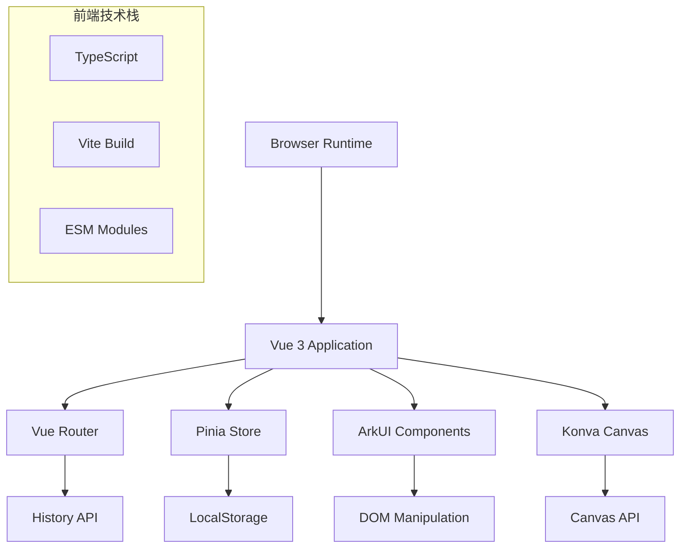
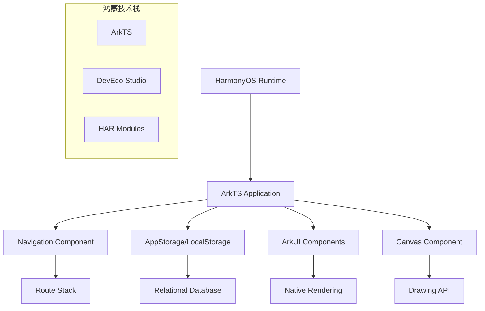
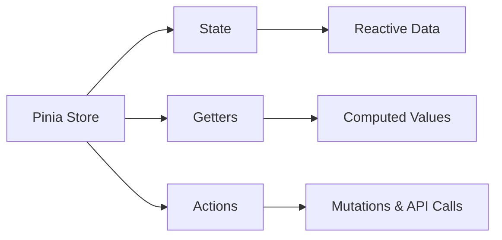
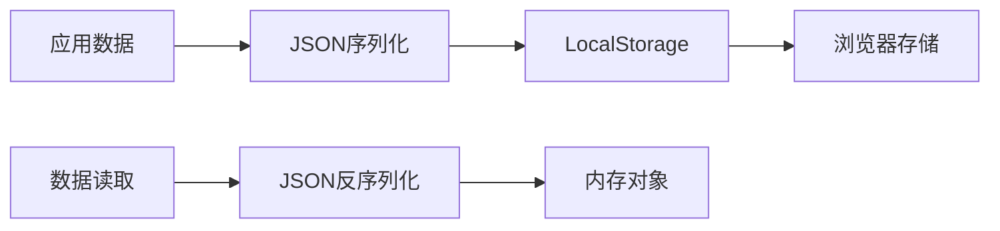
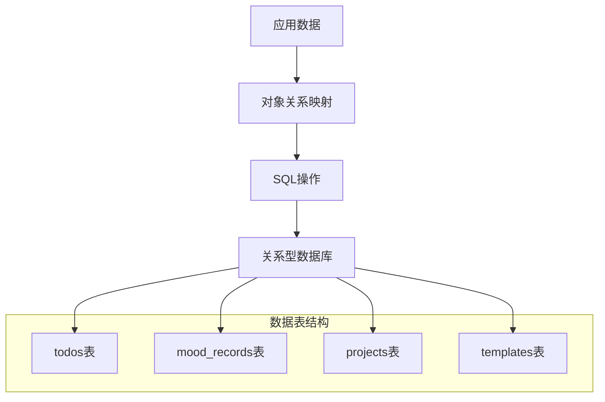
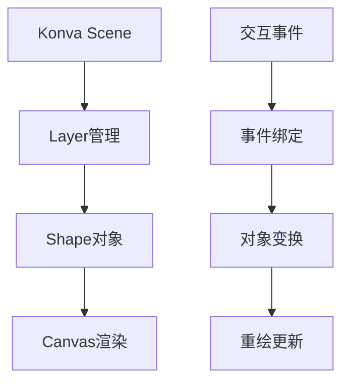
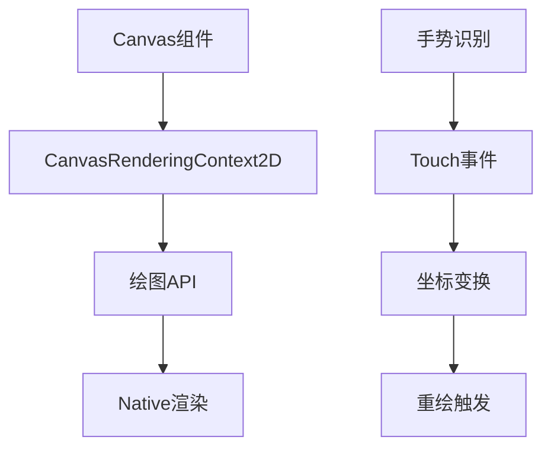
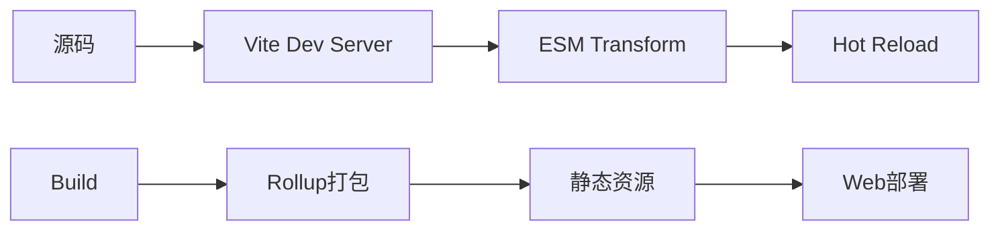
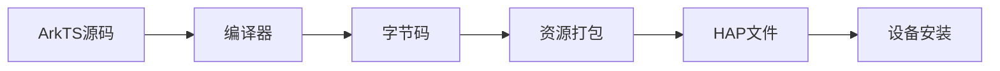
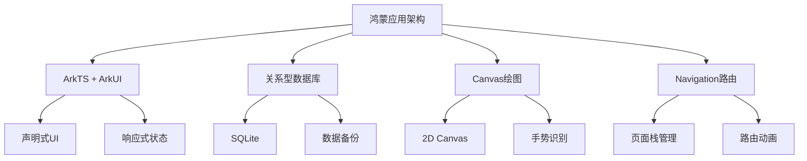

# 技术架构对比分析

## 总体架构对比

### 当前Vue.js架构



### 目标鸿蒙ArkTS架构



## 核心技术映射对比

### 1. 开发语言对比

| 方面 | Vue.js + TypeScript | HarmonyOS ArkTS | 迁移策略 |
|------|-------------------|-----------------|----------|
| **语法特性** | ES6+, 装饰器, 泛型 | TS语法扩展, 声明式UI | 语法相似度高，学习成本较低 |
| **组件定义** | `<script setup>`, Composition API | `@Component`, `@Builder` | 重新定义组件结构 |
| **响应式系统** | Proxy-based reactivity | `@State`, `@Prop`, `@Watch` | 响应式概念一致，API不同 |
| **类型支持** | 完整TypeScript支持 | ArkTS类型系统 | 类型定义需要适配 |

**示例对比：**

**Vue.js组件**
```typescript
<script setup lang="ts">
import { ref, computed } from 'vue'

const count = ref(0)
const doubleCount = computed(() => count.value * 2)

const increment = () => {
  count.value++
}
</script>
```

**ArkTS组件**
```typescript
@Component
struct CounterComponent {
  @State count: number = 0
  
  get doubleCount(): number {
    return this.count * 2
  }
  
  increment() {
    this.count++
  }
  
  build() {
    Column() {
      Text(`Count: ${this.count}`)
      Text(`Double: ${this.doubleCount}`)
      Button('Increment').onClick(() => this.increment())
    }
  }
}
```

### 2. 状态管理对比

#### Pinia Store结构


#### 鸿蒙状态管理结构
```mermaid
graph LR
    A[ArkTS State Management] --> B[AppStorage]
    A --> C[LocalStorage]
    A --> D[Component State]
    
    B --> E[Global State]
    C --> F[Persistent State]
    D --> G[@State, @Prop, @Link]
```

**迁移映射表：**

| Pinia概念 | 鸿蒙对应方案 | 实现方式 |
|-----------|-------------|----------|
| `defineStore` | 自定义Store类 | 封装AppStorage操作 |
| `ref/reactive` | `@State` | 组件响应式状态 |
| `computed` | `get`方法 | 计算属性 |
| `actions` | 普通方法 | 状态变更方法 |
| 跨组件共享 | `AppStorageLink` | 全局状态绑定 |

### 3. 路由导航对比

#### Vue Router架构
```typescript
// 路由配置
const routes = [
  { path: '/', component: Home },
  { path: '/todo', component: Todo },
  { path: '/mood', component: Mood }
]

// 编程式导航
router.push('/todo')
```

#### 鸿蒙Navigation架构
```typescript
// 页面栈管理
@Entry
@Component
struct MainPage {
  @Provide('pageStack') pageStack: NavPathStack = new NavPathStack()
  
  build() {
    Navigation(this.pageStack) {
      // 页面内容
    }
  }
}

// 页面跳转
this.pageStack.pushPath({ name: 'TodoPage' })
```

### 4. UI组件系统对比

#### Vue.js组件特性
- **模板语法**: `<template>`, 插值绑定
- **指令系统**: `v-if`, `v-for`, `v-model`
- **插槽机制**: `<slot>`, 作用域插槽
- **组件通信**: Props, Events, Provide/Inject

#### ArkUI组件特性  
- **声明式构建**: `build()`方法
- **容器组件**: `Column`, `Row`, `Stack`
- **基础组件**: `Text`, `Button`, `Image`
- **条件渲染**: `if...else`, `ForEach`

**组件对比示例：**

**Vue.js表单组件**
```vue
<template>
  <form @submit="onSubmit">
    <div v-for="field in fields" :key="field.name">
      <label>{{ field.label }}</label>
      <input 
        v-model="formData[field.name]"
        :type="field.type"
        :required="field.required"
      />
    </div>
    <button type="submit">提交</button>
  </form>
</template>
```

**ArkTS表单组件**
```typescript
@Component
struct FormComponent {
  @State formData: Record<string, string> = {}
  
  build() {
    Column() {
      ForEach(this.fields, (field: FieldConfig) => {
        Column() {
          Text(field.label)
          TextInput({ text: this.formData[field.name] })
            .onChange((value) => {
              this.formData[field.name] = value
            })
        }
      }, (field) => field.name)
      
      Button('提交')
        .onClick(() => this.onSubmit())
    }
  }
}
```

## 数据存储架构对比

### 当前LocalStorage方案



**特点分析：**
- ✅ 简单易用，无需配置
- ✅ 同步API，操作直接
- ❌ 存储空间限制（通常5-10MB）
- ❌ 仅支持字符串存储
- ❌ 无数据查询能力
- ❌ 无数据关系约束

### 鸿蒙关系型数据库方案



**方案优势：**
- ✅ 大容量存储支持
- ✅ 强大的查询能力
- ✅ 数据关系完整性
- ✅ 事务支持
- ✅ 数据备份恢复
- ✅ 性能优化机制

## 图形绘制系统对比

### Konva.js方案分析



**核心特性：**
- 🎨 丰富的图形对象库
- ⚡ 高性能渲染引擎
- 🖱️ 完整的交互事件系统
- 🔄 图层管理机制
- 📱 移动设备支持

### 鸿蒙Canvas组件方案



**迁移策略：**

| Konva功能 | 鸿蒙Canvas实现 | 实现复杂度 |
|-----------|---------------|------------|
| Shape绘制 | Canvas 2D API | 中等 |
| 图层管理 | 多Canvas叠加 | 中等 |
| 事件处理 | Touch + 坐标计算 | 较高 |
| 动画系统 | AnimatorSet | 中等 |
| 变换操作 | Matrix变换 | 较高 |

## 构建系统对比

### Vite构建流程


### DevEco Studio构建流程


## 性能特性对比

### 运行时性能

| 性能指标 | Vue.js Web应用 | 鸿蒙原生应用 | 性能提升 |
|----------|---------------|-------------|----------|
| **启动时间** | 2-5秒 | <2秒 | 50%+ |
| **内存占用** | 50-100MB | 30-60MB | 40%+ |
| **渲染帧率** | 30-60fps | 60fps+ | 稳定提升 |
| **响应延迟** | 50-200ms | 16-50ms | 70%+ |
| **电量消耗** | 较高 | 优化 | 30%+ |

### 开发体验对比

| 开发方面 | Vue.js | HarmonyOS ArkTS | 备注 |
|----------|--------|----------------|------|
| **学习曲线** | 中等 | 中等偏高 | ArkTS概念较新 |
| **调试工具** | 成熟完善 | 持续完善 | DevEco Studio |
| **生态支持** | 丰富 | 快速发展 | 官方强力支持 |
| **文档质量** | 优秀 | 良好 | 中文文档完善 |
| **社区活跃度** | 很高 | 快速增长 | 华为生态推动 |

## 迁移风险评估

### 高风险项目
1. **复杂图形编辑功能**
   - Konva到Canvas的功能对等迁移
   - 交互事件处理复杂度高
   - 性能优化挑战

2. **数据迁移完整性**
   - LocalStorage到数据库的数据转换
   - 数据结构变更适配
   - 历史数据兼容性

### 中等风险项目  
1. **UI交互一致性**
   - Vue指令到ArkTS语法转换
   - 组件生命周期差异
   - 动画效果迁移

2. **状态管理重构**
   - Pinia到ArkTS状态管理
   - 跨组件数据共享机制
   - 数据持久化方案

### 低风险项目
1. **基础UI组件**
   - 文本、按钮等基础组件
   - 布局容器组件
   - 样式系统适配

2. **业务逻辑迁移**
   - 纯函数逻辑
   - 数据处理算法
   - 工具函数库

## 技术选型建议

### 推荐技术方案



### 关键决策点

1. **数据库选择**：推荐使用关系型数据库替代LocalStorage
2. **图形方案**：采用Canvas + 自定义图形库的方案
3. **状态管理**：基于AppStorage构建全局状态管理
4. **UI框架**：全面拥抱ArkUI声明式开发范式

---

**总结**：从Vue.js到HarmonyOS的迁移虽然涉及技术栈的全面更换，但得益于两者在设计理念上的相似性（组件化、响应式、声明式），迁移的复杂度是可控的。关键在于做好详细的功能拆解和分阶段实施计划。
