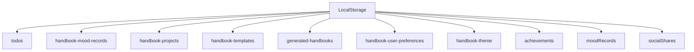
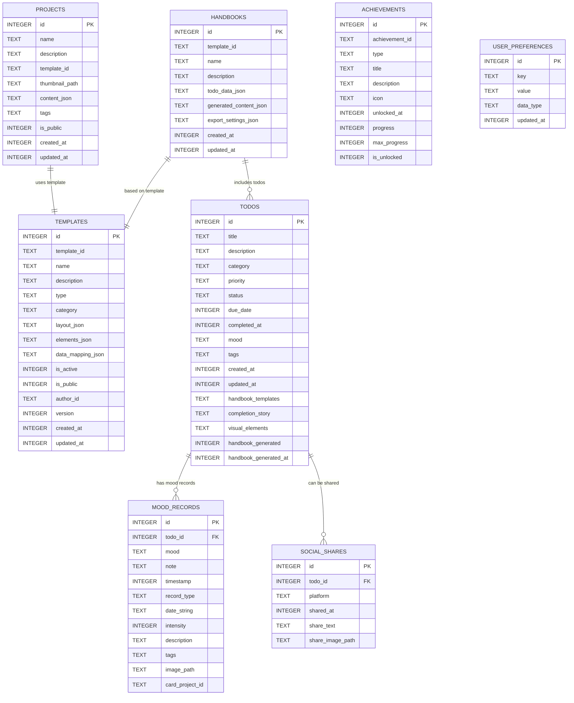
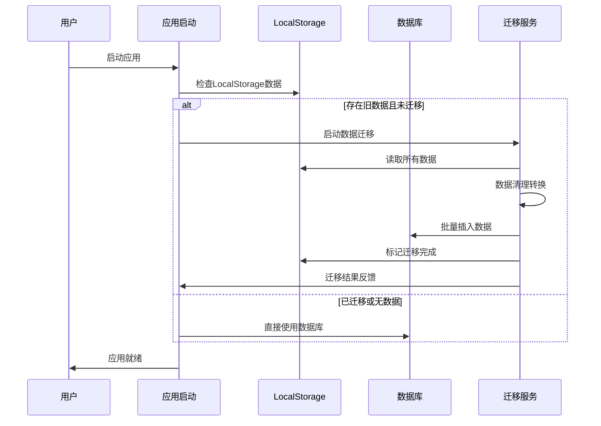
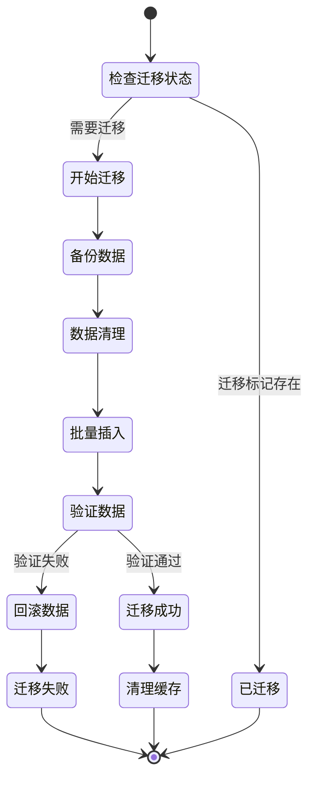
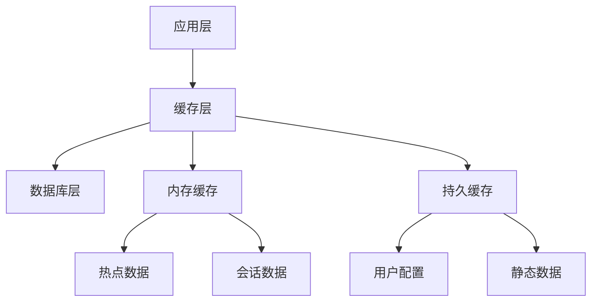

# 数据存储迁移方案

## 现有数据存储分析

### LocalStorage数据结构

当前应用使用LocalStorage存储所有数据，以JSON格式序列化存储：



### 现有数据模型详析

#### 1. Todo数据模型
```typescript
interface TodoItem {
  id: string                    // 主键
  title: string                // 标题
  description?: string         // 描述
  category: TodoCategory       // 分类枚举
  priority: TodoPriority       // 优先级枚举
  status: TodoStatus          // 状态枚举
  dueDate?: Date              // 截止日期
  completedAt?: Date          // 完成时间
  mood?: MoodType             // 心情枚举
  tags: string[]              // 标签数组
  createdAt: Date             // 创建时间
  updatedAt: Date             // 更新时间
  // 扩展字段
  handbookTemplates?: string[]
  completionStory?: string
  visualElements?: object
  handbookGenerated?: boolean
  handbookGeneratedAt?: Date
}
```

#### 2. 项目数据模型
```typescript
interface Project {
  id: string
  name: string
  description: string
  templateId: string
  thumbnail: string           // Base64或URL
  content: {
    title: string
    subtitle: string
    images: string[]          // Base64图片数组
    stickers: string[]
    filters: string[]
    text: string
    mood: string
    colors: {
      primary: string
      secondary: string
      text: string
    }
    ratio: string
    // 编辑器相关
    fontSize?: number
    fontStyle?: string
    textAlign?: string
    borderStyle?: string
    borderWidth?: number
    borderColor?: string
    borderRadius?: number
    adjustments?: object
    composited?: boolean
  }
  tags: string[]
  isPublic: boolean
  createdAt: string
  updatedAt: string
}
```

#### 3. 心情记录数据模型
```typescript
interface MoodRecord {
  id: string
  todoId: string              // 关联Todo ID
  mood: MoodType             // 心情枚举
  note?: string              // 备注
  timestamp: Date            // 时间戳
}

// 另一种心情记录格式
interface SimpleMoodRecord {
  id: string
  date: string               // YYYY-MM-DD格式
  mood: MoodId              // 简化心情ID
  intensity: number         // 强度1-10
  description: string
  tags: string[]
  image?: string
  cardProjectId?: string
  createdAt: string
}
```

#### 4. 手账相关数据模型
```typescript
interface TodoHandbook {
  id: string
  templateId: string
  name: string
  description: string
  todoData: TodoItem[]
  generatedContent: {
    elements: GeneratedElement[]
    layout: TemplateLayout
    metadata: HandbookMetadata
  }
  exportSettings: ExportSettings
  createdAt: Date
  updatedAt: Date
}
```

## 鸿蒙数据库设计

### 数据库选型

选择**关系型数据库**作为数据存储方案：

**优势分析：**
- ✅ 支持复杂查询和数据关联
- ✅ 事务支持，保证数据一致性
- ✅ 更好的性能表现
- ✅ 数据完整性约束
- ✅ 支持索引优化
- ✅ 标准SQL语法

### 数据库架构设计



### 详细表结构设计

#### 1. TODOS 表
```sql
CREATE TABLE todos (
    id INTEGER PRIMARY KEY AUTOINCREMENT,
    title TEXT NOT NULL,
    description TEXT,
    category TEXT NOT NULL CHECK(category IN ('学习', '生活', '工作', '娱乐')),
    priority TEXT NOT NULL CHECK(priority IN ('低', '中', '高')),
    status TEXT NOT NULL CHECK(status IN ('待办', '进行中', '已完成')),
    due_date INTEGER,  -- Unix timestamp
    completed_at INTEGER,  -- Unix timestamp
    mood TEXT CHECK(mood IN ('😄', '😊', '🤩', '😌', '😐', '😴', '😰', '😢', '😠')),
    tags TEXT,  -- JSON array as string
    created_at INTEGER NOT NULL,
    updated_at INTEGER NOT NULL,
    -- 扩展字段
    handbook_templates TEXT,  -- JSON array as string
    completion_story TEXT,
    visual_elements TEXT,  -- JSON object as string
    handbook_generated INTEGER DEFAULT 0,  -- boolean as integer
    handbook_generated_at INTEGER
);

-- 创建索引
CREATE INDEX idx_todos_status ON todos(status);
CREATE INDEX idx_todos_category ON todos(category);
CREATE INDEX idx_todos_due_date ON todos(due_date);
CREATE INDEX idx_todos_created_at ON todos(created_at);
```

#### 2. MOOD_RECORDS 表
```sql
CREATE TABLE mood_records (
    id INTEGER PRIMARY KEY AUTOINCREMENT,
    todo_id INTEGER,
    mood TEXT NOT NULL,
    note TEXT,
    timestamp INTEGER NOT NULL,
    record_type TEXT DEFAULT 'todo_mood',  -- 'todo_mood' or 'daily_mood'
    -- 日常心情记录字段
    date_string TEXT,  -- YYYY-MM-DD格式
    intensity INTEGER CHECK(intensity >= 1 AND intensity <= 10),
    description TEXT,
    tags TEXT,  -- JSON array as string
    image_path TEXT,
    card_project_id TEXT,
    FOREIGN KEY(todo_id) REFERENCES todos(id) ON DELETE CASCADE
);

-- 创建索引
CREATE INDEX idx_mood_records_todo_id ON mood_records(todo_id);
CREATE INDEX idx_mood_records_timestamp ON mood_records(timestamp);
CREATE INDEX idx_mood_records_date ON mood_records(date_string);
```

#### 3. PROJECTS 表
```sql
CREATE TABLE projects (
    id INTEGER PRIMARY KEY AUTOINCREMENT,
    name TEXT NOT NULL,
    description TEXT,
    template_id TEXT NOT NULL,
    thumbnail_path TEXT,  -- 本地文件路径
    content_json TEXT NOT NULL,  -- 项目内容JSON
    tags TEXT,  -- JSON array as string
    is_public INTEGER DEFAULT 0,  -- boolean as integer
    created_at INTEGER NOT NULL,
    updated_at INTEGER NOT NULL
);

-- 创建索引
CREATE INDEX idx_projects_template_id ON projects(template_id);
CREATE INDEX idx_projects_created_at ON projects(created_at);
CREATE INDEX idx_projects_is_public ON projects(is_public);
```

#### 4. 其他表结构
```sql
-- 手账表
CREATE TABLE handbooks (
    id INTEGER PRIMARY KEY AUTOINCREMENT,
    template_id TEXT NOT NULL,
    name TEXT NOT NULL,
    description TEXT,
    todo_data_json TEXT,  -- 关联的Todo数据
    generated_content_json TEXT,  -- 生成的内容
    export_settings_json TEXT,  -- 导出设置
    created_at INTEGER NOT NULL,
    updated_at INTEGER NOT NULL
);

-- 模板表
CREATE TABLE templates (
    id INTEGER PRIMARY KEY AUTOINCREMENT,
    template_id TEXT UNIQUE NOT NULL,  -- 业务ID
    name TEXT NOT NULL,
    description TEXT,
    type TEXT NOT NULL,
    category TEXT NOT NULL,
    layout_json TEXT NOT NULL,
    elements_json TEXT NOT NULL,
    data_mapping_json TEXT NOT NULL,
    is_active INTEGER DEFAULT 1,
    is_public INTEGER DEFAULT 0,
    author_id TEXT,
    version INTEGER DEFAULT 1,
    created_at INTEGER NOT NULL,
    updated_at INTEGER NOT NULL
);

-- 成就表
CREATE TABLE achievements (
    id INTEGER PRIMARY KEY AUTOINCREMENT,
    achievement_id TEXT UNIQUE NOT NULL,
    type TEXT NOT NULL,
    title TEXT NOT NULL,
    description TEXT,
    icon TEXT,
    unlocked_at INTEGER,
    progress INTEGER DEFAULT 0,
    max_progress INTEGER DEFAULT 1,
    is_unlocked INTEGER DEFAULT 0
);

-- 用户偏好设置表
CREATE TABLE user_preferences (
    id INTEGER PRIMARY KEY AUTOINCREMENT,
    key TEXT UNIQUE NOT NULL,
    value TEXT NOT NULL,
    data_type TEXT DEFAULT 'string',  -- 'string', 'number', 'boolean', 'json'
    updated_at INTEGER NOT NULL
);

-- 社交分享表
CREATE TABLE social_shares (
    id INTEGER PRIMARY KEY AUTOINCREMENT,
    todo_id INTEGER,
    platform TEXT NOT NULL CHECK(platform IN ('wechat', 'weibo', 'qq', 'douyin')),
    shared_at INTEGER NOT NULL,
    share_text TEXT,
    share_image_path TEXT,
    FOREIGN KEY(todo_id) REFERENCES todos(id) ON DELETE CASCADE
);
```

## 数据迁移策略

### 迁移流程设计



### 迁移实现代码框架

```typescript
// 数据迁移服务
class DataMigrationService {
  private db: RdbStore
  private migrationKey = 'data_migrated_v1'
  
  async checkAndMigrate(): Promise<boolean> {
    try {
      // 检查是否已迁移
      if (await this.isMigrated()) {
        console.log('数据已迁移，跳过迁移过程')
        return true
      }
      
      // 执行迁移
      await this.performMigration()
      
      // 标记迁移完成
      await this.markMigrated()
      
      return true
    } catch (error) {
      console.error('数据迁移失败:', error)
      return false
    }
  }
  
  private async performMigration(): Promise<void> {
    // 1. 迁移Todo数据
    await this.migrateTodos()
    
    // 2. 迁移心情记录
    await this.migrateMoodRecords()
    
    // 3. 迁移项目数据
    await this.migrateProjects()
    
    // 4. 迁移手账数据
    await this.migrateHandbooks()
    
    // 5. 迁移用户设置
    await this.migrateUserPreferences()
    
    // 6. 迁移其他数据
    await this.migrateOtherData()
  }
  
  private async migrateTodos(): Promise<void> {
    const todosData = this.getLocalStorageData('todos')
    if (!todosData) return
    
    const todos: TodoItem[] = JSON.parse(todosData)
    
    for (const todo of todos) {
      const valueBucket = this.todoToValueBucket(todo)
      await this.db.insert('todos', valueBucket)
    }
  }
  
  private todoToValueBucket(todo: TodoItem): ValuesBucket {
    return {
      title: todo.title,
      description: todo.description || '',
      category: todo.category,
      priority: todo.priority,
      status: todo.status,
      due_date: todo.dueDate ? todo.dueDate.getTime() : null,
      completed_at: todo.completedAt ? todo.completedAt.getTime() : null,
      mood: todo.mood || null,
      tags: JSON.stringify(todo.tags),
      created_at: todo.createdAt.getTime(),
      updated_at: todo.updatedAt.getTime(),
      handbook_templates: todo.handbookTemplates ? JSON.stringify(todo.handbookTemplates) : null,
      completion_story: todo.completionStory || null,
      visual_elements: todo.visualElements ? JSON.stringify(todo.visualElements) : null,
      handbook_generated: todo.handbookGenerated ? 1 : 0,
      handbook_generated_at: todo.handbookGeneratedAt ? todo.handbookGeneratedAt.getTime() : null
    }
  }
  
  private getLocalStorageData(key: string): string | null {
    try {
      return JSON.stringify(globalThis.localStorage?.getItem(key) || null)
    } catch {
      return null
    }
  }
}
```

### 数据清理与验证

#### 数据清理规则
```typescript
class DataCleanupService {
  // 清理无效的Todo数据
  cleanTodoData(todo: any): TodoItem | null {
    // 必需字段验证
    if (!todo.id || !todo.title || !todo.category) {
      return null
    }
    
    // 枚举值验证
    if (!this.isValidCategory(todo.category)) {
      todo.category = '生活'  // 默认分类
    }
    
    if (!this.isValidPriority(todo.priority)) {
      todo.priority = '中'  // 默认优先级
    }
    
    if (!this.isValidStatus(todo.status)) {
      todo.status = '待办'  // 默认状态
    }
    
    // 日期格式验证
    todo.createdAt = this.parseDate(todo.createdAt) || new Date()
    todo.updatedAt = this.parseDate(todo.updatedAt) || new Date()
    todo.dueDate = this.parseDate(todo.dueDate)
    todo.completedAt = this.parseDate(todo.completedAt)
    
    // 数组字段验证
    todo.tags = Array.isArray(todo.tags) ? todo.tags : []
    
    return todo as TodoItem
  }
  
  // 清理项目数据中的大文件
  cleanProjectContent(content: any): any {
    // 移除过大的base64图片
    if (content.images) {
      content.images = content.images.map((img: string) => {
        if (typeof img === 'string' && img.startsWith('data:') && img.length > 1024 * 1024) {
          // 超过1MB的图片转为空字符串，需要用户重新添加
          console.warn('检测到过大的图片数据，已清理')
          return ''
        }
        return img
      }).filter((img: string) => img.length > 0)
    }
    
    return content
  }
}
```

### 迁移进度与错误处理



## 数据访问层设计

### Repository模式实现

```typescript
// 基础Repository接口
interface BaseRepository<T> {
  findById(id: number): Promise<T | null>
  findAll(): Promise<T[]>
  save(entity: T): Promise<T>
  update(id: number, updates: Partial<T>): Promise<T>
  delete(id: number): Promise<boolean>
}

// Todo Repository实现
class TodoRepository implements BaseRepository<TodoItem> {
  constructor(private db: RdbStore) {}
  
  async findById(id: number): Promise<TodoItem | null> {
    const predicates = new RdbPredicates('todos')
    predicates.equalTo('id', id)
    
    const resultSet = await this.db.query(predicates)
    if (resultSet.goToFirstRow()) {
      return this.mapResultSetToTodo(resultSet)
    }
    return null
  }
  
  async findByStatus(status: TodoStatus): Promise<TodoItem[]> {
    const predicates = new RdbPredicates('todos')
    predicates.equalTo('status', status)
    predicates.orderByDesc('updated_at')
    
    const resultSet = await this.db.query(predicates)
    return this.mapResultSetToTodos(resultSet)
  }
  
  async searchTodos(query: string): Promise<TodoItem[]> {
    const predicates = new RdbPredicates('todos')
    predicates.like('title', `%${query}%`)
      .or()
      .like('description', `%${query}%`)
    
    const resultSet = await this.db.query(predicates)
    return this.mapResultSetToTodos(resultSet)
  }
  
  private mapResultSetToTodo(resultSet: ResultSet): TodoItem {
    return {
      id: resultSet.getString(resultSet.getColumnIndex('id')),
      title: resultSet.getString(resultSet.getColumnIndex('title')),
      description: resultSet.getString(resultSet.getColumnIndex('description')),
      category: resultSet.getString(resultSet.getColumnIndex('category')) as TodoCategory,
      priority: resultSet.getString(resultSet.getColumnIndex('priority')) as TodoPriority,
      status: resultSet.getString(resultSet.getColumnIndex('status')) as TodoStatus,
      dueDate: this.timestampToDate(resultSet.getLong(resultSet.getColumnIndex('due_date'))),
      completedAt: this.timestampToDate(resultSet.getLong(resultSet.getColumnIndex('completed_at'))),
      mood: resultSet.getString(resultSet.getColumnIndex('mood')) as MoodType,
      tags: JSON.parse(resultSet.getString(resultSet.getColumnIndex('tags')) || '[]'),
      createdAt: new Date(resultSet.getLong(resultSet.getColumnIndex('created_at'))),
      updatedAt: new Date(resultSet.getLong(resultSet.getColumnIndex('updated_at')))
    }
  }
}
```

## 性能优化策略

### 数据库优化

1. **索引策略**
   - 为常用查询字段创建索引
   - 复合索引优化多条件查询
   - 定期分析索引使用情况

2. **查询优化**
   - 使用prepared statements
   - 批量操作减少数据库访问
   - 分页查询大数据集

3. **事务管理**
   - 合理使用事务边界
   - 批量操作使用事务
   - 避免长事务

### 缓存策略



## 数据备份与恢复

### 备份策略
1. **自动备份**：定期备份用户数据
2. **手动备份**：用户主动触发备份
3. **增量备份**：只备份变更数据
4. **云端备份**：支持云端存储（可选）

### 恢复机制
1. **本地恢复**：从本地备份文件恢复
2. **版本回退**：支持多版本数据恢复
3. **选择性恢复**：允许用户选择要恢复的数据类型

---

**总结**：通过关系型数据库替代LocalStorage，不仅解决了存储限制问题，还提供了更强大的数据查询和管理能力。完善的迁移策略确保用户数据的平滑过渡，而优化的数据访问层则为应用提供了高性能的数据服务基础。
