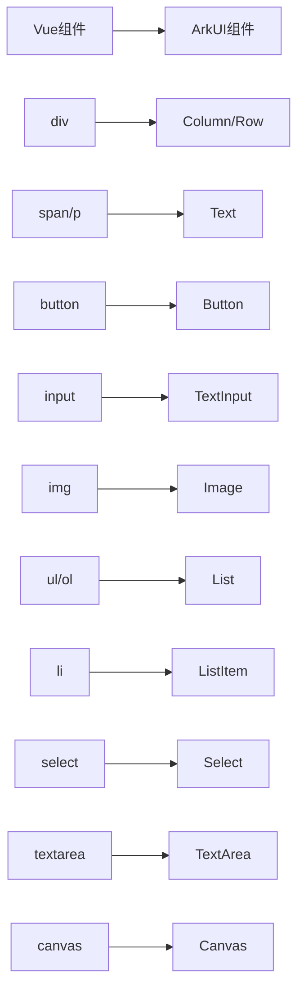
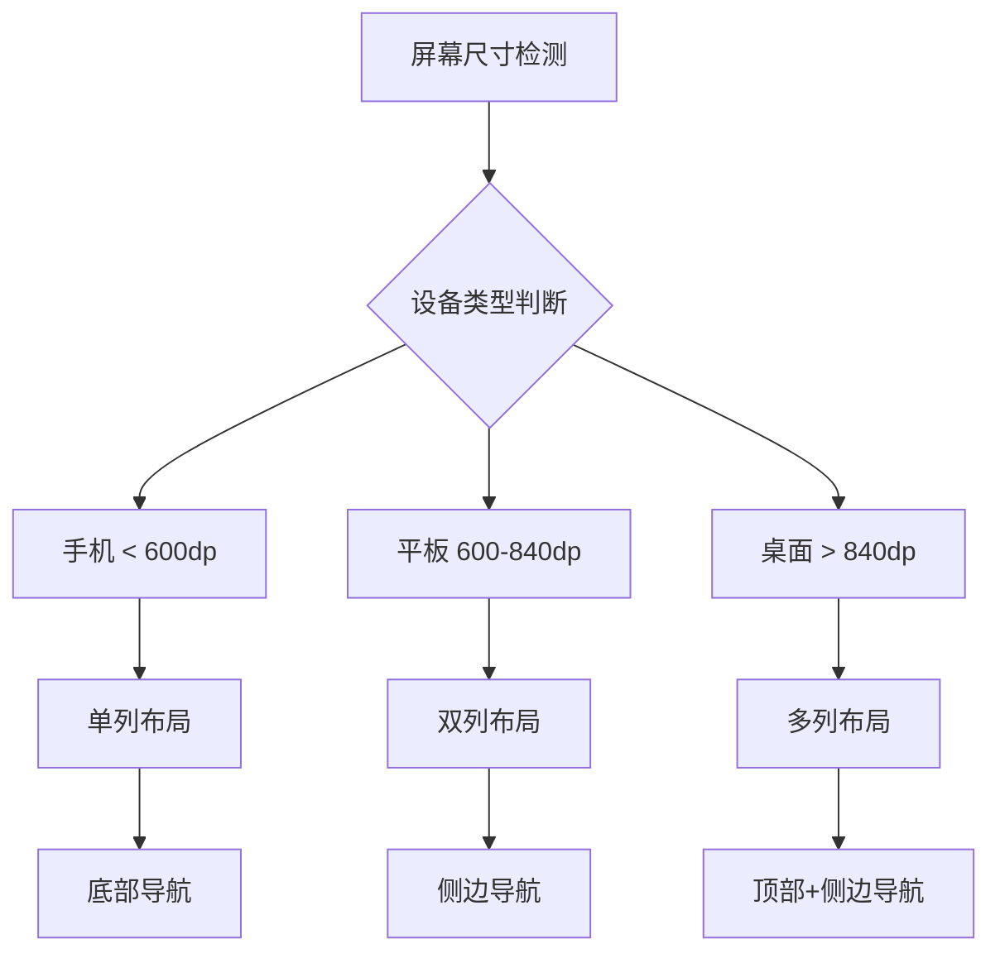

# UI组件适配方案

## Vue.js到ArkUI组件映射

### 布局组件对比

#### Vue.js布局方式
```vue
<template>
  <div class="container">
    <header class="header">
      <h1>标题</h1>
      <nav class="nav">
        <a href="/todo">待办</a>
        <a href="/mood">心情</a>
      </nav>
    </header>
    
    <main class="content">
      <aside class="sidebar">侧边栏</aside>
      <section class="main-area">主内容</section>
    </main>
    
    <footer class="footer">底部</footer>
  </div>
</template>

<style>
.container {
  display: flex;
  flex-direction: column;
  height: 100vh;
}

.content {
  display: flex;
  flex: 1;
}

.sidebar {
  width: 200px;
  background: #f5f5f5;
}

.main-area {
  flex: 1;
  padding: 20px;
}
</style>
```

#### ArkUI布局对应
```typescript
@Component
struct MainLayout {
  build() {
    Column() {
      // Header区域
      Row() {
        Text('标题')
          .fontSize(24)
          .fontWeight(FontWeight.Bold)
        
        Flex({ wrap: FlexWrap.NoWrap, alignItems: ItemAlign.Center }) {
          Text('待办').onClick(() => {/* 导航到待办页面 */})
          Text('心情').onClick(() => {/* 导航到心情页面 */})
        }
        .layoutWeight(1)
        .justifyContent(FlexAlign.End)
      }
      .width('100%')
      .height(60)
      .backgroundColor('#ffffff')
      .padding({ left: 16, right: 16 })
      
      // Content区域
      Flex() {
        // 侧边栏
        Column() {
          Text('侧边栏内容')
        }
        .width(200)
        .height('100%')
        .backgroundColor('#f5f5f5')
        
        // 主内容区域
        Column() {
          Text('主内容区域')
        }
        .layoutWeight(1)
        .padding(20)
      }
      .layoutWeight(1)
      
      // Footer区域
      Row() {
        Text('底部')
      }
      .width('100%')
      .height(50)
      .backgroundColor('#ffffff')
    }
    .width('100%')
    .height('100%')
  }
}
```

### 组件映射对照表



#### 详细组件映射

| Vue.js组件 | ArkUI组件 | 转换说明 | 示例 |
|-----------|----------|---------|------|
| `<div>` | `Column()` / `Row()` | 根据flex-direction选择 | 垂直布局用Column，水平用Row |
| `<span>` / `<p>` | `Text()` | 文本显示 | 字体、颜色等样式直接转换 |
| `<button>` | `Button()` | 按钮组件 | 事件处理方式不同 |
| `<input>` | `TextInput()` | 输入框 | 双向绑定语法不同 |
| `` | `Image()` | 图片显示 | 资源路径处理方式不同 |
| `<ul>`/`<ol>` | `List()` | 列表容器 | 需要配合ListItem使用 |
| `<li>` | `ListItem()` | 列表项 | 内嵌在List组件中 |

### 核心页面组件适配

#### 1. 首页(Home)组件适配

**Vue.js版本关键结构：**
```vue
<template>
  <div class="home">
    <!-- 欢迎区域 -->
    <section class="welcome-section">
      <h1>{{ greeting }}</h1>
      <p>{{ subTitle }}</p>
    </section>
    
    <!-- 快速操作 -->
    <section class="quick-actions">
      <div class="action-card" v-for="action in quickActions" :key="action.id">
        <div class="icon">{{ action.icon }}</div>
        <h3>{{ action.title }}</h3>
        <p>{{ action.description }}</p>
      </div>
    </section>
    
    <!-- 统计概览 -->
    <section class="stats-overview">
      <div class="stat-item" v-for="stat in stats" :key="stat.key">
        <span class="stat-number">{{ stat.value }}</span>
        <span class="stat-label">{{ stat.label }}</span>
      </div>
    </section>
  </div>
</template>
```

**ArkUI适配版本：**
```typescript
@Component
struct HomePage {
  @State greeting: string = '欢迎回来'
  @State subTitle: string = '开始记录美好生活'
  @State quickActions: QuickAction[] = [
    { id: '1', icon: '📝', title: '新建待办', description: '添加今日计划' },
    { id: '2', icon: '💭', title: '记录心情', description: '记录当前感受' },
    { id: '3', icon: '🎨', title: '创建项目', description: '开始新的创作' }
  ]
  @State stats: StatItem[] = [
    { key: 'todos', value: 12, label: '待办事项' },
    { key: 'completed', value: 8, label: '已完成' },
    { key: 'projects', value: 3, label: '项目数量' }
  ]
  
  build() {
    Scroll() {
      Column({ space: 24 }) {
        // 欢迎区域
        Column({ space: 8 }) {
          Text(this.greeting)
            .fontSize(28)
            .fontWeight(FontWeight.Bold)
            .fontColor('#333333')
          
          Text(this.subTitle)
            .fontSize(16)
            .fontColor('#666666')
        }
        .width('100%')
        .padding({ top: 40, bottom: 20 })
        
        // 快速操作
        Column({ space: 16 }) {
          Text('快速操作')
            .fontSize(20)
            .fontWeight(FontWeight.Medium)
            .width('100%')
            .textAlign(TextAlign.Start)
          
          Grid() {
            ForEach(this.quickActions, (action: QuickAction) => {
              GridItem() {
                this.ActionCard(action)
              }
            }, (action) => action.id)
          }
          .columnsTemplate('1fr 1fr 1fr')
          .rowsGap(12)
          .columnsGap(12)
        }
        .width('100%')
        .alignItems(HorizontalAlign.Start)
        
        // 统计概览
        Column({ space: 16 }) {
          Text('数据概览')
            .fontSize(20)
            .fontWeight(FontWeight.Medium)
            .width('100%')
            .textAlign(TextAlign.Start)
          
          Row() {
            ForEach(this.stats, (stat: StatItem) => {
              Column({ space: 4 }) {
                Text(stat.value.toString())
                  .fontSize(24)
                  .fontWeight(FontWeight.Bold)
                  .fontColor('#1890ff')
                
                Text(stat.label)
                  .fontSize(14)
                  .fontColor('#666666')
              }
              .layoutWeight(1)
            }, (stat) => stat.key)
          }
          .width('100%')
          .justifyContent(FlexAlign.SpaceAround)
        }
        .width('100%')
      }
      .width('100%')
      .padding({ left: 16, right: 16, bottom: 20 })
    }
    .width('100%')
    .height('100%')
  }
  
  @Builder ActionCard(action: QuickAction) {
    Column({ space: 8 }) {
      Text(action.icon)
        .fontSize(32)
      
      Text(action.title)
        .fontSize(16)
        .fontWeight(FontWeight.Medium)
        .fontColor('#333333')
      
      Text(action.description)
        .fontSize(12)
        .fontColor('#999999')
        .maxLines(2)
        .textOverflow({ overflow: TextOverflow.Ellipsis })
    }
    .width('100%')
    .height(120)
    .backgroundColor('#ffffff')
    .borderRadius(12)
    .padding(16)
    .shadow({
      radius: 4,
      color: 'rgba(0,0,0,0.1)',
      offsetX: 0,
      offsetY: 2
    })
    .onClick(() => {
      this.onActionTap(action)
    })
  }
  
  onActionTap(action: QuickAction) {
    // 处理快速操作点击事件
    switch (action.id) {
      case '1':
        // 导航到新建待办页面
        break
      case '2':
        // 导航到心情记录页面
        break
      case '3':
        // 导航到项目创建页面
        break
    }
  }
}

interface QuickAction {
  id: string
  icon: string
  title: string
  description: string
}

interface StatItem {
  key: string
  value: number
  label: string
}
```

#### 2. 待办列表(Todo)组件适配

**Vue.js核心逻辑：**
```vue
<template>
  <div class="todo-list">
    <!-- 筛选器 -->
    <div class="filters">
      <select v-model="currentFilter" @change="filterTodos">
        <option value="all">全部</option>
        <option value="pending">待办</option>
        <option value="completed">已完成</option>
      </select>
    </div>
    
    <!-- 待办列表 -->
    <div class="todo-items">
      <div 
        v-for="todo in filteredTodos" 
        :key="todo.id"
        class="todo-item"
        :class="{ completed: todo.status === '已完成' }"
      >
        <div class="todo-checkbox">
          <input 
            type="checkbox" 
            :checked="todo.status === '已完成'"
            @change="toggleTodo(todo.id)"
          />
        </div>
        <div class="todo-content">
          <h4>{{ todo.title }}</h4>
          <p>{{ todo.description }}</p>
          <div class="todo-meta">
            <span class="priority" :class="todo.priority">{{ todo.priority }}</span>
            <span class="category">{{ todo.category }}</span>
            <span class="due-date" v-if="todo.dueDate">{{ formatDate(todo.dueDate) }}</span>
          </div>
        </div>
        <div class="todo-actions">
          <button @click="editTodo(todo)">编辑</button>
          <button @click="deleteTodo(todo.id)">删除</button>
        </div>
      </div>
    </div>
  </div>
</template>
```

**ArkUI适配版本：**
```typescript
@Component
struct TodoListPage {
  @State currentFilter: string = 'all'
  @State todos: TodoItem[] = []
  @State filteredTodos: TodoItem[] = []
  
  aboutToAppear() {
    this.loadTodos()
    this.filterTodos()
  }
  
  build() {
    Column() {
      // 筛选器区域
      Row() {
        Text('筛选：')
          .fontSize(16)
          .fontColor('#333333')
        
        Select([
          { value: 'all', text: '全部' },
          { value: 'pending', text: '待办' },
          { value: 'completed', text: '已完成' }
        ])
          .value(this.currentFilter)
          .onSelect((index: number, value: string) => {
            this.currentFilter = value
            this.filterTodos()
          })
      }
      .width('100%')
      .padding({ left: 16, right: 16, top: 16, bottom: 8 })
      .justifyContent(FlexAlign.Start)
      
      // 待办列表
      List({ space: 8 }) {
        ForEach(this.filteredTodos, (todo: TodoItem) => {
          ListItem() {
            this.TodoItemCard(todo)
          }
        }, (todo) => todo.id)
      }
      .layoutWeight(1)
      .padding({ left: 16, right: 16 })
      .divider({
        strokeWidth: 1,
        color: '#f0f0f0',
        startMargin: 16,
        endMargin: 16
      })
    }
    .width('100%')
    .height('100%')
    .backgroundColor('#fafafa')
  }
  
  @Builder TodoItemCard(todo: TodoItem) {
    Row({ space: 12 }) {
      // 勾选框
      Checkbox({ name: `todo_${todo.id}` })
        .select(todo.status === '已完成')
        .onChange((isChecked: boolean) => {
          this.toggleTodoStatus(todo.id, isChecked)
        })
      
      // 内容区域
      Column({ space: 8 }) {
        // 标题
        Text(todo.title)
          .fontSize(16)
          .fontWeight(FontWeight.Medium)
          .fontColor(todo.status === '已完成' ? '#999999' : '#333333')
          .decoration({
            type: todo.status === '已完成' ? TextDecorationType.LineThrough : TextDecorationType.None
          })
          .width('100%')
          .textAlign(TextAlign.Start)
        
        // 描述
        if (todo.description && todo.description.length > 0) {
          Text(todo.description)
            .fontSize(14)
            .fontColor('#666666')
            .maxLines(2)
            .textOverflow({ overflow: TextOverflow.Ellipsis })
            .width('100%')
            .textAlign(TextAlign.Start)
        }
        
        // 元信息
        Row({ space: 8 }) {
          // 优先级标签
          Text(todo.priority)
            .fontSize(12)
            .fontColor('#ffffff')
            .backgroundColor(this.getPriorityColor(todo.priority))
            .padding({ left: 8, right: 8, top: 2, bottom: 2 })
            .borderRadius(4)
          
          // 分类标签
          Text(todo.category)
            .fontSize(12)
            .fontColor('#666666')
            .backgroundColor('#f0f0f0')
            .padding({ left: 8, right: 8, top: 2, bottom: 2 })
            .borderRadius(4)
          
          // 截止日期
          if (todo.dueDate) {
            Text(this.formatDate(todo.dueDate))
              .fontSize(12)
              .fontColor('#ff6b6b')
              .backgroundColor('#fff0f0')
              .padding({ left: 8, right: 8, top: 2, bottom: 2 })
              .borderRadius(4)
          }
        }
        .width('100%')
        .justifyContent(FlexAlign.Start)
      }
      .layoutWeight(1)
      .alignItems(HorizontalAlign.Start)
      
      // 操作按钮
      Column({ space: 8 }) {
        Button('编辑')
          .width(60)
          .height(32)
          .fontSize(12)
          .type(ButtonType.Normal)
          .backgroundColor('#1890ff')
          .onClick(() => {
            this.editTodo(todo)
          })
        
        Button('删除')
          .width(60)
          .height(32)
          .fontSize(12)
          .type(ButtonType.Normal)
          .backgroundColor('#ff4d4f')
          .onClick(() => {
            this.deleteTodo(todo.id)
          })
      }
    }
    .width('100%')
    .padding(16)
    .backgroundColor('#ffffff')
    .borderRadius(8)
    .shadow({
      radius: 2,
      color: 'rgba(0,0,0,0.05)',
      offsetX: 0,
      offsetY: 1
    })
  }
  
  // 筛选待办事项
  filterTodos() {
    switch (this.currentFilter) {
      case 'pending':
        this.filteredTodos = this.todos.filter(todo => todo.status !== '已完成')
        break
      case 'completed':
        this.filteredTodos = this.todos.filter(todo => todo.status === '已完成')
        break
      default:
        this.filteredTodos = [...this.todos]
    }
  }
  
  // 切换待办状态
  toggleTodoStatus(todoId: string, isCompleted: boolean) {
    const todoIndex = this.todos.findIndex(todo => todo.id === todoId)
    if (todoIndex >= 0) {
      this.todos[todoIndex].status = isCompleted ? '已完成' : '待办'
      this.todos[todoIndex].updatedAt = new Date()
      if (isCompleted) {
        this.todos[todoIndex].completedAt = new Date()
      } else {
        this.todos[todoIndex].completedAt = undefined
      }
      this.filterTodos()
      // 保存到数据库
      this.saveTodoToDatabase(this.todos[todoIndex])
    }
  }
  
  // 获取优先级颜色
  getPriorityColor(priority: string): string {
    switch (priority) {
      case '高':
        return '#ff4d4f'
      case '中':
        return '#faad14'
      case '低':
        return '#52c41a'
      default:
        return '#d9d9d9'
    }
  }
  
  // 格式化日期
  formatDate(date: Date): string {
    const month = (date.getMonth() + 1).toString().padStart(2, '0')
    const day = date.getDate().toString().padStart(2, '0')
    return `${month}-${day}`
  }
  
  // 编辑待办
  editTodo(todo: TodoItem) {
    // 导航到编辑页面或显示编辑弹窗
  }
  
  // 删除待办
  deleteTodo(todoId: string) {
    // 显示确认删除弹窗，确认后删除
  }
  
  // 加载待办数据
  async loadTodos() {
    // 从数据库或状态管理中加载待办数据
    // this.todos = await todoRepository.findAll()
  }
  
  // 保存待办到数据库
  async saveTodoToDatabase(todo: TodoItem) {
    // 保存到数据库
    // await todoRepository.save(todo)
  }
}
```

### 样式系统适配

#### CSS到ArkTS样式转换

**CSS Flexbox布局：**
```css
.container {
  display: flex;
  flex-direction: column;
  justify-content: center;
  align-items: center;
  gap: 16px;
  padding: 20px;
  background-color: #f5f5f5;
  border-radius: 8px;
  box-shadow: 0 2px 8px rgba(0,0,0,0.1);
}

.item {
  flex: 1;
  min-width: 200px;
  max-width: 300px;
  padding: 16px;
  margin: 8px;
  background: linear-gradient(135deg, #667eea 0%, #764ba2 100%);
  border: 1px solid #ddd;
  border-radius: 4px;
  transition: all 0.3s ease;
}

.item:hover {
  transform: translateY(-2px);
  box-shadow: 0 4px 12px rgba(0,0,0,0.15);
}
```

**ArkTS样式对应：**
```typescript
@Component
struct StyledContainer {
  @State isHovered: boolean = false
  
  build() {
    Column({ space: 16 }) {
      // 对应 .container
      Column() {
        // 子元素
        ForEach(this.items, (item) => {
          Column() {
            Text(item.content)
          }
          // 对应 .item 样式
          .layoutWeight(1)
          .constraintSize({ minWidth: 200, maxWidth: 300 })
          .padding(16)
          .margin(8)
          .linearGradient({
            angle: 135,
            colors: [['#667eea', 0.0], ['#764ba2', 1.0]]
          })
          .border({
            width: 1,
            color: '#ddd',
            radius: 4
          })
          .shadow({
            radius: this.isHovered ? 12 : 8,
            color: this.isHovered ? 'rgba(0,0,0,0.15)' : 'rgba(0,0,0,0.1)',
            offsetX: 0,
            offsetY: this.isHovered ? 4 : 2
          })
          .animation({
            duration: 300,
            curve: Curve.Ease,
            iterations: 1,
            playMode: PlayMode.Normal
          })
          .translate({ 
            x: 0, 
            y: this.isHovered ? -2 : 0 
          })
          .onHover((isHover: boolean) => {
            this.isHovered = isHover
          })
        })
      }
      .justifyContent(FlexAlign.Center)
      .alignItems(HorizontalAlign.Center)
      .padding(20)
      .backgroundColor('#f5f5f5')
      .borderRadius(8)
      .shadow({
        radius: 8,
        color: 'rgba(0,0,0,0.1)',
        offsetX: 0,
        offsetY: 2
      })
    }
  }
}
```

### 响应式设计适配



**响应式布局实现：**
```typescript
@Component
struct ResponsiveLayout {
  @StorageLink('windowWidth') windowWidth: number = 360
  @StorageLink('windowHeight') windowHeight: number = 800
  
  // 计算列数
  get columnCount(): number {
    if (this.windowWidth < 600) {
      return 1  // 手机：单列
    } else if (this.windowWidth < 840) {
      return 2  // 平板：双列
    } else {
      return 3  // 桌面：三列
    }
  }
  
  // 计算导航类型
  get navigationType(): 'bottom' | 'side' | 'top' {
    if (this.windowWidth < 600) {
      return 'bottom'  // 手机：底部导航
    } else if (this.windowWidth < 840) {
      return 'side'    // 平板：侧边导航
    } else {
      return 'top'     // 桌面：顶部导航
    }
  }
  
  build() {
    if (this.navigationType === 'bottom') {
      this.MobileLayout()
    } else if (this.navigationType === 'side') {
      this.TabletLayout()
    } else {
      this.DesktopLayout()
    }
  }
  
  @Builder MobileLayout() {
    Column() {
      // 主内容区域
      Scroll() {
        Grid() {
          ForEach(this.items, (item) => {
            GridItem() {
              this.ItemCard(item)
            }
          })
        }
        .columnsTemplate('1fr')
        .rowsGap(12)
      }
      .layoutWeight(1)
      
      // 底部导航
      this.BottomNavigation()
    }
  }
  
  @Builder TabletLayout() {
    Row() {
      // 侧边导航
      this.SideNavigation()
      
      // 主内容区域
      Grid() {
        ForEach(this.items, (item) => {
          GridItem() {
            this.ItemCard(item)
          }
        })
      }
      .columnsTemplate('1fr 1fr')
      .layoutWeight(1)
    }
  }
  
  @Builder DesktopLayout() {
    Column() {
      // 顶部导航
      this.TopNavigation()
      
      // 主内容区域
      Grid() {
        ForEach(this.items, (item) => {
          GridItem() {
            this.ItemCard(item)
          }
        })
      }
      .columnsTemplate('1fr 1fr 1fr')
      .layoutWeight(1)
    }
  }
}
```

## 动画与过渡效果

### Vue.js过渡动画
```vue
<template>
  <transition name="fade">
    <div v-if="show" class="modal">
      <!-- 模态框内容 -->
    </div>
  </transition>
</template>

<style>
.fade-enter-active, .fade-leave-active {
  transition: opacity 0.3s ease;
}
.fade-enter-from, .fade-leave-to {
  opacity: 0;
}
</style>
```

### ArkTS动画对应
```typescript
@Component
struct AnimatedModal {
  @State show: boolean = false
  @State opacity: number = 0
  
  showModal() {
    this.show = true
    animateTo({
      duration: 300,
      curve: Curve.Ease,
    }, () => {
      this.opacity = 1
    })
  }
  
  hideModal() {
    animateTo({
      duration: 300,
      curve: Curve.Ease,
    }, () => {
      this.opacity = 0
    })
    
    // 动画完成后隐藏组件
    setTimeout(() => {
      this.show = false
    }, 300)
  }
  
  build() {
    if (this.show) {
      Column() {
        Text('模态框内容')
      }
      .width('100%')
      .height('100%')
      .backgroundColor('rgba(0,0,0,0.5)')
      .opacity(this.opacity)
    }
  }
}
```

## 主题系统适配

### Vue.js CSS变量主题
```css
:root {
  --primary-color: #1890ff;
  --text-color: #333333;
  --background-color: #ffffff;
  --border-radius: 4px;
}

[data-theme="dark"] {
  --primary-color: #177ddc;
  --text-color: #ffffff;
  --background-color: #141414;
}

.button {
  background-color: var(--primary-color);
  color: var(--text-color);
  border-radius: var(--border-radius);
}
```

### ArkTS主题系统
```typescript
// 主题定义
interface AppTheme {
  primaryColor: string
  textColor: string
  backgroundColor: string
  borderRadius: number
}

class ThemeManager {
  static lightTheme: AppTheme = {
    primaryColor: '#1890ff',
    textColor: '#333333', 
    backgroundColor: '#ffffff',
    borderRadius: 4
  }
  
  static darkTheme: AppTheme = {
    primaryColor: '#177ddc',
    textColor: '#ffffff',
    backgroundColor: '#141414', 
    borderRadius: 4
  }
  
  @StorageLink('currentTheme') 
  static currentTheme: AppTheme = ThemeManager.lightTheme
}

@Component
struct ThemedButton {
  @StorageLink('currentTheme') currentTheme: AppTheme = ThemeManager.lightTheme
  
  build() {
    Button('主题按钮')
      .backgroundColor(this.currentTheme.primaryColor)
      .fontColor(this.currentTheme.textColor)
      .borderRadius(this.currentTheme.borderRadius)
  }
}
```

---

**总结**：从Vue.js到ArkUI的组件适配需要重新理解声明式UI的构建方式，虽然概念相似，但语法和实现细节有较大差异。关键在于理解ArkUI的布局系统、组件体系和状态管理机制，通过合理的抽象和封装，可以保持原有的用户体验同时获得原生应用的性能优势。
