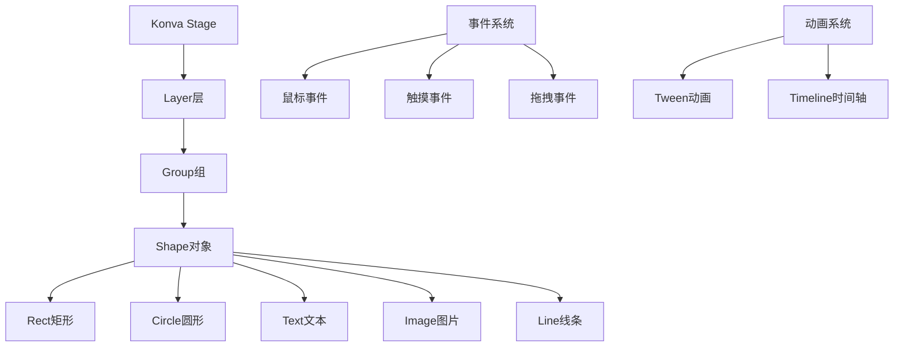
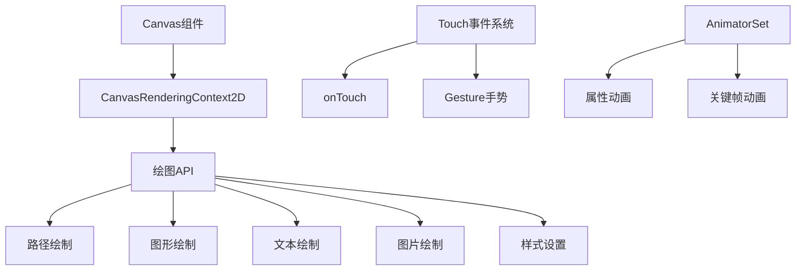
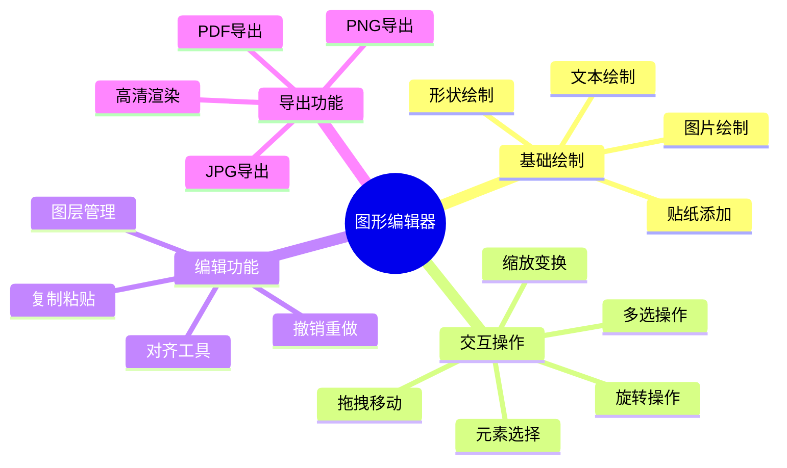
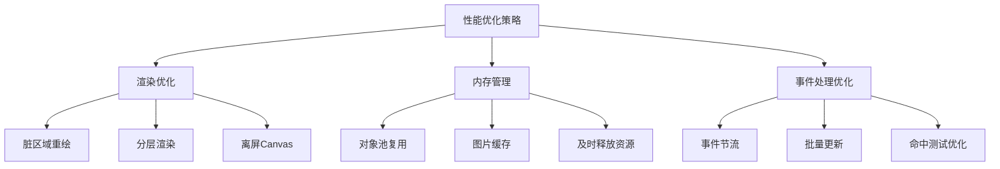

# 图形绘制系统迁移方案

## Konva.js vs 鸿蒙Canvas对比分析

### Konva.js架构特点



**Konva.js核心优势：**
- 🎨 丰富的形状库和绘制API
- 🖱️ 完整的事件处理系统
- 🔄 强大的变换和动画能力
- 📱 良好的移动端支持
- 🎯 高性能的渲染优化

### 鸿蒙Canvas系统架构



**鸿蒙Canvas特点：**
- ✅ 原生性能优势
- ✅ 系统深度集成
- ✅ 内存管理优化
- ❌ API相对较少
- ❌ 需要手动实现高级功能

## 当前项目中的图形编辑器分析

### KonvaCanvas组件结构

从项目中找到的Canvas组件位于：`src/components/editor/KonvaCanvas.vue`

```typescript
// 基于现有代码结构分析
interface CanvasElement {
  id: string
  type: 'text' | 'image' | 'shape' | 'sticker'
  x: number
  y: number
  width: number
  height: number
  rotation: number
  scaleX: number
  scaleY: number
  // 样式属性
  fill?: string
  stroke?: string
  strokeWidth?: number
  opacity: number
  // 文本特有属性
  text?: string
  fontSize?: number
  fontFamily?: string
  fontStyle?: string
  textAlign?: string
  // 图片特有属性
  src?: string
  // 交互状态
  draggable: boolean
  visible: boolean
  listening: boolean
}

interface CanvasState {
  elements: CanvasElement[]
  selectedElementIds: string[]
  canvasSize: { width: number, height: number }
  zoom: number
  history: CanvasElement[][]
  historyIndex: number
}
```

### 核心功能需求分析

通过分析项目代码，图形编辑器需要实现以下核心功能：



## 鸿蒙Canvas迁移方案

### 1. 核心架构设计

```typescript
// Canvas管理器 - 替代Konva Stage
@Component
struct HarmonyCanvasEditor {
  @State private canvasWidth: number = 400
  @State private canvasHeight: number = 600
  @State private elements: CanvasElement[] = []
  @State private selectedElements: string[] = []
  @State private isDragging: boolean = false
  @State private dragStartPos: Position = { x: 0, y: 0 }
  
  private settings: RenderingContextSettings = new RenderingContextSettings(true)
  private context: CanvasRenderingContext2D = new CanvasRenderingContext2D(this.settings)
  
  build() {
    Column() {
      // 工具栏
      this.ToolbarSection()
      
      // 画布区域
      Canvas(this.context)
        .width(this.canvasWidth)
        .height(this.canvasHeight)
        .backgroundColor('#ffffff')
        .border({ width: 1, color: '#e0e0e0' })
        .onReady(() => {
          this.initCanvas()
        })
        .onTouch((event: TouchEvent) => {
          this.handleTouchEvent(event)
        })
      
      // 属性面板
      this.PropertiesPanel()
    }
    .width('100%')
    .height('100%')
  }
  
  // 初始化画布
  private initCanvas() {
    this.renderAllElements()
  }
  
  // 渲染所有元素
  private renderAllElements() {
    // 清空画布
    this.context.clearRect(0, 0, this.canvasWidth, this.canvasHeight)
    
    // 按z-index顺序渲染元素
    const sortedElements = [...this.elements].sort((a, b) => a.zIndex - b.zIndex)
    
    for (const element of sortedElements) {
      this.renderElement(element)
      
      // 如果元素被选中，绘制选中框
      if (this.selectedElements.includes(element.id)) {
        this.renderSelectionBox(element)
      }
    }
  }
}
```

### 2. 元素渲染系统

```typescript
// 元素渲染器 - 替代Konva Shape系统
class ElementRenderer {
  private context: CanvasRenderingContext2D
  
  constructor(context: CanvasRenderingContext2D) {
    this.context = context
  }
  
  // 渲染文本元素
  renderText(element: TextElement) {
    this.context.save()
    
    // 应用变换
    this.applyTransform(element)
    
    // 设置文本样式
    this.context.font = `${element.fontStyle} ${element.fontSize}px ${element.fontFamily}`
    this.context.fillStyle = element.fill || '#000000'
    this.context.textAlign = element.textAlign || 'left'
    this.context.textBaseline = 'top'
    this.context.globalAlpha = element.opacity
    
    // 绘制文本
    const lines = element.text.split('\n')
    const lineHeight = element.fontSize * 1.2
    
    for (let i = 0; i < lines.length; i++) {
      this.context.fillText(lines[i], 0, i * lineHeight)
    }
    
    this.context.restore()
  }
  
  // 渲染图片元素
  async renderImage(element: ImageElement) {
    if (!element.imageData) {
      await this.loadImageData(element)
    }
    
    this.context.save()
    this.applyTransform(element)
    
    this.context.globalAlpha = element.opacity
    
    // 绘制图片
    if (element.imageData) {
      this.context.drawImage(
        element.imageData,
        0, 0,
        element.width, element.height
      )
    }
    
    this.context.restore()
  }
  
  // 渲染矩形元素
  renderRectangle(element: RectangleElement) {
    this.context.save()
    this.applyTransform(element)
    
    this.context.globalAlpha = element.opacity
    
    // 填充
    if (element.fill) {
      this.context.fillStyle = element.fill
      this.context.fillRect(0, 0, element.width, element.height)
    }
    
    // 描边
    if (element.stroke && element.strokeWidth > 0) {
      this.context.strokeStyle = element.stroke
      this.context.lineWidth = element.strokeWidth
      this.context.strokeRect(0, 0, element.width, element.height)
    }
    
    this.context.restore()
  }
  
  // 渲染圆形元素
  renderCircle(element: CircleElement) {
    this.context.save()
    this.applyTransform(element)
    
    this.context.globalAlpha = element.opacity
    
    // 绘制圆形路径
    this.context.beginPath()
    this.context.arc(
      element.width / 2,
      element.height / 2,
      Math.min(element.width, element.height) / 2,
      0, 2 * Math.PI
    )
    
    // 填充
    if (element.fill) {
      this.context.fillStyle = element.fill
      this.context.fill()
    }
    
    // 描边
    if (element.stroke && element.strokeWidth > 0) {
      this.context.strokeStyle = element.stroke
      this.context.lineWidth = element.strokeWidth
      this.context.stroke()
    }
    
    this.context.restore()
  }
  
  // 应用元素变换
  private applyTransform(element: CanvasElement) {
    // 移动到元素位置
    this.context.translate(element.x, element.y)
    
    // 旋转
    if (element.rotation !== 0) {
      this.context.rotate(element.rotation * Math.PI / 180)
    }
    
    // 缩放
    if (element.scaleX !== 1 || element.scaleY !== 1) {
      this.context.scale(element.scaleX, element.scaleY)
    }
  }
  
  // 加载图片数据
  private async loadImageData(element: ImageElement): Promise<void> {
    return new Promise((resolve, reject) => {
      const img = new Image()
      img.onload = () => {
        element.imageData = img
        resolve()
      }
      img.onerror = reject
      img.src = element.src
    })
  }
}
```

### 3. 交互事件处理系统

```typescript
// 事件处理器 - 替代Konva事件系统
class CanvasInteractionHandler {
  private canvas: HarmonyCanvasEditor
  private isDragging: boolean = false
  private dragTarget: CanvasElement | null = null
  private dragStartPos: Position = { x: 0, y: 0 }
  private elementStartPos: Position = { x: 0, y: 0 }
  
  constructor(canvas: HarmonyCanvasEditor) {
    this.canvas = canvas
  }
  
  handleTouchEvent(event: TouchEvent) {
    const touch = event.touches[0]
    const canvasPos = this.getCanvasPosition(touch)
    
    switch (event.type) {
      case TouchType.Down:
        this.handleTouchDown(canvasPos)
        break
      case TouchType.Move:
        this.handleTouchMove(canvasPos)
        break
      case TouchType.Up:
        this.handleTouchUp(canvasPos)
        break
    }
  }
  
  private handleTouchDown(position: Position) {
    // 检测点击的元素
    const hitElement = this.hitTest(position)
    
    if (hitElement) {
      // 选中元素
      this.canvas.selectElement(hitElement.id)
      
      // 开始拖拽
      this.isDragging = true
      this.dragTarget = hitElement
      this.dragStartPos = position
      this.elementStartPos = { x: hitElement.x, y: hitElement.y }
    } else {
      // 清空选择
      this.canvas.clearSelection()
    }
  }
  
  private handleTouchMove(position: Position) {
    if (this.isDragging && this.dragTarget) {
      // 计算移动偏移
      const deltaX = position.x - this.dragStartPos.x
      const deltaY = position.y - this.dragStartPos.y
      
      // 更新元素位置
      this.dragTarget.x = this.elementStartPos.x + deltaX
      this.dragTarget.y = this.elementStartPos.y + deltaY
      
      // 重新渲染
      this.canvas.renderAllElements()
    }
  }
  
  private handleTouchUp(position: Position) {
    if (this.isDragging && this.dragTarget) {
      // 结束拖拽
      this.isDragging = false
      
      // 添加到历史记录
      this.canvas.addToHistory()
      
      this.dragTarget = null
    }
  }
  
  // 碰撞检测 - 判断点击位置是否在元素内
  private hitTest(position: Position): CanvasElement | null {
    // 从上到下检测元素（z-index从大到小）
    const sortedElements = [...this.canvas.elements]
      .sort((a, b) => b.zIndex - a.zIndex)
    
    for (const element of sortedElements) {
      if (this.isPointInElement(position, element)) {
        return element
      }
    }
    
    return null
  }
  
  // 检测点是否在元素内
  private isPointInElement(point: Position, element: CanvasElement): boolean {
    // 考虑旋转和缩放的情况下进行碰撞检测
    const bounds = this.getElementBounds(element)
    
    return point.x >= bounds.left &&
           point.x <= bounds.right &&
           point.y >= bounds.top &&
           point.y <= bounds.bottom
  }
  
  // 获取元素边界框
  private getElementBounds(element: CanvasElement): Bounds {
    // 简化版本，不考虑旋转
    return {
      left: element.x,
      top: element.y,
      right: element.x + element.width * element.scaleX,
      bottom: element.y + element.height * element.scaleY
    }
  }
  
  // 获取画布坐标
  private getCanvasPosition(touch: TouchObject): Position {
    // 这里需要根据实际的Canvas组件位置计算相对坐标
    return {
      x: touch.x,
      y: touch.y
    }
  }
}

interface Position {
  x: number
  y: number
}

interface Bounds {
  left: number
  top: number
  right: number
  bottom: number
}
```

### 4. 选择和变换控制

```typescript
// 选择控制器 - 替代Konva Transformer
class SelectionController {
  private canvas: HarmonyCanvasEditor
  private context: CanvasRenderingContext2D
  
  constructor(canvas: HarmonyCanvasEditor, context: CanvasRenderingContext2D) {
    this.canvas = canvas
    this.context = context
  }
  
  // 绘制选中框
  renderSelectionBox(element: CanvasElement) {
    this.context.save()
    
    // 设置选中框样式
    this.context.strokeStyle = '#1890ff'
    this.context.lineWidth = 2
    this.context.setLineDash([5, 5])
    
    // 绘制边框
    const bounds = this.getElementBounds(element)
    this.context.strokeRect(
      bounds.left - 2,
      bounds.top - 2,
      bounds.right - bounds.left + 4,
      bounds.bottom - bounds.top + 4
    )
    
    // 绘制控制点
    this.renderControlPoints(bounds)
    
    this.context.restore()
  }
  
  // 绘制变换控制点
  private renderControlPoints(bounds: Bounds) {
    const controlPoints = this.getControlPoints(bounds)
    
    this.context.fillStyle = '#1890ff'
    this.context.strokeStyle = '#ffffff'
    this.context.lineWidth = 1
    this.context.setLineDash([])
    
    for (const point of controlPoints) {
      // 绘制控制点
      this.context.beginPath()
      this.context.arc(point.x, point.y, 6, 0, 2 * Math.PI)
      this.context.fill()
      this.context.stroke()
    }
  }
  
  // 获取控制点位置
  private getControlPoints(bounds: Bounds): Position[] {
    const { left, top, right, bottom } = bounds
    const centerX = (left + right) / 2
    const centerY = (top + bottom) / 2
    
    return [
      // 四个角的控制点
      { x: left, y: top },      // 左上
      { x: right, y: top },     // 右上
      { x: right, y: bottom },  // 右下
      { x: left, y: bottom },   // 左下
      // 四条边的中点控制点
      { x: centerX, y: top },    // 上中
      { x: right, y: centerY },  // 右中
      { x: centerX, y: bottom }, // 下中
      { x: left, y: centerY },   // 左中
    ]
  }
  
  // 检测控制点点击
  getHitControlPoint(position: Position, element: CanvasElement): string | null {
    const bounds = this.getElementBounds(element)
    const controlPoints = this.getControlPoints(bounds)
    
    const pointNames = [
      'top-left', 'top-right', 'bottom-right', 'bottom-left',
      'top-center', 'center-right', 'bottom-center', 'center-left'
    ]
    
    for (let i = 0; i < controlPoints.length; i++) {
      const point = controlPoints[i]
      const distance = Math.sqrt(
        Math.pow(position.x - point.x, 2) + 
        Math.pow(position.y - point.y, 2)
      )
      
      if (distance <= 8) {
        return pointNames[i]
      }
    }
    
    return null
  }
}
```

### 5. 历史记录和撤销重做

```typescript
// 历史管理器
class HistoryManager {
  private history: CanvasState[] = []
  private currentIndex: number = -1
  private maxHistorySize: number = 50
  
  // 添加历史状态
  addState(state: CanvasState) {
    // 如果当前不在最新状态，删除后面的历史
    if (this.currentIndex < this.history.length - 1) {
      this.history = this.history.slice(0, this.currentIndex + 1)
    }
    
    // 添加新状态
    this.history.push(this.cloneState(state))
    
    // 限制历史记录数量
    if (this.history.length > this.maxHistorySize) {
      this.history.shift()
    } else {
      this.currentIndex++
    }
  }
  
  // 撤销
  undo(): CanvasState | null {
    if (this.canUndo()) {
      this.currentIndex--
      return this.cloneState(this.history[this.currentIndex])
    }
    return null
  }
  
  // 重做
  redo(): CanvasState | null {
    if (this.canRedo()) {
      this.currentIndex++
      return this.cloneState(this.history[this.currentIndex])
    }
    return null
  }
  
  // 是否可以撤销
  canUndo(): boolean {
    return this.currentIndex > 0
  }
  
  // 是否可以重做
  canRedo(): boolean {
    return this.currentIndex < this.history.length - 1
  }
  
  // 深拷贝状态
  private cloneState(state: CanvasState): CanvasState {
    return JSON.parse(JSON.stringify(state))
  }
  
  // 清空历史
  clear() {
    this.history = []
    this.currentIndex = -1
  }
}
```

### 6. 导出功能实现

```typescript
// 导出管理器
class ExportManager {
  private canvas: HarmonyCanvasEditor
  
  constructor(canvas: HarmonyCanvasEditor) {
    this.canvas = canvas
  }
  
  // 导出为PNG
  async exportToPNG(quality: number = 1.0): Promise<string> {
    // 创建临时高分辨率Canvas
    const exportWidth = this.canvas.canvasWidth * quality
    const exportHeight = this.canvas.canvasHeight * quality
    
    const exportSettings = new RenderingContextSettings(true)
    const exportContext = new CanvasRenderingContext2D(exportSettings)
    
    // 设置高分辨率画布
    exportContext.scale(quality, quality)
    
    // 绘制所有元素到导出画布
    await this.renderToContext(exportContext)
    
    // 转换为Base64
    return exportContext.toDataURL('image/png')
  }
  
  // 导出为JPG
  async exportToJPG(quality: number = 0.9): Promise<string> {
    const exportSettings = new RenderingContextSettings(true)
    const exportContext = new CanvasRenderingContext2D(exportSettings)
    
    // 先绘制白色背景（JPG不支持透明）
    exportContext.fillStyle = '#ffffff'
    exportContext.fillRect(0, 0, this.canvas.canvasWidth, this.canvas.canvasHeight)
    
    // 绘制所有元素
    await this.renderToContext(exportContext)
    
    return exportContext.toDataURL('image/jpeg', quality)
  }
  
  // 导出为PDF (需要额外实现PDF生成逻辑)
  async exportToPDF(): Promise<Uint8Array> {
    // PDF生成需要使用专门的PDF库
    // 这里提供接口框架
    throw new Error('PDF export not implemented yet')
  }
  
  // 在指定上下文中渲染所有元素
  private async renderToContext(context: CanvasRenderingContext2D) {
    const renderer = new ElementRenderer(context)
    
    // 按z-index顺序渲染所有元素
    const sortedElements = [...this.canvas.elements]
      .sort((a, b) => a.zIndex - b.zIndex)
    
    for (const element of sortedElements) {
      switch (element.type) {
        case 'text':
          renderer.renderText(element as TextElement)
          break
        case 'image':
          await renderer.renderImage(element as ImageElement)
          break
        case 'rectangle':
          renderer.renderRectangle(element as RectangleElement)
          break
        case 'circle':
          renderer.renderCircle(element as CircleElement)
          break
      }
    }
  }
}
```

## 性能优化策略

### 1. 渲染优化



### 2. 实现细节

```typescript
// 性能优化管理器
class PerformanceOptimizer {
  private canvas: HarmonyCanvasEditor
  private dirtyRegions: Region[] = []
  private lastRenderTime: number = 0
  private renderQueue: RenderTask[] = []
  
  constructor(canvas: HarmonyCanvasEditor) {
    this.canvas = canvas
  }
  
  // 标记脏区域
  markDirtyRegion(bounds: Bounds) {
    this.dirtyRegions.push({
      x: Math.floor(bounds.left),
      y: Math.floor(bounds.top),
      width: Math.ceil(bounds.right - bounds.left),
      height: Math.ceil(bounds.bottom - bounds.top)
    })
  }
  
  // 优化的渲染方法
  optimizedRender() {
    const now = Date.now()
    
    // 限制渲染频率（60fps）
    if (now - this.lastRenderTime < 16) {
      return
    }
    
    if (this.dirtyRegions.length > 0) {
      this.renderDirtyRegions()
      this.dirtyRegions = []
    }
    
    this.lastRenderTime = now
  }
  
  // 渲染脏区域
  private renderDirtyRegions() {
    for (const region of this.dirtyRegions) {
      // 清空脏区域
      this.canvas.context.clearRect(region.x, region.y, region.width, region.height)
      
      // 只渲染与脏区域相交的元素
      const intersectingElements = this.getIntersectingElements(region)
      
      for (const element of intersectingElements) {
        this.renderElement(element)
      }
    }
  }
  
  // 获取与区域相交的元素
  private getIntersectingElements(region: Region): CanvasElement[] {
    return this.canvas.elements.filter(element => {
      const elementBounds = this.getElementBounds(element)
      return this.boundsIntersect(region, elementBounds)
    })
  }
  
  // 边界相交检测
  private boundsIntersect(a: Region, b: Bounds): boolean {
    return !(a.x + a.width < b.left ||
             b.right < a.x ||
             a.y + a.height < b.top ||
             b.bottom < a.y)
  }
}

interface Region {
  x: number
  y: number
  width: number
  height: number
}

interface RenderTask {
  element: CanvasElement
  priority: number
}
```

## 迁移实施步骤

### 阶段一：基础框架搭建
1. **Canvas组件封装** - 创建基础的Canvas组件包装器
2. **元素类型定义** - 定义所有图形元素的接口和类
3. **渲染器实现** - 实现基本的图形渲染功能

### 阶段二：交互功能实现
1. **事件处理系统** - 实现触摸事件的处理和分发
2. **选择和变换** - 实现元素选择和变换控制
3. **拖拽操作** - 实现元素的拖拽移动功能

### 阶段三：高级功能补充
1. **历史记录** - 实现撤销重做功能
2. **导入导出** - 实现项目的保存和加载
3. **性能优化** - 实现渲染性能优化

### 阶段四：功能完善
1. **动画系统** - 实现元素动画效果
2. **滤镜效果** - 实现图片滤镜和特效
3. **插件扩展** - 预留插件扩展接口

---

**总结**：从Konva.js到鸿蒙Canvas的迁移是一个渐进式的过程，需要重新实现大部分的交互和渲染逻辑。虽然工作量较大，但可以获得更好的性能和更深的系统集成。通过合理的架构设计和分阶段实施，可以确保功能的平滑迁移。
