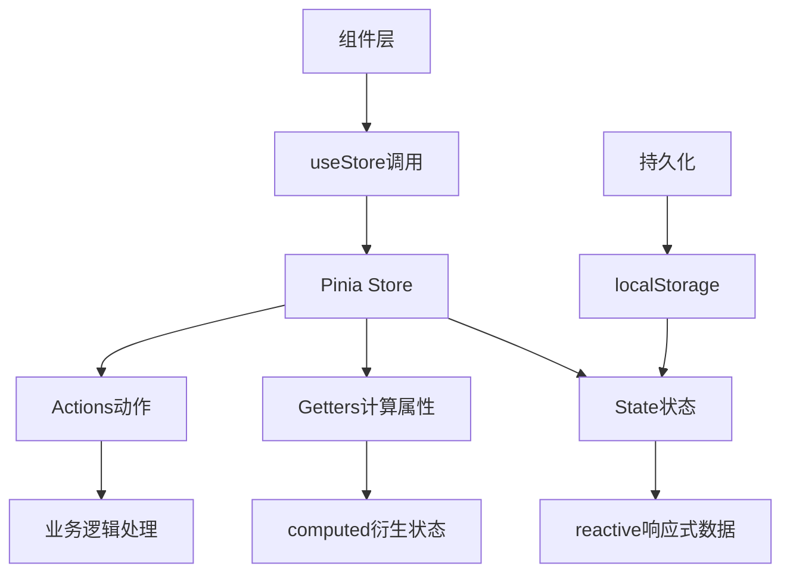
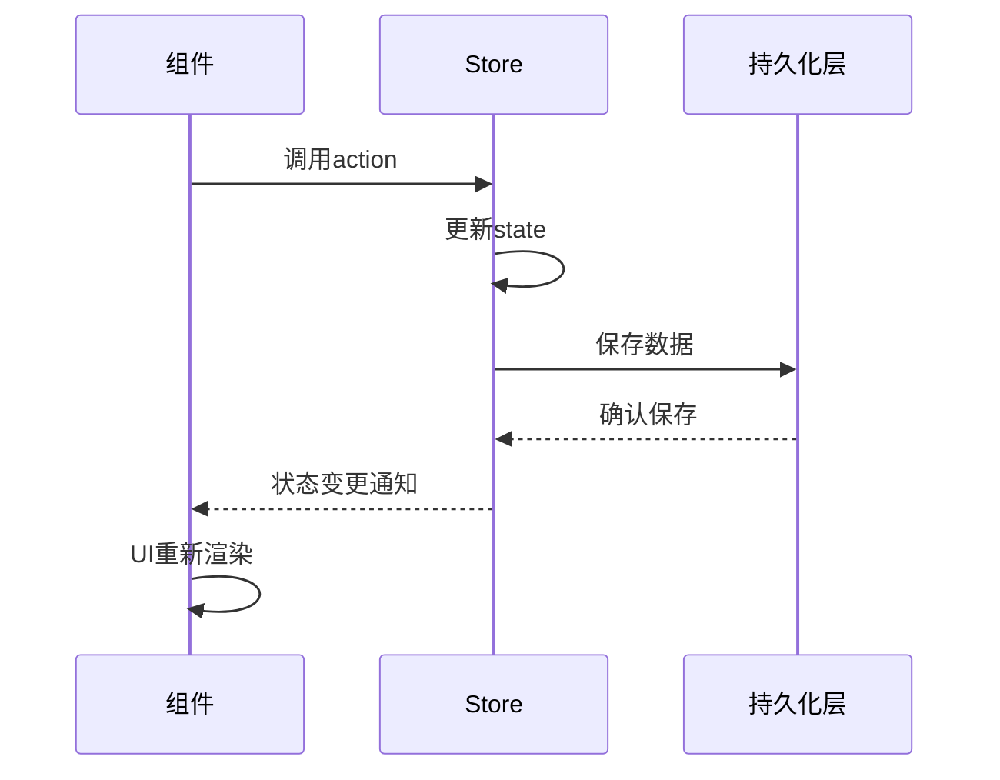
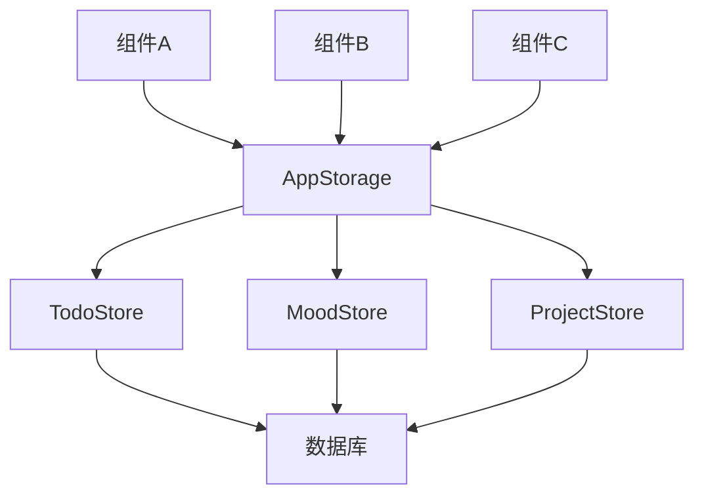

# 状态管理系统设计

## Pinia vs 鸿蒙状态管理对比

### Pinia架构特点



**Pinia核心特性：**
- 🔄 响应式状态管理
- 📦 模块化Store设计
- 🔍 TypeScript强类型支持
- 🛠️ DevTools调试支持
- 💾 状态持久化能力
- ⚡ 轻量级运行时

### 鸿蒙状态管理架构

```mermaid
graph TB
    A[ArkTS状态管理] --> B[组件内状态]
    A --> C[全局状态]
    A --> D[持久化状态]
    
    B --> E[@State]
    B --> F[@Prop]
    B --> G[@Link]
    
    C --> H[AppStorage]
    C --> I[LocalStorage]
    
    D --> J[关系型数据库]
    D --> K[首选项数据库]
    
    L[组件层] --> M[状态装饰器]
    M --> A
```

**鸿蒙状态管理特点：**
- 🎯 基于装饰器的声明式状态
- 🔗 多层级状态绑定机制  
- 🏠 原生性能优势
- 💿 多种持久化选择
- 🌐 分布式状态同步能力

## 原项目状态管理分析

### 现有Store结构分析

从项目代码分析，当前使用了以下Store模块：

```typescript
// 现有Store模块映射
interface StoreModules {
  todo: {
    状态: ['todos', 'filters', 'selectedTodos', 'achievements', 'moodRecords']
    操作: ['addTodo', 'updateTodo', 'deleteTodo', 'completeTodo', 'filterTodos']
    持久化: 'localStorage'
  }
  
  mood: {
    状态: ['moods', 'records', 'currentMood']
    操作: ['addRecord', 'updateRecord', 'deleteRecord', 'getMoodStats']
    持久化: 'localStorage'
  }
  
  project: {
    状态: ['projects', 'byId', 'recentProjects']
    操作: ['addProject', 'updateProject', 'deleteProject', 'searchProjects']
    持久化: 'localStorage + 存储空间管理'
  }
  
  handbook: {
    状态: ['templates', 'generatedHandbooks', 'activeTemplate']
    操作: ['generateHandbook', 'saveTemplate', 'exportHandbook']
    持久化: 'localStorage'
  }
  
  theme: {
    状态: ['themes', 'currentThemeId']
    操作: ['loadThemes', 'switchTheme', 'restoreFromLocal']
    持久化: 'localStorage'
  }
  
  user: {
    状态: ['preferences']
    操作: ['setTheme', 'setLanguage', 'updatePreferences']
    持久化: 'localStorage'
  }
}
```

### 数据流分析



## 鸿蒙状态管理迁移方案

### 1. 全局状态管理架构

```typescript
// 全局状态管理器 - 替代Pinia根Store
class GlobalStateManager {
  // 使用AppStorage管理全局状态
  static initializeStores() {
    // 初始化各个Store的状态
    AppStorage.SetOrCreate('todoStore', new TodoStoreState())
    AppStorage.SetOrCreate('moodStore', new MoodStoreState())
    AppStorage.SetOrCreate('projectStore', new ProjectStoreState())
    AppStorage.SetOrCreate('handbookStore', new HandbookStoreState())
    AppStorage.SetOrCreate('themeStore', new ThemeStoreState())
    AppStorage.SetOrCreate('userStore', new UserStoreState())
  }
  
  // 获取指定Store实例
  static getStore<T>(storeName: string): T | undefined {
    return AppStorage.Get(storeName)
  }
  
  // 监听Store变化
  static watchStore<T>(storeName: string, callback: (newValue: T, oldValue: T) => void) {
    AppStorage.SetAndLink(storeName, AppStorage.Get(storeName), callback)
  }
}

// Store基类
abstract class BaseStore<T> {
  protected data: T
  
  constructor(initialData: T) {
    this.data = initialData
  }
  
  // 获取当前状态
  getState(): T {
    return this.data
  }
  
  // 更新状态并持久化
  protected setState(updates: Partial<T>) {
    this.data = { ...this.data, ...updates }
    this.persistState()
  }
  
  // 持久化状态（子类实现具体逻辑）
  protected abstract persistState(): void
  
  // 从持久化存储恢复状态
  protected abstract restoreState(): Promise<void>
}
```

### 2. Todo状态管理实现

```typescript
// Todo Store状态接口
interface TodoStoreState {
  todos: TodoItem[]
  filters: TodoFilters
  selectedTodos: string[]
  achievements: Achievement[]
  moodRecords: MoodRecord[]
  socialShares: SocialShare[]
  isLoading: boolean
  showCelebration: boolean
  lastCompletedTodo: TodoItem | null
}

// Todo Store实现
class TodoStore extends BaseStore<TodoStoreState> {
  private repository: TodoRepository
  
  constructor() {
    super({
      todos: [],
      filters: {
        search: '',
        category: undefined,
        priority: undefined,
        status: undefined,
        tags: [],
        dueDateRange: undefined
      },
      selectedTodos: [],
      achievements: [],
      moodRecords: [],
      socialShares: [],
      isLoading: false,
      showCelebration: false,
      lastCompletedTodo: null
    })
    
    this.repository = new TodoRepository()
    this.restoreState()
  }
  
  // 添加待办事项
  async addTodo(todoData: CreateTodoData): Promise<TodoItem> {
    const newTodo: TodoItem = {
      id: this.generateId(),
      title: todoData.title,
      description: todoData.description || '',
      category: todoData.category,
      priority: todoData.priority,
      status: todoData.status || TodoStatus.TODO,
      dueDate: todoData.dueDate,
      completedAt: undefined,
      mood: undefined,
      tags: todoData.tags || [],
      createdAt: new Date(),
      updatedAt: new Date()
    }
    
    // 添加到数据库
    await this.repository.save(newTodo)
    
    // 更新状态
    this.setState({
      todos: [...this.data.todos, newTodo]
    })
    
    // 检查成就
    this.checkAchievements()
    
    return newTodo
  }
  
  // 更新待办事项
  async updateTodo(id: string, updates: UpdateTodoData): Promise<TodoItem | null> {
    const todoIndex = this.data.todos.findIndex(todo => todo.id === id)
    if (todoIndex === -1) return null
    
    const updatedTodo = {
      ...this.data.todos[todoIndex],
      ...updates,
      updatedAt: new Date()
    }
    
    // 更新数据库
    await this.repository.update(id, updatedTodo)
    
    // 更新状态
    const newTodos = [...this.data.todos]
    newTodos[todoIndex] = updatedTodo
    
    this.setState({
      todos: newTodos
    })
    
    return updatedTodo
  }
  
  // 完成待办事项
  async completeTodo(id: string, mood: MoodType, note?: string): Promise<boolean> {
    const todo = this.data.todos.find(t => t.id === id)
    if (!todo) return false
    
    const completedAt = new Date()
    
    // 更新待办状态
    await this.updateTodo(id, {
      status: TodoStatus.COMPLETED,
      completedAt,
      mood
    })
    
    // 添加心情记录
    const moodRecord: MoodRecord = {
      id: this.generateId(),
      todoId: id,
      mood,
      note,
      timestamp: completedAt
    }
    
    this.setState({
      moodRecords: [...this.data.moodRecords, moodRecord],
      lastCompletedTodo: todo,
      showCelebration: true
    })
    
    // 3秒后隐藏庆祝动画
    setTimeout(() => {
      this.setState({ showCelebration: false })
    }, 3000)
    
    // 检查成就
    this.checkAchievements()
    
    return true
  }
  
  // 删除待办事项
  async deleteTodo(id: string): Promise<boolean> {
    try {
      await this.repository.delete(id)
      
      this.setState({
        todos: this.data.todos.filter(todo => todo.id !== id),
        selectedTodos: this.data.selectedTodos.filter(selectedId => selectedId !== id)
      })
      
      return true
    } catch (error) {
      console.error('删除待办失败:', error)
      return false
    }
  }
  
  // 设置筛选条件
  setFilters(newFilters: Partial<TodoFilters>) {
    this.setState({
      filters: { ...this.data.filters, ...newFilters }
    })
  }
  
  // 获取筛选后的待办列表
  getFilteredTodos(): TodoItem[] {
    let filtered = this.data.todos
    const filters = this.data.filters
    
    if (filters.search) {
      const searchLower = filters.search.toLowerCase()
      filtered = filtered.filter(todo =>
        todo.title.toLowerCase().includes(searchLower) ||
        todo.description?.toLowerCase().includes(searchLower) ||
        todo.tags.some(tag => tag.toLowerCase().includes(searchLower))
      )
    }
    
    if (filters.category) {
      filtered = filtered.filter(todo => todo.category === filters.category)
    }
    
    if (filters.priority) {
      filtered = filtered.filter(todo => todo.priority === filters.priority)
    }
    
    if (filters.status) {
      filtered = filtered.filter(todo => todo.status === filters.status)
    }
    
    if (filters.tags && filters.tags.length > 0) {
      filtered = filtered.filter(todo =>
        filters.tags!.some(tag => todo.tags.includes(tag))
      )
    }
    
    return filtered
  }
  
  // 获取统计数据
  getStats(): TodoStats {
    const total = this.data.todos.length
    const completed = this.data.todos.filter(todo => todo.status === TodoStatus.COMPLETED).length
    const inProgress = this.data.todos.filter(todo => todo.status === TodoStatus.IN_PROGRESS).length
    const pending = this.data.todos.filter(todo => todo.status === TodoStatus.TODO).length
    
    const completionRate = total > 0 ? Math.round((completed / total) * 100) : 0
    
    return {
      total,
      completed,
      inProgress,
      pending,
      highPriority: this.data.todos.filter(todo => todo.priority === TodoPriority.HIGH).length,
      mediumPriority: this.data.todos.filter(todo => todo.priority === TodoPriority.MEDIUM).length,
      lowPriority: this.data.todos.filter(todo => todo.priority === TodoPriority.LOW).length,
      overdue: this.data.todos.filter(todo => 
        todo.dueDate && todo.dueDate < new Date() && todo.status !== TodoStatus.COMPLETED
      ).length,
      dueToday: this.data.todos.filter(todo => 
        todo.dueDate && this.isSameDay(todo.dueDate, new Date())
      ).length,
      dueThisWeek: this.data.todos.filter(todo => 
        todo.dueDate && this.isThisWeek(todo.dueDate)
      ).length,
      categoryStats: this.getCategoryStats(),
      tagStats: this.getTagStats(),
      completionRate,
      moodStats: this.getMoodStats(),
      achievementCount: this.data.achievements.filter(a => a.isUnlocked).length,
      currentStreak: this.calculateCurrentStreak(),
      longestStreak: this.calculateLongestStreak(),
      weeklyProgress: this.calculateWeeklyProgress(),
      monthlyProgress: this.calculateMonthlyProgress()
    }
  }
  
  // 持久化状态
  protected persistState(): void {
    // 状态已经通过Repository持久化到数据库
    // 这里可以处理一些临时状态的缓存
  }
  
  // 恢复状态
  protected async restoreState(): Promise<void> {
    try {
      // 从数据库加载待办数据
      const todos = await this.repository.findAll()
      
      // 从数据库加载其他相关数据
      // const achievements = await this.achievementRepository.findAll()
      // const moodRecords = await this.moodRecordRepository.findAll()
      
      this.setState({
        todos,
        // achievements,
        // moodRecords
      })
    } catch (error) {
      console.error('恢复Todo状态失败:', error)
    }
  }
  
  // 工具方法
  private generateId(): string {
    return Date.now().toString()
  }
  
  private isSameDay(date1: Date, date2: Date): boolean {
    return date1.toDateString() === date2.toDateString()
  }
  
  private isThisWeek(date: Date): boolean {
    const now = new Date()
    const startOfWeek = new Date(now)
    startOfWeek.setDate(now.getDate() - now.getDay())
    const endOfWeek = new Date(startOfWeek)
    endOfWeek.setDate(startOfWeek.getDate() + 6)
    return date >= startOfWeek && date <= endOfWeek
  }
  
  private getCategoryStats(): Record<string, number> {
    const stats: Record<string, number> = {}
    this.data.todos.forEach(todo => {
      stats[todo.category] = (stats[todo.category] || 0) + 1
    })
    return stats
  }
  
  private getTagStats(): Record<string, number> {
    const stats: Record<string, number> = {}
    this.data.todos.forEach(todo => {
      todo.tags.forEach(tag => {
        stats[tag] = (stats[tag] || 0) + 1
      })
    })
    return stats
  }
  
  private getMoodStats(): Record<MoodType, number> {
    const stats: Record<MoodType, number> = {
      [MoodType.VERY_HAPPY]: 0,
      [MoodType.HAPPY]: 0,
      [MoodType.EXCITED]: 0,
      [MoodType.CALM]: 0,
      [MoodType.NEUTRAL]: 0,
      [MoodType.TIRED]: 0,
      [MoodType.STRESSED]: 0,
      [MoodType.SAD]: 0,
      [MoodType.ANGRY]: 0
    }
    
    this.data.moodRecords.forEach(record => {
      stats[record.mood]++
    })
    
    return stats
  }
  
  private checkAchievements() {
    // 成就检查逻辑
    const stats = this.getStats()
    
    // 检查第一个任务成就
    if (stats.total >= 1) {
      this.unlockAchievement('first_task')
    }
    
    // 检查任务连击成就
    if (stats.currentStreak >= 3) {
      this.unlockAchievement('task_streak')
    }
    
    // ... 其他成就检查
  }
  
  private unlockAchievement(type: string) {
    const achievement = this.data.achievements.find(a => a.type === type && !a.isUnlocked)
    if (achievement) {
      achievement.isUnlocked = true
      achievement.unlockedAt = new Date()
      
      // 触发状态更新
      this.setState({
        achievements: [...this.data.achievements]
      })
    }
  }
  
  private calculateCurrentStreak(): number {
    // 计算当前连击数
    let streak = 0
    const today = new Date()
    let currentDate = new Date(today)
    
    while (true) {
      const dayTodos = this.data.todos.filter(todo => 
        todo.completedAt && this.isSameDay(todo.completedAt, currentDate)
      )
      
      if (dayTodos.length > 0) {
        streak++
        currentDate.setDate(currentDate.getDate() - 1)
      } else {
        break
      }
    }
    
    return streak
  }
  
  private calculateLongestStreak(): number {
    // 计算最长连击数的逻辑
    return 0 // 简化实现
  }
  
  private calculateWeeklyProgress(): number {
    // 计算周进度的逻辑
    return 0 // 简化实现
  }
  
  private calculateMonthlyProgress(): number {
    // 计算月进度的逻辑
    return 0 // 简化实现
  }
}
```

### 3. 组件中的状态使用

```typescript
// 使用状态管理的组件示例
@Component
struct TodoListComponent {
  // 连接全局状态
  @StorageLink('todoStore') todoStore: TodoStore = new TodoStore()
  
  // 本地状态
  @State private isLoading: boolean = false
  @State private showAddDialog: boolean = false
  
  // 计算属性 - 替代Pinia getters
  get filteredTodos(): TodoItem[] {
    return this.todoStore.getFilteredTodos()
  }
  
  get stats(): TodoStats {
    return this.todoStore.getStats()
  }
  
  aboutToAppear() {
    this.loadInitialData()
  }
  
  build() {
    Column() {
      // 统计信息显示
      this.StatsSection()
      
      // 筛选器
      this.FilterSection()
      
      // 待办列表
      List() {
        ForEach(this.filteredTodos, (todo: TodoItem) => {
          ListItem() {
            this.TodoItemCard(todo)
          }
        }, (todo) => todo.id)
      }
      .layoutWeight(1)
      
      // 添加按钮
      Button('添加待办')
        .onClick(() => {
          this.showAddDialog = true
        })
    }
    .width('100%')
    .height('100%')
  }
  
  @Builder TodoItemCard(todo: TodoItem) {
    Row() {
      Checkbox({ name: `todo_${todo.id}` })
        .select(todo.status === TodoStatus.COMPLETED)
        .onChange((isChecked: boolean) => {
          if (isChecked) {
            // 显示心情选择对话框
            this.showMoodSelectionDialog(todo.id)
          } else {
            this.todoStore.updateTodo(todo.id, { status: TodoStatus.TODO })
          }
        })
      
      Column() {
        Text(todo.title)
          .fontSize(16)
          .fontWeight(FontWeight.Medium)
        
        if (todo.description) {
          Text(todo.description)
            .fontSize(14)
            .fontColor('#666666')
        }
        
        Row() {
          Text(todo.priority)
            .fontSize(12)
            .backgroundColor(this.getPriorityColor(todo.priority))
          
          Text(todo.category)
            .fontSize(12)
            .backgroundColor('#f0f0f0')
        }
      }
      .layoutWeight(1)
      .alignItems(HorizontalAlign.Start)
    }
    .padding(16)
    .backgroundColor('#ffffff')
    .borderRadius(8)
    .onClick(() => {
      this.editTodo(todo)
    })
  }
  
  @Builder StatsSection() {
    Row() {
      Column() {
        Text(this.stats.total.toString())
          .fontSize(24)
          .fontWeight(FontWeight.Bold)
        Text('总数')
          .fontSize(12)
          .fontColor('#666666')
      }
      
      Column() {
        Text(this.stats.completed.toString())
          .fontSize(24)
          .fontWeight(FontWeight.Bold)
          .fontColor('#52c41a')
        Text('已完成')
          .fontSize(12)
          .fontColor('#666666')
      }
      
      Column() {
        Text(`${this.stats.completionRate}%`)
          .fontSize(24)
          .fontWeight(FontWeight.Bold)
          .fontColor('#1890ff')
        Text('完成率')
          .fontSize(12)
          .fontColor('#666666')
      }
    }
    .width('100%')
    .justifyContent(FlexAlign.SpaceAround)
    .padding(16)
    .backgroundColor('#fafafa')
    .borderRadius(8)
  }
  
  // 业务方法 - 替代Pinia actions
  private async loadInitialData() {
    this.isLoading = true
    try {
      // 数据加载已经在Store的构造函数中完成
      await new Promise(resolve => setTimeout(resolve, 500)) // 模拟加载
    } catch (error) {
      console.error('加载数据失败:', error)
    } finally {
      this.isLoading = false
    }
  }
  
  private async addTodo(todoData: CreateTodoData) {
    try {
      await this.todoStore.addTodo(todoData)
      this.showAddDialog = false
    } catch (error) {
      console.error('添加待办失败:', error)
    }
  }
  
  private editTodo(todo: TodoItem) {
    // 导航到编辑页面或显示编辑对话框
  }
  
  private showMoodSelectionDialog(todoId: string) {
    // 显示心情选择对话框
    // 选择心情后调用 this.todoStore.completeTodo(todoId, selectedMood)
  }
  
  private getPriorityColor(priority: TodoPriority): string {
    switch (priority) {
      case TodoPriority.HIGH:
        return '#ff4d4f'
      case TodoPriority.MEDIUM:
        return '#faad14'
      case TodoPriority.LOW:
        return '#52c41a'
      default:
        return '#d9d9d9'
    }
  }
}
```

### 4. 状态同步与持久化

```typescript
// 状态同步管理器
class StateSyncManager {
  private stores: Map<string, BaseStore<any>> = new Map()
  private syncQueue: SyncTask[] = []
  private isSyncing: boolean = false
  
  // 注册Store
  registerStore<T>(name: string, store: BaseStore<T>) {
    this.stores.set(name, store)
    
    // 监听状态变化
    this.watchStoreChanges(name, store)
  }
  
  // 监听Store变化
  private watchStoreChanges<T>(storeName: string, store: BaseStore<T>) {
    // 使用装饰器监听状态变化
    AppStorage.SetAndLink(storeName, store.getState(), (newValue: T) => {
      this.queueSync(storeName, newValue)
    })
  }
  
  // 队列同步任务
  private queueSync<T>(storeName: string, data: T) {
    this.syncQueue.push({
      storeName,
      data,
      timestamp: Date.now()
    })
    
    // 延迟批量同步
    this.debouncedSync()
  }
  
  // 防抖同步
  private debouncedSync = this.debounce(() => {
    this.performSync()
  }, 500)
  
  // 执行同步
  private async performSync() {
    if (this.isSyncing || this.syncQueue.length === 0) {
      return
    }
    
    this.isSyncing = true
    
    try {
      // 批量处理同步任务
      const tasks = [...this.syncQueue]
      this.syncQueue = []
      
      for (const task of tasks) {
        const store = this.stores.get(task.storeName)
        if (store) {
          await store.persistState()
        }
      }
    } catch (error) {
      console.error('状态同步失败:', error)
    } finally {
      this.isSyncing = false
    }
  }
  
  // 防抖工具函数
  private debounce(func: Function, delay: number) {
    let timeoutId: number
    return (...args: any[]) => {
      clearTimeout(timeoutId)
      timeoutId = setTimeout(() => func.apply(this, args), delay)
    }
  }
  
  // 全量同步所有Store
  async syncAllStores() {
    for (const [name, store] of this.stores) {
      try {
        await store.persistState()
      } catch (error) {
        console.error(`同步Store ${name} 失败:`, error)
      }
    }
  }
}

interface SyncTask {
  storeName: string
  data: any
  timestamp: number
}
```

### 5. 跨组件状态共享



```typescript
// 跨组件状态共享示例

// 父组件 - 提供状态
@Entry
@Component
struct MainPage {
  @Provide('todoStore') todoStore: TodoStore = GlobalStateManager.getStore('todoStore')
  @Provide('moodStore') moodStore: MoodStore = GlobalStateManager.getStore('moodStore')
  
  build() {
    Navigation() {
      Column() {
        this.HeaderComponent()
        this.ContentComponent()
        this.FooterComponent()
      }
    }
  }
}

// 子组件 - 消费状态
@Component
struct TodoSummaryCard {
  @Consume('todoStore') todoStore: TodoStore
  
  get todayCount(): number {
    return this.todoStore.getFilteredTodos()
      .filter(todo => this.isToday(todo.dueDate)).length
  }
  
  build() {
    Card() {
      Column() {
        Text(`今日待办: ${this.todayCount}`)
          .fontSize(16)
          .fontWeight(FontWeight.Medium)
        
        Button('查看详情')
          .onClick(() => {
            // 导航到详情页面
          })
      }
      .padding(16)
    }
  }
  
  private isToday(date?: Date): boolean {
    if (!date) return false
    const today = new Date()
    return date.toDateString() === today.toDateString()
  }
}

// 另一个子组件 - 同时使用多个Store
@Component
struct MoodTodoIntegration {
  @Consume('todoStore') todoStore: TodoStore
  @Consume('moodStore') moodStore: MoodStore
  
  // 计算心情与待办完成的关联
  get moodCompletionData(): Array<{mood: MoodType, completedCount: number}> {
    const moodRecords = this.todoStore.getState().moodRecords
    const stats: Record<string, number> = {}
    
    moodRecords.forEach(record => {
      const moodKey = record.mood.toString()
      stats[moodKey] = (stats[moodKey] || 0) + 1
    })
    
    return Object.entries(stats).map(([mood, count]) => ({
      mood: mood as MoodType,
      completedCount: count
    }))
  }
  
  build() {
    Column() {
      Text('心情完成统计')
        .fontSize(18)
        .fontWeight(FontWeight.Bold)
      
      ForEach(this.moodCompletionData, (item) => {
        Row() {
          Text(item.mood)
            .fontSize(24)
          Text(`完成 ${item.completedCount} 个任务`)
            .fontSize(14)
            .fontColor('#666666')
        }
        .width('100%')
        .justifyContent(FlexAlign.SpaceBetween)
        .padding({ left: 16, right: 16, top: 8, bottom: 8 })
      }, (item) => item.mood)
    }
  }
}
```

## 迁移策略总结

### 状态管理迁移对照表

| Pinia概念 | 鸿蒙ArkTS对应方案 | 实现方式 |
|-----------|----------------|----------|
| `defineStore` | `BaseStore`类 | 继承基类实现Store |
| `ref/reactive` | `@State`装饰器 | 响应式状态定义 |
| `computed` | `get`方法 | 计算属性实现 |
| `actions` | Store方法 | 异步业务逻辑 |
| `$patch` | `setState`方法 | 批量状态更新 |
| `$subscribe` | `AppStorage.SetAndLink` | 状态变化监听 |
| `persist` | 数据库+同步器 | 持久化机制 |

### 迁移步骤

1. **阶段一：基础架构**
   - 设计BaseStore基类
   - 实现GlobalStateManager
   - 创建状态同步机制

2. **阶段二：Store迁移**
   - 逐个迁移各个Store模块
   - 实现数据持久化
   - 添加状态监听机制

3. **阶段三：组件适配**
   - 更新组件中的状态使用
   - 替换Pinia API调用
   - 测试状态流转

4. **阶段四：优化完善**
   - 性能监控与优化
   - 错误处理完善
   - 状态调试工具

---

**总结**：从Pinia到鸿蒙状态管理的迁移需要重新设计状态架构，但基本的设计理念是相通的。通过合理的抽象和封装，可以保持原有的开发体验，同时获得原生应用的性能优势和系统集成能力。
