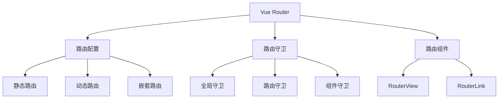
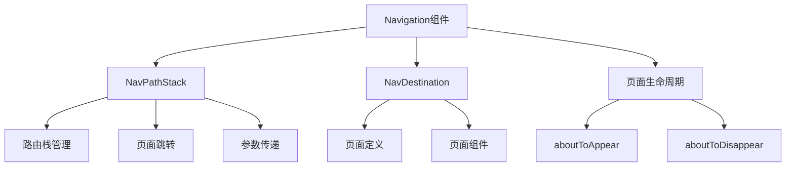
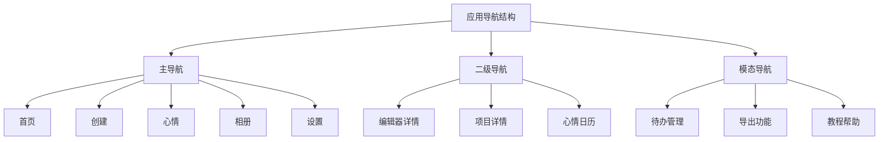

# 页面导航系统设计

## Vue Router vs 鸿蒙Navigation对比

### Vue Router架构特点



**Vue Router特点：**
- 🔄 声明式路由配置
- 🛡️ 路由守卫机制
- 📊 路由懒加载支持
- 🧭 编程式导航
- 📜 路由历史管理
- 🎯 路由参数传递

### 鸿蒙Navigation架构



**鸿蒙Navigation特点：**
- 📱 原生页面栈管理
- ⚡ 高性能页面切换
- 🔗 深度系统集成
- 💾 自动状态保持
- 🎨 丰富的转场动画
- 📡 分布式页面能力

## 原项目路由分析

### 现有路由结构

从项目的`router/index.ts`分析：

```typescript
// 现有路由映射分析
interface RouteStructure {
  根路径: {
    path: '/',
    component: 'Home',
    功能: '应用首页，展示概览信息'
  }
  
  创建功能: {
    path: '/create',
    component: 'Create',
    功能: '创建新项目入口页面'
  }
  
  编辑器: {
    path: ['/editor', '/editor/:id'],
    component: 'Editor',
    功能: '图形编辑器，支持新建和编辑'
  }
  
  心情模块: {
    paths: ['/mood', '/mood-calendar', '/mood-card'],
    components: ['Mood', 'MoodCalendar', 'MoodCard'],
    功能: '心情记录相关页面'
  }
  
  项目模块: {
    paths: ['/album', '/project/:id'],
    components: ['Album', 'ProjectDetail'],
    功能: '项目展示和详情'
  }
  
  待办模块: {
    path: '/todo',
    component: 'Todo',
    功能: '待办事项管理'
  }
  
  系统页面: {
    paths: ['/settings', '/export', '/tutorial', '/faq', '/feedback', '/contact', '/about', '/terms', '/updates', '/privacy'],
    功能: '设置和信息页面'
  }
}
```

### 导航模式分析



## 鸿蒙Navigation迁移方案

### 1. 导航架构设计

```typescript
// 应用导航管理器
class AppNavigationManager {
  private navigationStack: NavPathStack = new NavPathStack()
  private routeConfigMap: Map<string, RouteConfig> = new Map()
  
  constructor() {
    this.initializeRoutes()
  }
  
  // 初始化路由配置
  private initializeRoutes() {
    const routes: RouteConfig[] = [
      {
        name: 'Home',
        path: '/',
        component: 'HomePage',
        title: '首页',
        showInTab: true,
        icon: 'home'
      },
      {
        name: 'Create',
        path: '/create',
        component: 'CreatePage',
        title: '创建',
        showInTab: true,
        icon: 'add'
      },
      {
        name: 'Mood',
        path: '/mood',
        component: 'MoodPage',
        title: '心情',
        showInTab: true,
        icon: 'mood'
      },
      {
        name: 'Album',
        path: '/album',
        component: 'AlbumPage',
        title: '相册',
        showInTab: true,
        icon: 'album'
      },
      {
        name: 'Settings',
        path: '/settings',
        component: 'SettingsPage',
        title: '设置',
        showInTab: true,
        icon: 'settings'
      },
      // 二级页面
      {
        name: 'Editor',
        path: '/editor',
        component: 'EditorPage',
        title: '编辑器',
        showInTab: false,
        params: ['id']
      },
      {
        name: 'ProjectDetail',
        path: '/project',
        component: 'ProjectDetailPage',
        title: '项目详情',
        showInTab: false,
        params: ['id']
      },
      {
        name: 'MoodCalendar',
        path: '/mood-calendar',
        component: 'MoodCalendarPage',
        title: '心情日历',
        showInTab: false
      },
      {
        name: 'Todo',
        path: '/todo',
        component: 'TodoPage',
        title: '待办事项',
        showInTab: false
      }
    ]
    
    routes.forEach(route => {
      this.routeConfigMap.set(route.name, route)
    })
  }
  
  // 获取导航栈
  getNavigationStack(): NavPathStack {
    return this.navigationStack
  }
  
  // 页面跳转
  navigateTo(routeName: string, params?: Record<string, any>) {
    const route = this.routeConfigMap.get(routeName)
    if (!route) {
      console.error(`路由 ${routeName} 不存在`)
      return
    }
    
    // 构造导航路径
    const navPath: NavPathStack = new NavPathStack()
    
    if (params && route.params) {
      // 带参数导航
      navPath.pushPath({ name: routeName, param: params })
    } else {
      // 普通导航
      navPath.pushPath({ name: routeName })
    }
    
    this.navigationStack = navPath
  }
  
  // 返回上一页
  goBack() {
    if (this.navigationStack.size() > 1) {
      this.navigationStack.pop()
    }
  }
  
  // 返回首页
  goHome() {
    this.navigationStack.clear()
    this.navigateTo('Home')
  }
  
  // 获取当前路由信息
  getCurrentRoute(): RouteInfo | null {
    const currentIndex = this.navigationStack.size() - 1
    if (currentIndex >= 0) {
      const pathInfo = this.navigationStack.getPathByIndex(currentIndex)
      return {
        name: pathInfo.name,
        params: pathInfo.param || {},
        index: currentIndex
      }
    }
    return null
  }
}

// 路由配置接口
interface RouteConfig {
  name: string
  path: string
  component: string
  title: string
  showInTab: boolean
  icon?: string
  params?: string[]
  meta?: Record<string, any>
}

// 路由信息接口
interface RouteInfo {
  name: string
  params: Record<string, any>
  index: number
}
```

### 2. 主导航组件

```typescript
// 主导航框架组件
@Entry
@Component
struct MainNavigationApp {
  @Provide('navigationManager') navigationManager: AppNavigationManager = new AppNavigationManager()
  @State currentTabIndex: number = 0
  
  // 标签页配置
  private tabConfigs: TabConfig[] = [
    { name: 'Home', title: '首页', icon: $r('app.media.ic_home') },
    { name: 'Create', title: '创建', icon: $r('app.media.ic_add') },
    { name: 'Mood', title: '心情', icon: $r('app.media.ic_mood') },
    { name: 'Album', title: '相册', icon: $r('app.media.ic_album') },
    { name: 'Settings', title: '设置', icon: $r('app.media.ic_settings') }
  ]
  
  build() {
    Column() {
      // 主内容区域
      Navigation(this.navigationManager.getNavigationStack()) {
        // 这里会根据当前路由显示对应的页面组件
      }
      .title(this.getCurrentPageTitle())
      .titleMode(NavigationTitleMode.Free)
      .hideBackButton(this.shouldHideBackButton())
      .onTitleModeChange((titleMode: NavigationTitleMode) => {
        // 标题模式变化处理
      })
      .layoutWeight(1)
      
      // 底部标签导航
      Tabs({ barPosition: BarPosition.End, index: this.currentTabIndex }) {
        ForEach(this.tabConfigs, (tab: TabConfig, index: number) => {
          TabContent() {
            // 空内容，实际内容在Navigation中显示
          }
          .tabBar(this.TabBarBuilder(tab, index))
        }, (tab) => tab.name)
      }
      .onChange((index: number) => {
        this.currentTabIndex = index
        const targetTab = this.tabConfigs[index]
        this.navigationManager.navigateTo(targetTab.name)
      })
      .height(60)
    }
    .width('100%')
    .height('100%')
  }
  
  @Builder TabBarBuilder(tab: TabConfig, index: number) {
    Column({ space: 4 }) {
      Image(tab.icon)
        .width(24)
        .height(24)
        .fillColor(this.currentTabIndex === index ? '#1890ff' : '#999999')
      
      Text(tab.title)
        .fontSize(12)
        .fontColor(this.currentTabIndex === index ? '#1890ff' : '#999999')
    }
  }
  
  // 获取当前页面标题
  private getCurrentPageTitle(): string {
    const currentRoute = this.navigationManager.getCurrentRoute()
    if (currentRoute) {
      const routeConfig = this.navigationManager['routeConfigMap'].get(currentRoute.name)
      return routeConfig?.title || '应用'
    }
    return '女性手账'
  }
  
  // 是否隐藏返回按钮
  private shouldHideBackButton(): boolean {
    const currentRoute = this.navigationManager.getCurrentRoute()
    if (!currentRoute) return true
    
    // 主要标签页不显示返回按钮
    return this.tabConfigs.some(tab => tab.name === currentRoute.name)
  }
}

interface TabConfig {
  name: string
  title: string
  icon: Resource
}
```

### 3. 页面组件注册

```typescript
// 页面组件构建器
@Builder
function PageBuilder(name: string, param: Object | undefined) {
  switch (name) {
    case 'HomePage':
      HomePage()
      break
    case 'CreatePage':
      CreatePage()
      break
    case 'MoodPage':
      MoodPage()
      break
    case 'AlbumPage':
      AlbumPage()
      break
    case 'SettingsPage':
      SettingsPage()
      break
    case 'EditorPage':
      EditorPage({ projectId: param?.['id'] || '' })
      break
    case 'ProjectDetailPage':
      ProjectDetailPage({ projectId: param?.['id'] || '' })
      break
    case 'MoodCalendarPage':
      MoodCalendarPage()
      break
    case 'TodoPage':
      TodoPage()
      break
    default:
      // 404页面
      NotFoundPage()
      break
  }
}

// 页面注册
@Component
struct NavigationWrapper {
  @Consume('navigationManager') navigationManager: AppNavigationManager
  
  build() {
    Navigation(this.navigationManager.getNavigationStack()) {
      // 页面内容将通过NavDestination动态加载
    }
    .navDestination(PageBuilder)
  }
}
```

### 4. 具体页面实现示例

```typescript
// 首页组件
@Component
struct HomePage {
  @Consume('navigationManager') navigationManager: AppNavigationManager
  @State greeting: string = '欢迎回来'
  
  build() {
    Scroll() {
      Column({ space: 24 }) {
        // 欢迎区域
        Column({ space: 8 }) {
          Text(this.greeting)
            .fontSize(28)
            .fontWeight(FontWeight.Bold)
          
          Text('开始记录美好生活')
            .fontSize(16)
            .fontColor('#666666')
        }
        .width('100%')
        .padding({ top: 40, bottom: 20 })
        
        // 快速操作
        Grid() {
          GridItem() {
            this.QuickActionCard('新建待办', '📝', () => {
              this.navigationManager.navigateTo('Todo')
            })
          }
          
          GridItem() {
            this.QuickActionCard('记录心情', '💭', () => {
              this.navigationManager.navigateTo('Mood')
            })
          }
          
          GridItem() {
            this.QuickActionCard('创建项目', '🎨', () => {
              this.navigationManager.navigateTo('Create')
            })
          }
        }
        .columnsTemplate('1fr 1fr 1fr')
        .rowsGap(12)
        .columnsGap(12)
        
        // 最近项目
        this.RecentProjectsSection()
        
        // 今日心情
        this.TodayMoodSection()
      }
      .width('100%')
      .padding({ left: 16, right: 16, bottom: 20 })
    }
    .width('100%')
    .height('100%')
  }
  
  @Builder QuickActionCard(title: string, icon: string, onTap: () => void) {
    Column({ space: 8 }) {
      Text(icon)
        .fontSize(32)
      
      Text(title)
        .fontSize(14)
        .fontWeight(FontWeight.Medium)
    }
    .width('100%')
    .height(100)
    .backgroundColor('#ffffff')
    .borderRadius(12)
    .justifyContent(FlexAlign.Center)
    .onClick(onTap)
    .shadow({
      radius: 4,
      color: 'rgba(0,0,0,0.1)',
      offsetX: 0,
      offsetY: 2
    })
  }
  
  @Builder RecentProjectsSection() {
    Column({ space: 12 }) {
      Row() {
        Text('最近项目')
          .fontSize(18)
          .fontWeight(FontWeight.Medium)
        
        Blank()
        
        Text('查看全部')
          .fontSize(14)
          .fontColor('#1890ff')
          .onClick(() => {
            this.navigationManager.navigateTo('Album')
          })
      }
      .width('100%')
      
      // 项目列表
      Row({ space: 12 }) {
        ForEach(['project1', 'project2', 'project3'], (projectId: string) => {
          Column() {
            Image($r('app.media.placeholder'))
              .width('100%')
              .height(80)
              .borderRadius(8)
            
            Text('项目标题')
              .fontSize(12)
              .maxLines(1)
              .textOverflow({ overflow: TextOverflow.Ellipsis })
          }
          .width(80)
          .onClick(() => {
            this.navigationManager.navigateTo('ProjectDetail', { id: projectId })
          })
        })
      }
      .width('100%')
    }
    .width('100%')
    .alignItems(HorizontalAlign.Start)
  }
  
  @Builder TodayMoodSection() {
    Column({ space: 12 }) {
      Text('今日心情')
        .fontSize(18)
        .fontWeight(FontWeight.Medium)
        .width('100%')
        .textAlign(TextAlign.Start)
      
      Row({ space: 16 }) {
        Text('😊')
          .fontSize(48)
        
        Column({ space: 4 }) {
          Text('心情不错')
            .fontSize(16)
            .fontWeight(FontWeight.Medium)
          
          Text('今天完成了3个待办事项')
            .fontSize(14)
            .fontColor('#666666')
        }
        .alignItems(HorizontalAlign.Start)
        
        Blank()
        
        Button('记录心情')
          .fontSize(12)
          .backgroundColor('#f0f8ff')
          .fontColor('#1890ff')
          .onClick(() => {
            this.navigationManager.navigateTo('Mood')
          })
      }
      .width('100%')
      .padding(16)
      .backgroundColor('#ffffff')
      .borderRadius(12)
      .shadow({
        radius: 4,
        color: 'rgba(0,0,0,0.1)',
        offsetX: 0,
        offsetY: 2
      })
    }
    .width('100%')
    .alignItems(HorizontalAlign.Start)
  }
}

// 编辑器页面 - 带参数示例
@Component
struct EditorPage {
  @Consume('navigationManager') navigationManager: AppNavigationManager
  @Prop projectId: string = ''
  @State isNewProject: boolean = true
  
  aboutToAppear() {
    this.isNewProject = this.projectId === ''
    if (!this.isNewProject) {
      this.loadProject(this.projectId)
    }
  }
  
  build() {
    Column() {
      // 工具栏
      Row() {
        Button('返回')
          .onClick(() => {
            this.navigationManager.goBack()
          })
        
        Blank()
        
        Text(this.isNewProject ? '新建项目' : '编辑项目')
          .fontSize(18)
          .fontWeight(FontWeight.Medium)
        
        Blank()
        
        Button('保存')
          .onClick(() => {
            this.saveProject()
          })
      }
      .width('100%')
      .height(60)
      .padding({ left: 16, right: 16 })
      .backgroundColor('#ffffff')
      
      // 编辑器内容
      // 这里集成Canvas编辑器组件
      HarmonyCanvasEditor()
        .layoutWeight(1)
      
      // 底部工具栏
      this.BottomToolbar()
    }
    .width('100%')
    .height('100%')
  }
  
  @Builder BottomToolbar() {
    Row() {
      Button('文本')
        .onClick(() => {
          // 添加文本元素
        })
      
      Button('图片')
        .onClick(() => {
          // 添加图片元素
        })
      
      Button('形状')
        .onClick(() => {
          // 添加形状元素
        })
      
      Button('贴纸')
        .onClick(() => {
          // 添加贴纸元素
        })
    }
    .width('100%')
    .height(60)
    .backgroundColor('#ffffff')
    .justifyContent(FlexAlign.SpaceAround)
  }
  
  private loadProject(projectId: string) {
    // 加载项目数据
  }
  
  private saveProject() {
    // 保存项目数据
  }
}
```

### 5. 路由守卫和权限控制

```typescript
// 路由守卫管理器
class RouteGuardManager {
  private guards: Map<string, RouteGuard[]> = new Map()
  
  // 添加路由守卫
  addGuard(routeName: string, guard: RouteGuard) {
    if (!this.guards.has(routeName)) {
      this.guards.set(routeName, [])
    }
    this.guards.get(routeName)!.push(guard)
  }
  
  // 检查路由权限
  async canNavigate(routeName: string, params?: Record<string, any>): Promise<boolean> {
    const routeGuards = this.guards.get(routeName) || []
    
    for (const guard of routeGuards) {
      const result = await guard.canActivate(routeName, params)
      if (!result) {
        return false
      }
    }
    
    return true
  }
  
  // 执行进入守卫
  async beforeEnter(routeName: string, params?: Record<string, any>) {
    const routeGuards = this.guards.get(routeName) || []
    
    for (const guard of routeGuards) {
      if (guard.beforeEnter) {
        await guard.beforeEnter(routeName, params)
      }
    }
  }
  
  // 执行离开守卫
  async beforeLeave(routeName: string) {
    const routeGuards = this.guards.get(routeName) || []
    
    for (const guard of routeGuards) {
      if (guard.beforeLeave) {
        const canLeave = await guard.beforeLeave(routeName)
        if (!canLeave) {
          return false
        }
      }
    }
    
    return true
  }
}

// 路由守卫接口
interface RouteGuard {
  canActivate(routeName: string, params?: Record<string, any>): Promise<boolean>
  beforeEnter?(routeName: string, params?: Record<string, any>): Promise<void>
  beforeLeave?(routeName: string): Promise<boolean>
}

// 示例：编辑器保存守卫
class EditorSaveGuard implements RouteGuard {
  async canActivate(routeName: string, params?: Record<string, any>): Promise<boolean> {
    // 编辑器页面总是可以激活
    return true
  }
  
  async beforeLeave(routeName: string): Promise<boolean> {
    // 检查是否有未保存的更改
    const hasUnsavedChanges = this.checkUnsavedChanges()
    
    if (hasUnsavedChanges) {
      // 显示确认对话框
      const result = await this.showSaveConfirmDialog()
      return result !== 'cancel'
    }
    
    return true
  }
  
  private checkUnsavedChanges(): boolean {
    // 检查编辑器是否有未保存的更改
    return false // 简化实现
  }
  
  private async showSaveConfirmDialog(): Promise<'save' | 'discard' | 'cancel'> {
    // 显示保存确认对话框
    return 'save' // 简化实现
  }
}
```

### 6. 深度链接支持

```typescript
// 深度链接管理器
class DeepLinkManager {
  private navigationManager: AppNavigationManager
  
  constructor(navigationManager: AppNavigationManager) {
    this.navigationManager = navigationManager
  }
  
  // 处理深度链接
  handleDeepLink(url: string) {
    const parsedUrl = this.parseDeepLinkUrl(url)
    
    if (parsedUrl) {
      this.navigationManager.navigateTo(parsedUrl.routeName, parsedUrl.params)
    }
  }
  
  // 生成深度链接
  generateDeepLink(routeName: string, params?: Record<string, any>): string {
    const baseUrl = 'handbookapp://'
    let path = routeName.toLowerCase()
    
    if (params) {
      const queryString = Object.entries(params)
        .map(([key, value]) => `${key}=${encodeURIComponent(value)}`)
        .join('&')
      
      if (queryString) {
        path += `?${queryString}`
      }
    }
    
    return baseUrl + path
  }
  
  // 解析深度链接URL
  private parseDeepLinkUrl(url: string): { routeName: string, params?: Record<string, any> } | null {
    const urlPattern = /^handbookapp:\/\/([^?]+)(\?(.+))?$/
    const match = url.match(urlPattern)
    
    if (!match) return null
    
    const routeName = this.capitalizeFirstLetter(match[1])
    const queryString = match[3]
    
    let params: Record<string, any> | undefined
    if (queryString) {
      params = {}
      const pairs = queryString.split('&')
      for (const pair of pairs) {
        const [key, value] = pair.split('=')
        params[key] = decodeURIComponent(value)
      }
    }
    
    return { routeName, params }
  }
  
  private capitalizeFirstLetter(string: string): string {
    return string.charAt(0).toUpperCase() + string.slice(1)
  }
}
```

## 路由系统迁移策略

### 迁移映射表

| Vue Router特性 | 鸿蒙Navigation对应 | 实现方式 |
|----------------|------------------|----------|
| 路由配置 | RouteConfig类型 | 配置映射表 |
| RouterView | Navigation组件 | 页面容器 |
| RouterLink | 编程式导航 | navigationManager.navigateTo |
| 路由参数 | NavPathStack.param | 参数传递 |
| 路由守卫 | RouteGuardManager | 自实现守卫系统 |
| 嵌套路由 | 子Navigation | 嵌套页面栈 |
| 懒加载 | 动态组件加载 | Builder函数分发 |

### 迁移步骤

1. **基础架构搭建**
   - 创建AppNavigationManager
   - 设计RouteConfig结构
   - 实现基础导航功能

2. **页面组件迁移**
   - 逐个迁移Vue组件到ArkTS
   - 适配页面生命周期
   - 处理页面间数据传递

3. **导航体验优化**
   - 添加转场动画
   - 实现路由守卫
   - 支持深度链接

4. **功能完善**
   - 错误处理机制
   - 性能监控
   - 调试工具集成

---

**总结**：从Vue Router到鸿蒙Navigation的迁移需要重新设计导航架构，但可以保持类似的开发体验。鸿蒙的Navigation组件提供了更强的原生性能和系统集成能力，通过合理的封装可以实现平滑的迁移过程。
