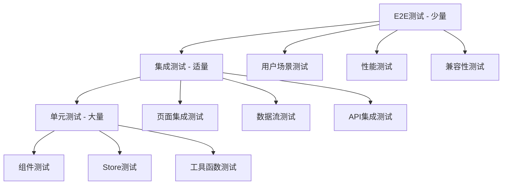

# 测试策略与质量保证

## 测试金字塔架构



## 单元测试策略

### 1. 组件测试框架

```typescript
// 测试工具配置
import { TestBed, ComponentFixture } from '@harmony/testing'
import { expect } from '@jest/globals'

// 组件测试基类
class ComponentTestBase<T> {
  protected component: T
  protected fixture: ComponentFixture<T>
  
  protected async setupComponent(componentType: any, props: any = {}) {
    TestBed.configureTestingModule({
      components: [componentType],
      providers: this.getTestProviders()
    })
    
    this.fixture = TestBed.createComponent(componentType)
    this.component = this.fixture.componentInstance
    
    // 设置属性
    Object.assign(this.component, props)
    
    // 触发变更检测
    this.fixture.detectChanges()
    await this.fixture.whenStable()
  }
  
  protected getTestProviders(): any[] {
    return [
      // Mock服务提供者
      { provide: 'TodoStore', useValue: this.createMockTodoStore() },
      { provide: 'MoodStore', useValue: this.createMockMoodStore() },
      { provide: 'NavigationManager', useValue: this.createMockNavigationManager() }
    ]
  }
  
  protected createMockTodoStore() {
    return {
      todos: [],
      loading: false,
      error: null,
      addTodo: jest.fn(),
      updateTodo: jest.fn(),
      deleteTodo: jest.fn(),
      getStats: jest.fn().mockReturnValue({
        total: 0,
        completed: 0,
        pending: 0
      })
    }
  }
  
  protected createMockMoodStore() {
    return {
      records: [],
      addRecord: jest.fn(),
      updateRecord: jest.fn(),
      deleteRecord: jest.fn(),
      getMoodStats: jest.fn()
    }
  }
  
  protected createMockNavigationManager() {
    return {
      navigateTo: jest.fn(),
      goBack: jest.fn(),
      getCurrentRoute: jest.fn()
    }
  }
  
  protected async waitForAsync() {
    await this.fixture.whenStable()
    this.fixture.detectChanges()
  }
  
  protected queryByText(text: string): Element | null {
    return this.fixture.nativeElement.querySelector(`[text*="${text}"]`)
  }
  
  protected queryByTestId(testId: string): Element | null {
    return this.fixture.nativeElement.querySelector(`[data-testid="${testId}"]`)
  }
  
  protected async clickElement(element: Element) {
    const event = new Event('click')
    element.dispatchEvent(event)
    await this.waitForAsync()
  }
}
```

### 2. TodoItem组件测试

```typescript
// TodoItem组件测试
describe('TodoItem Component', () => {
  class TodoItemTest extends ComponentTestBase<TodoItem> {
    private mockTodo: TodoItem = {
      id: '1',
      title: '测试待办事项',
      description: '这是一个测试描述',
      category: TodoCategory.WORK,
      priority: TodoPriority.HIGH,
      status: TodoStatus.TODO,
      tags: ['标签1', '标签2'],
      createdAt: new Date('2024-01-01'),
      updatedAt: new Date('2024-01-01')
    }
  }
  
  let testHelper: TodoItemTest
  
  beforeEach(async () => {
    testHelper = new TodoItemTest()
    await testHelper.setupComponent(TodoItem, {
      todo: testHelper['mockTodo']
    })
  })
  
  afterEach(() => {
    jest.clearAllMocks()
  })
  
  describe('渲染测试', () => {
    it('应该正确显示待办事项标题', () => {
      const titleElement = testHelper.queryByTestId('todo-title')
      expect(titleElement?.textContent).toBe('测试待办事项')
    })
    
    it('应该正确显示待办事项描述', () => {
      const descriptionElement = testHelper.queryByTestId('todo-description')
      expect(descriptionElement?.textContent).toBe('这是一个测试描述')
    })
    
    it('应该根据状态显示正确的勾选状态', () => {
      const checkbox = testHelper.queryByTestId('todo-checkbox') as HTMLInputElement
      expect(checkbox?.checked).toBe(false)
    })
    
    it('应该显示优先级标签', () => {
      const priorityElement = testHelper.queryByTestId('todo-priority')
      expect(priorityElement?.textContent).toBe('高')
      expect(priorityElement?.classList).toContain('priority-high')
    })
    
    it('应该显示分类标签', () => {
      const categoryElement = testHelper.queryByTestId('todo-category')
      expect(categoryElement?.textContent).toBe('工作')
    })
    
    it('应该显示所有标签', () => {
      const tagElements = testHelper.fixture.nativeElement.querySelectorAll('[data-testid="todo-tag"]')
      expect(tagElements).toHaveLength(2)
      expect(tagElements[0].textContent).toBe('标签1')
      expect(tagElements[1].textContent).toBe('标签2')
    })
  })
  
  describe('交互测试', () => {
    it('点击勾选框应该触发状态变更', async () => {
      const mockStore = testHelper.getTestProviders()[0].useValue
      const checkbox = testHelper.queryByTestId('todo-checkbox')
      
      await testHelper.clickElement(checkbox!)
      
      expect(mockStore.updateTodo).toHaveBeenCalledWith('1', {
        status: TodoStatus.COMPLETED,
        completedAt: expect.any(Date)
      })
    })
    
    it('点击编辑按钮应该打开编辑对话框', async () => {
      const editButton = testHelper.queryByTestId('todo-edit-button')
      const showEditDialogSpy = jest.spyOn(testHelper.component, 'showEditDialog')
      
      await testHelper.clickElement(editButton!)
      
      expect(showEditDialogSpy).toHaveBeenCalled()
    })
    
    it('点击删除按钮应该显示确认对话框', async () => {
      const deleteButton = testHelper.queryByTestId('todo-delete-button')
      const showDeleteConfirmSpy = jest.spyOn(testHelper.component, 'showDeleteConfirm')
      
      await testHelper.clickElement(deleteButton!)
      
      expect(showDeleteConfirmSpy).toHaveBeenCalledWith('1')
    })
    
    it('长按应该显示上下文菜单', async () => {
      const itemContainer = testHelper.queryByTestId('todo-item-container')
      const showContextMenuSpy = jest.spyOn(testHelper.component, 'showContextMenu')
      
      // 模拟长按手势
      const longPressEvent = new Event('longpress')
      itemContainer!.dispatchEvent(longPressEvent)
      await testHelper.waitForAsync()
      
      expect(showContextMenuSpy).toHaveBeenCalled()
    })
  })
  
  describe('状态变化测试', () => {
    it('当待办状态变为完成时应该显示划线效果', async () => {
      const completedTodo = {
        ...testHelper['mockTodo'],
        status: TodoStatus.COMPLETED
      }
      
      testHelper.component.todo = completedTodo
      await testHelper.waitForAsync()
      
      const titleElement = testHelper.queryByTestId('todo-title')
      expect(titleElement?.classList).toContain('completed')
    })
    
    it('过期待办应该显示过期样式', async () => {
      const overdueTodo = {
        ...testHelper['mockTodo'],
        dueDate: new Date(Date.now() - 24 * 60 * 60 * 1000) // 昨天
      }
      
      testHelper.component.todo = overdueTodo
      await testHelper.waitForAsync()
      
      const itemContainer = testHelper.queryByTestId('todo-item-container')
      expect(itemContainer?.classList).toContain('overdue')
    })
  })
  
  describe('可访问性测试', () => {
    it('应该有正确的可访问性标签', () => {
      const checkbox = testHelper.queryByTestId('todo-checkbox')
      expect(checkbox?.getAttribute('aria-label')).toBe('标记待办事项为已完成')
      
      const editButton = testHelper.queryByTestId('todo-edit-button')
      expect(editButton?.getAttribute('aria-label')).toBe('编辑待办事项')
      
      const deleteButton = testHelper.queryByTestId('todo-delete-button')
      expect(deleteButton?.getAttribute('aria-label')).toBe('删除待办事项')
    })
    
    it('应该支持键盘导航', async () => {
      const itemContainer = testHelper.queryByTestId('todo-item-container')
      
      // 模拟Tab键聚焦
      const focusEvent = new Event('focus')
      itemContainer!.dispatchEvent(focusEvent)
      await testHelper.waitForAsync()
      
      expect(itemContainer?.classList).toContain('focused')
      
      // 模拟回车键激活
      const keydownEvent = new KeyboardEvent('keydown', { key: 'Enter' })
      itemContainer!.dispatchEvent(keydownEvent)
      await testHelper.waitForAsync()
      
      // 应该触发编辑功能
      expect(jest.spyOn(testHelper.component, 'showEditDialog')).toHaveBeenCalled()
    })
  })
})
```

### 3. Store业务逻辑测试

```typescript
// TodoStore测试
describe('TodoStore', () => {
  let todoStore: TodoStore
  let mockRepository: jest.Mocked<TodoRepository>
  let mockNotificationService: jest.Mocked<NotificationService>
  
  beforeEach(() => {
    // 创建Mock依赖
    mockRepository = {
      findAll: jest.fn(),
      findById: jest.fn(),
      save: jest.fn(),
      update: jest.fn(),
      delete: jest.fn(),
      findByStatus: jest.fn(),
      findByCategory: jest.fn(),
      search: jest.fn()
    }
    
    mockNotificationService = {
      showSuccess: jest.fn(),
      showError: jest.fn(),
      showWarning: jest.fn()
    }
    
    todoStore = new TodoStore(mockRepository, mockNotificationService)
  })
  
  afterEach(() => {
    jest.clearAllMocks()
  })
  
  describe('数据加载', () => {
    it('应该成功加载待办列表', async () => {
      const mockTodos: TodoItem[] = [
        { id: '1', title: 'Todo 1', status: TodoStatus.TODO, createdAt: new Date(), updatedAt: new Date() },
        { id: '2', title: 'Todo 2', status: TodoStatus.COMPLETED, createdAt: new Date(), updatedAt: new Date() }
      ]
      
      mockRepository.findAll.mockResolvedValue(mockTodos)
      
      await todoStore.loadTodos()
      
      expect(todoStore.todos).toEqual(mockTodos)
      expect(todoStore.loading).toBe(false)
      expect(todoStore.error).toBeNull()
      expect(mockRepository.findAll).toHaveBeenCalled()
    })
    
    it('应该处理加载失败的情况', async () => {
      const errorMessage = '网络连接失败'
      mockRepository.findAll.mockRejectedValue(new Error(errorMessage))
      
      await todoStore.loadTodos()
      
      expect(todoStore.todos).toEqual([])
      expect(todoStore.loading).toBe(false)
      expect(todoStore.error).toBe(errorMessage)
      expect(mockNotificationService.showError).toHaveBeenCalledWith(errorMessage)
    })
    
    it('加载过程中loading状态应该正确', async () => {
      let loadingDuringFetch = false
      
      mockRepository.findAll.mockImplementation(() => {
        loadingDuringFetch = todoStore.loading
        return Promise.resolve([])
      })
      
      const loadPromise = todoStore.loadTodos()
      
      expect(todoStore.loading).toBe(true)
      
      await loadPromise
      
      expect(loadingDuringFetch).toBe(true)
      expect(todoStore.loading).toBe(false)
    })
  })
  
  describe('CRUD操作', () => {
    it('应该成功添加新待办', async () => {
      const newTodoData: CreateTodoData = {
        title: '新待办',
        description: '测试描述',
        category: TodoCategory.WORK,
        priority: TodoPriority.MEDIUM,
        tags: ['测试']
      }
      
      const savedTodo: TodoItem = {
        id: '3',
        ...newTodoData,
        status: TodoStatus.TODO,
        createdAt: new Date(),
        updatedAt: new Date()
      }
      
      mockRepository.save.mockResolvedValue(savedTodo)
      
      const result = await todoStore.addTodo(newTodoData)
      
      expect(result).toEqual(savedTodo)
      expect(todoStore.todos).toContain(savedTodo)
      expect(mockRepository.save).toHaveBeenCalledWith(expect.objectContaining({
        title: newTodoData.title,
        description: newTodoData.description,
        category: newTodoData.category,
        priority: newTodoData.priority,
        tags: newTodoData.tags
      }))
      expect(mockNotificationService.showSuccess).toHaveBeenCalledWith('待办添加成功')
    })
    
    it('应该成功更新待办', async () => {
      const existingTodo: TodoItem = {
        id: '1',
        title: '原标题',
        description: '原描述',
        category: TodoCategory.WORK,
        priority: TodoPriority.LOW,
        status: TodoStatus.TODO,
        tags: [],
        createdAt: new Date(),
        updatedAt: new Date()
      }
      
      todoStore['_todos'] = [existingTodo]
      
      const updates: UpdateTodoData = {
        title: '新标题',
        priority: TodoPriority.HIGH
      }
      
      const updatedTodo = { ...existingTodo, ...updates, updatedAt: new Date() }
      mockRepository.update.mockResolvedValue(updatedTodo)
      
      const result = await todoStore.updateTodo('1', updates)
      
      expect(result).toEqual(updatedTodo)
      expect(todoStore.todos[0]).toEqual(updatedTodo)
      expect(mockRepository.update).toHaveBeenCalledWith('1', expect.objectContaining(updates))
      expect(mockNotificationService.showSuccess).toHaveBeenCalledWith('待办更新成功')
    })
    
    it('应该成功删除待办', async () => {
      const todoToDelete: TodoItem = {
        id: '1',
        title: '待删除',
        category: TodoCategory.WORK,
        priority: TodoPriority.LOW,
        status: TodoStatus.TODO,
        tags: [],
        createdAt: new Date(),
        updatedAt: new Date()
      }
      
      todoStore['_todos'] = [todoToDelete]
      mockRepository.delete.mockResolvedValue(true)
      
      const result = await todoStore.deleteTodo('1')
      
      expect(result).toBe(true)
      expect(todoStore.todos).toHaveLength(0)
      expect(mockRepository.delete).toHaveBeenCalledWith('1')
      expect(mockNotificationService.showSuccess).toHaveBeenCalledWith('待办删除成功')
    })
  })
  
  describe('状态计算', () => {
    beforeEach(() => {
      const mockTodos: TodoItem[] = [
        { id: '1', title: 'Todo 1', status: TodoStatus.TODO, priority: TodoPriority.HIGH, category: TodoCategory.WORK, tags: ['工作'], createdAt: new Date(), updatedAt: new Date() },
        { id: '2', title: 'Todo 2', status: TodoStatus.COMPLETED, priority: TodoPriority.MEDIUM, category: TodoCategory.LIFE, tags: ['生活'], createdAt: new Date(), updatedAt: new Date() },
        { id: '3', title: 'Todo 3', status: TodoStatus.IN_PROGRESS, priority: TodoPriority.LOW, category: TodoCategory.WORK, tags: ['工作'], createdAt: new Date(), updatedAt: new Date() }
      ]
      
      todoStore['_todos'] = mockTodos
    })
    
    it('应该正确计算统计数据', () => {
      const stats = todoStore.getStats()
      
      expect(stats.total).toBe(3)
      expect(stats.completed).toBe(1)
      expect(stats.pending).toBe(1)
      expect(stats.inProgress).toBe(1)
      expect(stats.highPriority).toBe(1)
      expect(stats.mediumPriority).toBe(1)
      expect(stats.lowPriority).toBe(1)
      expect(stats.completionRate).toBe(33) // 1/3 * 100 ≈ 33
    })
    
    it('应该正确计算分类统计', () => {
      const stats = todoStore.getStats()
      
      expect(stats.categoryStats[TodoCategory.WORK]).toBe(2)
      expect(stats.categoryStats[TodoCategory.LIFE]).toBe(1)
    })
    
    it('应该正确计算标签统计', () => {
      const stats = todoStore.getStats()
      
      expect(stats.tagStats['工作']).toBe(2)
      expect(stats.tagStats['生活']).toBe(1)
    })
  })
  
  describe('筛选功能', () => {
    beforeEach(() => {
      const mockTodos: TodoItem[] = [
        { id: '1', title: 'Work Todo', status: TodoStatus.TODO, category: TodoCategory.WORK, priority: TodoPriority.HIGH, tags: ['urgent'], createdAt: new Date(), updatedAt: new Date() },
        { id: '2', title: 'Life Todo', status: TodoStatus.COMPLETED, category: TodoCategory.LIFE, priority: TodoPriority.LOW, tags: ['home'], createdAt: new Date(), updatedAt: new Date() },
        { id: '3', title: 'Study Todo', status: TodoStatus.TODO, category: TodoCategory.STUDY, priority: TodoPriority.MEDIUM, tags: ['learning'], createdAt: new Date(), updatedAt: new Date() }
      ]
      
      todoStore['_todos'] = mockTodos
    })
    
    it('应该根据关键词筛选', () => {
      todoStore.setFilters({ search: 'Work' })
      const filtered = todoStore.getFilteredTodos()
      
      expect(filtered).toHaveLength(1)
      expect(filtered[0].title).toBe('Work Todo')
    })
    
    it('应该根据分类筛选', () => {
      todoStore.setFilters({ category: TodoCategory.WORK })
      const filtered = todoStore.getFilteredTodos()
      
      expect(filtered).toHaveLength(1)
      expect(filtered[0].category).toBe(TodoCategory.WORK)
    })
    
    it('应该根据状态筛选', () => {
      todoStore.setFilters({ status: TodoStatus.TODO })
      const filtered = todoStore.getFilteredTodos()
      
      expect(filtered).toHaveLength(2)
      expect(filtered.every(todo => todo.status === TodoStatus.TODO)).toBe(true)
    })
    
    it('应该支持多条件筛选', () => {
      todoStore.setFilters({
        category: TodoCategory.WORK,
        status: TodoStatus.TODO,
        priority: TodoPriority.HIGH
      })
      
      const filtered = todoStore.getFilteredTodos()
      
      expect(filtered).toHaveLength(1)
      expect(filtered[0].id).toBe('1')
    })
  })
})
```

## 集成测试策略

### 1. 页面集成测试

```typescript
// 页面集成测试示例
describe('TodoListPage Integration', () => {
  let page: TodoListPage
  let testBed: TestEnvironment
  
  beforeEach(async () => {
    testBed = new TestEnvironment()
    
    // 配置测试环境
    await testBed.setup({
      components: [TodoListPage, TodoItem, FilterBar, StatsCard],
      stores: [TodoStore, MoodStore],
      services: [TodoRepository, NotificationService],
      mocks: {
        database: MockDatabase,
        navigation: MockNavigation
      }
    })
    
    page = testBed.getPage(TodoListPage)
  })
  
  afterEach(async () => {
    await testBed.cleanup()
  })
  
  describe('页面初始化', () => {
    it('应该正确加载并显示待办列表', async () => {
      // 准备测试数据
      await testBed.seedData('todos', [
        { id: '1', title: '测试待办1', status: TodoStatus.TODO },
        { id: '2', title: '测试待办2', status: TodoStatus.COMPLETED }
      ])
      
      await page.load()
      
      // 验证列表渲染
      const todoItems = page.queryAll('[data-testid="todo-item"]')
      expect(todoItems).toHaveLength(2)
      
      // 验证统计信息
      const statsCard = page.query('[data-testid="stats-card"]')
      expect(statsCard.query('[data-testid="total-count"]').textContent).toBe('2')
      expect(statsCard.query('[data-testid="completed-count"]').textContent).toBe('1')
    })
    
    it('空状态应该显示正确的提示', async () => {
      await page.load()
      
      const emptyState = page.query('[data-testid="empty-state"]')
      expect(emptyState).toBeVisible()
      expect(emptyState.textContent).toContain('暂无待办事项')
    })
    
    it('加载失败应该显示错误提示', async () => {
      testBed.mockService('TodoRepository').loadTodos.mockRejectedValue(new Error('网络错误'))
      
      await page.load()
      
      const errorMessage = page.query('[data-testid="error-message"]')
      expect(errorMessage).toBeVisible()
      expect(errorMessage.textContent).toContain('加载失败')
    })
  })
  
  describe('用户交互流程', () => {
    it('完整的添加待办流程', async () => {
      await page.load()
      
      // 点击添加按钮
      await page.click('[data-testid="add-todo-button"]')
      
      // 填写表单
      const dialog = page.query('[data-testid="add-todo-dialog"]')
      await dialog.fillText('[data-testid="title-input"]', '新的待办事项')
      await dialog.fillText('[data-testid="description-input"]', '详细描述')
      await dialog.select('[data-testid="category-select"]', TodoCategory.WORK)
      await dialog.select('[data-testid="priority-select"]', TodoPriority.HIGH)
      
      // 提交表单
      await dialog.click('[data-testid="submit-button"]')
      
      // 等待保存完成
      await page.waitForUpdate()
      
      // 验证新待办出现在列表中
      const newTodoItem = page.query('[data-testid="todo-item"]:first-child')
      expect(newTodoItem.query('[data-testid="todo-title"]').textContent).toBe('新的待办事项')
      
      // 验证统计更新
      const totalCount = page.query('[data-testid="total-count"]').textContent
      expect(totalCount).toBe('1')
    })
    
    it('完整的编辑待办流程', async () => {
      // 准备数据
      await testBed.seedData('todos', [
        { id: '1', title: '原标题', description: '原描述', status: TodoStatus.TODO }
      ])
      
      await page.load()
      
      // 点击编辑按钮
      const todoItem = page.query('[data-testid="todo-item"]')
      await todoItem.click('[data-testid="edit-button"]')
      
      // 修改内容
      const editDialog = page.query('[data-testid="edit-todo-dialog"]')
      await editDialog.clearAndFillText('[data-testid="title-input"]', '修改后的标题')
      
      // 保存修改
      await editDialog.click('[data-testid="save-button"]')
      await page.waitForUpdate()
      
      // 验证修改结果
      const updatedTitle = todoItem.query('[data-testid="todo-title"]').textContent
      expect(updatedTitle).toBe('修改后的标题')
    })
    
    it('完整的删除待办流程', async () => {
      // 准备数据
      await testBed.seedData('todos', [
        { id: '1', title: '待删除', status: TodoStatus.TODO }
      ])
      
      await page.load()
      
      // 点击删除按钮
      const todoItem = page.query('[data-testid="todo-item"]')
      await todoItem.click('[data-testid="delete-button"]')
      
      // 确认删除
      const confirmDialog = page.query('[data-testid="confirm-dialog"]')
      await confirmDialog.click('[data-testid="confirm-button"]')
      await page.waitForUpdate()
      
      // 验证删除结果
      const todoItems = page.queryAll('[data-testid="todo-item"]')
      expect(todoItems).toHaveLength(0)
      
      // 应该显示空状态
      const emptyState = page.query('[data-testid="empty-state"]')
      expect(emptyState).toBeVisible()
    })
  })
  
  describe('筛选和搜索', () => {
    beforeEach(async () => {
      await testBed.seedData('todos', [
        { id: '1', title: '工作任务', category: TodoCategory.WORK, status: TodoStatus.TODO },
        { id: '2', title: '生活事务', category: TodoCategory.LIFE, status: TodoStatus.COMPLETED },
        { id: '3', title: '学习计划', category: TodoCategory.STUDY, status: TodoStatus.TODO }
      ])
      
      await page.load()
    })
    
    it('应该支持关键词搜索', async () => {
      const searchInput = page.query('[data-testid="search-input"]')
      await searchInput.fillText('工作')
      await page.waitForUpdate()
      
      const todoItems = page.queryAll('[data-testid="todo-item"]')
      expect(todoItems).toHaveLength(1)
      expect(todoItems[0].query('[data-testid="todo-title"]').textContent).toBe('工作任务')
    })
    
    it('应该支持分类筛选', async () => {
      const categoryFilter = page.query('[data-testid="category-filter"]')
      await categoryFilter.select(TodoCategory.LIFE)
      await page.waitForUpdate()
      
      const todoItems = page.queryAll('[data-testid="todo-item"]')
      expect(todoItems).toHaveLength(1)
      expect(todoItems[0].query('[data-testid="todo-title"]').textContent).toBe('生活事务')
    })
    
    it('应该支持状态筛选', async () => {
      const statusFilter = page.query('[data-testid="status-filter"]')
      await statusFilter.select(TodoStatus.COMPLETED)
      await page.waitForUpdate()
      
      const todoItems = page.queryAll('[data-testid="todo-item"]')
      expect(todoItems).toHaveLength(1)
      expect(todoItems[0].query('[data-testid="todo-title"]').textContent).toBe('生活事务')
    })
  })
})
```

### 2. 数据流集成测试

```typescript
// Store与Repository集成测试
describe('TodoStore-Repository Integration', () => {
  let todoStore: TodoStore
  let database: TestDatabase
  
  beforeEach(async () => {
    database = new TestDatabase()
    await database.initialize()
    
    const repository = new TodoRepository(database)
    todoStore = new TodoStore(repository)
  })
  
  afterEach(async () => {
    await database.cleanup()
  })
  
  it('应该正确处理数据持久化流程', async () => {
    // 添加待办
    const todoData: CreateTodoData = {
      title: '集成测试待办',
      category: TodoCategory.WORK,
      priority: TodoPriority.HIGH,
      tags: ['测试']
    }
    
    const addedTodo = await todoStore.addTodo(todoData)
    expect(addedTodo.id).toBeDefined()
    
    // 验证数据库中的数据
    const savedTodo = await database.query('SELECT * FROM todos WHERE id = ?', [addedTodo.id])
    expect(savedTodo.title).toBe(todoData.title)
    
    // 重新加载Store
    const newStore = new TodoStore(new TodoRepository(database))
    await newStore.loadTodos()
    
    expect(newStore.todos).toHaveLength(1)
    expect(newStore.todos[0].title).toBe(todoData.title)
  })
  
  it('应该正确处理并发操作', async () => {
    // 并发添加多个待办
    const promises = []
    for (let i = 0; i < 5; i++) {
      promises.push(todoStore.addTodo({
        title: `待办 ${i}`,
        category: TodoCategory.WORK,
        priority: TodoPriority.MEDIUM,
        tags: []
      }))
    }
    
    const results = await Promise.all(promises)
    expect(results).toHaveLength(5)
    expect(todoStore.todos).toHaveLength(5)
    
    // 验证数据库中的数据
    const dbCount = await database.queryValue('SELECT COUNT(*) FROM todos')
    expect(dbCount).toBe(5)
  })
})
```

## E2E测试策略

### 1. 用户场景测试

```typescript
// 用户完整使用流程测试
describe('用户完整使用流程 E2E', () => {
  let app: AppDriver
  
  beforeAll(async () => {
    app = new AppDriver()
    await app.launch()
  })
  
  afterAll(async () => {
    await app.close()
  })
  
  beforeEach(async () => {
    await app.resetData()
  })
  
  it('新用户完整体验流程', async () => {
    // 1. 首次启动，查看引导页
    await app.waitForElement('[data-testid="welcome-screen"]')
    await app.click('[data-testid="start-button"]')
    
    // 2. 进入主页，查看空状态
    await app.waitForElement('[data-testid="home-page"]')
    const emptyState = await app.getElement('[data-testid="empty-state"]')
    expect(await emptyState.isVisible()).toBe(true)
    
    // 3. 添加第一个待办
    await app.click('[data-testid="add-first-todo"]')
    await app.fillText('[data-testid="todo-title-input"]', '我的第一个待办')
    await app.fillText('[data-testid="todo-description-input"]', '开始使用这个应用')
    await app.selectOption('[data-testid="category-select"]', '生活')
    await app.click('[data-testid="save-todo-button"]')
    
    // 4. 验证待办添加成功
    await app.waitForElement('[data-testid="todo-item"]')
    const todoTitle = await app.getText('[data-testid="todo-title"]')
    expect(todoTitle).toBe('我的第一个待办')
    
    // 5. 完成待办
    await app.click('[data-testid="todo-checkbox"]')
    
    // 6. 选择心情
    await app.waitForElement('[data-testid="mood-selection-dialog"]')
    await app.click('[data-testid="mood-happy"]')
    await app.click('[data-testid="confirm-mood"]')
    
    // 7. 查看庆祝动画
    await app.waitForElement('[data-testid="celebration-animation"]')
    await app.waitForElementHidden('[data-testid="celebration-animation"]', { timeout: 5000 })
    
    // 8. 验证统计数据更新
    const completedCount = await app.getText('[data-testid="completed-count"]')
    expect(completedCount).toBe('1')
    
    // 9. 查看心情记录
    await app.click('[data-testid="mood-tab"]')
    await app.waitForElement('[data-testid="mood-record"]')
    const moodRecord = await app.getElement('[data-testid="mood-record"]')
    expect(await moodRecord.getText()).toContain('😊')
  })
  
  it('项目创建和编辑流程', async () => {
    // 1. 进入创建页面
    await app.click('[data-testid="create-tab"]')
    await app.waitForElement('[data-testid="template-grid"]')
    
    // 2. 选择模板
    await app.click('[data-testid="template-campus-collage"]')
    await app.waitForElement('[data-testid="editor-page"]')
    
    // 3. 添加文本元素
    await app.click('[data-testid="add-text-button"]')
    const textElement = await app.getElement('[data-testid="canvas-text-element"]')
    await textElement.doubleClick()
    await app.fillText('[data-testid="text-input"]', '我的校园生活')
    await app.pressKey('Enter')
    
    // 4. 添加图片
    await app.click('[data-testid="add-image-button"]')
    await app.uploadFile('[data-testid="image-upload"]', 'test-image.jpg')
    await app.waitForElement('[data-testid="canvas-image-element"]')
    
    // 5. 调整元素位置
    const imageElement = await app.getElement('[data-testid="canvas-image-element"]')
    await imageElement.dragTo('[data-testid="canvas"]', { x: 200, y: 150 })
    
    // 6. 保存项目
    await app.click('[data-testid="save-button"]')
    await app.fillText('[data-testid="project-name-input"]', '我的第一个作品')
    await app.click('[data-testid="confirm-save"]')
    
    // 7. 验证保存成功
    await app.waitForElement('[data-testid="save-success-message"]')
    
    // 8. 查看相册
    await app.click('[data-testid="album-tab"]')
    await app.waitForElement('[data-testid="project-card"]')
    const projectName = await app.getText('[data-testid="project-name"]')
    expect(projectName).toBe('我的第一个作品')
  })
  
  it('数据导出和备份流程', async () => {
    // 准备测试数据
    await app.createTestData({
      todos: [
        { title: '待办1', status: 'completed' },
        { title: '待办2', status: 'todo' }
      ],
      projects: [
        { name: '项目1', type: 'collage' }
      ]
    })
    
    // 1. 进入设置页面
    await app.click('[data-testid="settings-tab"]')
    await app.waitForElement('[data-testid="settings-page"]')
    
    // 2. 点击数据导出
    await app.click('[data-testid="export-data-button"]')
    await app.waitForElement('[data-testid="export-options-dialog"]')
    
    // 3. 选择导出格式
    await app.checkCheckbox('[data-testid="export-todos"]')
    await app.checkCheckbox('[data-testid="export-projects"]')
    await app.selectOption('[data-testid="export-format"]', 'JSON')
    
    // 4. 执行导出
    await app.click('[data-testid="start-export"]')
    await app.waitForElement('[data-testid="export-progress"]')
    
    // 5. 等待导出完成
    await app.waitForElement('[data-testid="export-success"]', { timeout: 30000 })
    
    // 6. 验证导出文件
    const exportedFile = await app.getDownloadedFile('handbook-backup.json')
    expect(exportedFile).toBeDefined()
    
    const exportData = JSON.parse(await exportedFile.text())
    expect(exportData.todos).toHaveLength(2)
    expect(exportData.projects).toHaveLength(1)
  })
})
```

### 2. 性能测试

```typescript
// 性能基准测试
describe('应用性能测试', () => {
  let performanceMonitor: PerformanceMonitor
  
  beforeEach(() => {
    performanceMonitor = new PerformanceMonitor()
  })
  
  it('应用启动性能', async () => {
    const startTime = Date.now()
    
    const app = new AppDriver()
    await app.launch()
    
    // 等待首页完全加载
    await app.waitForElement('[data-testid="home-page"]')
    
    const loadTime = Date.now() - startTime
    
    // 启动时间应该在2秒内
    expect(loadTime).toBeLessThan(2000)
    
    await app.close()
  })
  
  it('大量数据列表性能', async () => {
    const app = new AppDriver()
    await app.launch()
    
    // 创建1000个待办数据
    await app.createBulkTestData({
      todos: Array.from({ length: 1000 }, (_, i) => ({
        title: `待办事项 ${i}`,
        status: i % 2 === 0 ? 'completed' : 'todo'
      }))
    })
    
    // 导航到待办列表
    await app.click('[data-testid="todo-tab"]')
    
    const renderStart = Date.now()
    await app.waitForElement('[data-testid="todo-list"]')
    const renderTime = Date.now() - renderStart
    
    // 列表渲染时间应该在1秒内
    expect(renderTime).toBeLessThan(1000)
    
    // 测试滚动性能
    const scrollMetrics = await performanceMonitor.measureScrollPerformance(() => {
      return app.scrollElement('[data-testid="todo-list"]', { distance: 2000, duration: 2000 })
    })
    
    expect(scrollMetrics.averageFPS).toBeGreaterThan(55)
    expect(scrollMetrics.frameDrops).toBeLessThan(10)
    
    await app.close()
  })
  
  it('图形编辑器性能', async () => {
    const app = new AppDriver()
    await app.launch()
    
    // 进入编辑器
    await app.click('[data-testid="create-tab"]')
    await app.click('[data-testid="template-free-canvas"]')
    await app.waitForElement('[data-testid="editor-canvas"]')
    
    // 添加100个元素
    for (let i = 0; i < 100; i++) {
      await app.click('[data-testid="add-text-button"]')
      await app.fillText('[data-testid="text-input"]', `文本 ${i}`)
      await app.pressKey('Enter')
    }
    
    // 测试画布操作性能
    const canvasMetrics = await performanceMonitor.measureCanvasPerformance(() => {
      return app.dragElement('[data-testid="canvas-element-0"]', { x: 300, y: 200 })
    })
    
    expect(canvasMetrics.responseTime).toBeLessThan(100)
    expect(canvasMetrics.redrawTime).toBeLessThan(50)
    
    await app.close()
  })
  
  it('内存使用监控', async () => {
    const app = new AppDriver()
    await app.launch()
    
    const initialMemory = await performanceMonitor.getMemoryUsage()
    
    // 执行内存密集型操作
    await app.createBulkTestData({
      projects: Array.from({ length: 50 }, (_, i) => ({
        name: `项目 ${i}`,
        type: 'collage',
        content: {
          images: Array.from({ length: 10 }, () => 'large-image-data-url...')
        }
      }))
    })
    
    // 等待数据加载完成
    await app.waitFor(2000)
    
    const peakMemory = await performanceMonitor.getMemoryUsage()
    
    // 触发垃圾回收
    await performanceMonitor.triggerGC()
    await app.waitFor(1000)
    
    const finalMemory = await performanceMonitor.getMemoryUsage()
    
    // 内存增长应该在合理范围内
    expect(peakMemory - initialMemory).toBeLessThan(200 * 1024 * 1024) // 200MB
    
    // 垃圾回收后内存应该有所释放
    expect(peakMemory - finalMemory).toBeGreaterThan(50 * 1024 * 1024) // 50MB
    
    await app.close()
  })
})
```

## 质量保证流程

### 1. 持续集成检查

```yaml
# CI/CD配置示例
name: 质量检查流水线

on:
  push:
    branches: [ main, develop ]
  pull_request:
    branches: [ main ]

jobs:
  lint-and-format:
    runs-on: ubuntu-latest
    steps:
      - uses: actions/checkout@v3
      - name: 设置Node.js
        uses: actions/setup-node@v3
        with:
          node-version: '18'
      - name: 安装依赖
        run: npm ci
      - name: 代码格式检查
        run: npm run lint
      - name: TypeScript类型检查
        run: npm run type-check
      
  unit-tests:
    runs-on: ubuntu-latest
    steps:
      - uses: actions/checkout@v3
      - name: 运行单元测试
        run: npm run test:unit
      - name: 生成覆盖率报告
        run: npm run test:coverage
      - name: 上传覆盖率
        uses: codecov/codecov-action@v3
        
  integration-tests:
    runs-on: ubuntu-latest
    steps:
      - uses: actions/checkout@v3
      - name: 运行集成测试
        run: npm run test:integration
        
  e2e-tests:
    runs-on: ubuntu-latest
    steps:
      - uses: actions/checkout@v3
      - name: 运行E2E测试
        run: npm run test:e2e
        
  performance-tests:
    runs-on: ubuntu-latest
    steps:
      - uses: actions/checkout@v3
      - name: 运行性能测试
        run: npm run test:performance
      - name: 性能报告
        run: npm run performance:report
```

### 2. 代码质量指标

```typescript
// 质量指标监控
class QualityMetrics {
  // 代码覆盖率要求
  static readonly COVERAGE_THRESHOLDS = {
    statements: 80,
    branches: 75,
    functions: 80,
    lines: 80
  }
  
  // 性能指标要求
  static readonly PERFORMANCE_THRESHOLDS = {
    appStartTime: 2000,    // 应用启动时间(ms)
    pageLoadTime: 1000,    // 页面加载时间(ms)
    listRenderTime: 500,   // 列表渲染时间(ms)
    canvasResponseTime: 100, // 画布响应时间(ms)
    memoryUsage: 200 * 1024 * 1024, // 内存使用(bytes)
    bundleSize: 5 * 1024 * 1024      // 包大小(bytes)
  }
  
  // 代码质量检查
  static checkCodeQuality(metrics: CodeMetrics): QualityReport {
    const issues: string[] = []
    
    // 检查覆盖率
    Object.entries(this.COVERAGE_THRESHOLDS).forEach(([key, threshold]) => {
      if (metrics.coverage[key] < threshold) {
        issues.push(`${key} 覆盖率 ${metrics.coverage[key]}% 低于要求 ${threshold}%`)
      }
    })
    
    // 检查复杂度
    if (metrics.complexity > 10) {
      issues.push(`代码复杂度 ${metrics.complexity} 过高`)
    }
    
    // 检查重复率
    if (metrics.duplication > 5) {
      issues.push(`代码重复率 ${metrics.duplication}% 过高`)
    }
    
    return {
      passed: issues.length === 0,
      issues,
      score: this.calculateQualityScore(metrics)
    }
  }
  
  // 性能指标检查
  static checkPerformance(metrics: PerformanceMetrics): PerformanceReport {
    const issues: string[] = []
    
    Object.entries(this.PERFORMANCE_THRESHOLDS).forEach(([key, threshold]) => {
      if (metrics[key] > threshold) {
        issues.push(`${key} ${metrics[key]} 超过阈值 ${threshold}`)
      }
    })
    
    return {
      passed: issues.length === 0,
      issues,
      score: this.calculatePerformanceScore(metrics)
    }
  }
  
  private static calculateQualityScore(metrics: CodeMetrics): number {
    // 计算综合质量得分
    let score = 100
    
    // 覆盖率扣分
    const coverageScore = Object.values(metrics.coverage).reduce((sum, val) => sum + val, 0) / 4
    score -= Math.max(0, (80 - coverageScore) * 0.5)
    
    // 复杂度扣分
    score -= Math.max(0, (metrics.complexity - 10) * 2)
    
    // 重复度扣分
    score -= Math.max(0, (metrics.duplication - 5) * 3)
    
    return Math.max(0, score)
  }
  
  private static calculatePerformanceScore(metrics: PerformanceMetrics): number {
    // 计算综合性能得分
    let score = 100
    
    // 各项指标扣分
    Object.entries(this.PERFORMANCE_THRESHOLDS).forEach(([key, threshold]) => {
      if (metrics[key] > threshold) {
        const excess = (metrics[key] - threshold) / threshold
        score -= excess * 10 // 超出阈值每10%扣1分
      }
    })
    
    return Math.max(0, score)
  }
}

interface CodeMetrics {
  coverage: {
    statements: number
    branches: number
    functions: number
    lines: number
  }
  complexity: number
  duplication: number
  maintainabilityIndex: number
}

interface PerformanceMetrics {
  appStartTime: number
  pageLoadTime: number
  listRenderTime: number
  canvasResponseTime: number
  memoryUsage: number
  bundleSize: number
}

interface QualityReport {
  passed: boolean
  issues: string[]
  score: number
}

interface PerformanceReport {
  passed: boolean
  issues: string[]
  score: number
}
```

---

**总结**：完善的测试策略和质量保证体系是确保应用稳定性和用户体验的关键。通过单元测试保证代码正确性，集成测试验证模块协作，E2E测试确保用户流程，性能测试保障使用体验，最终形成全方位的质量保护网。
