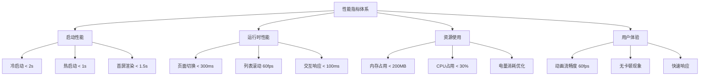
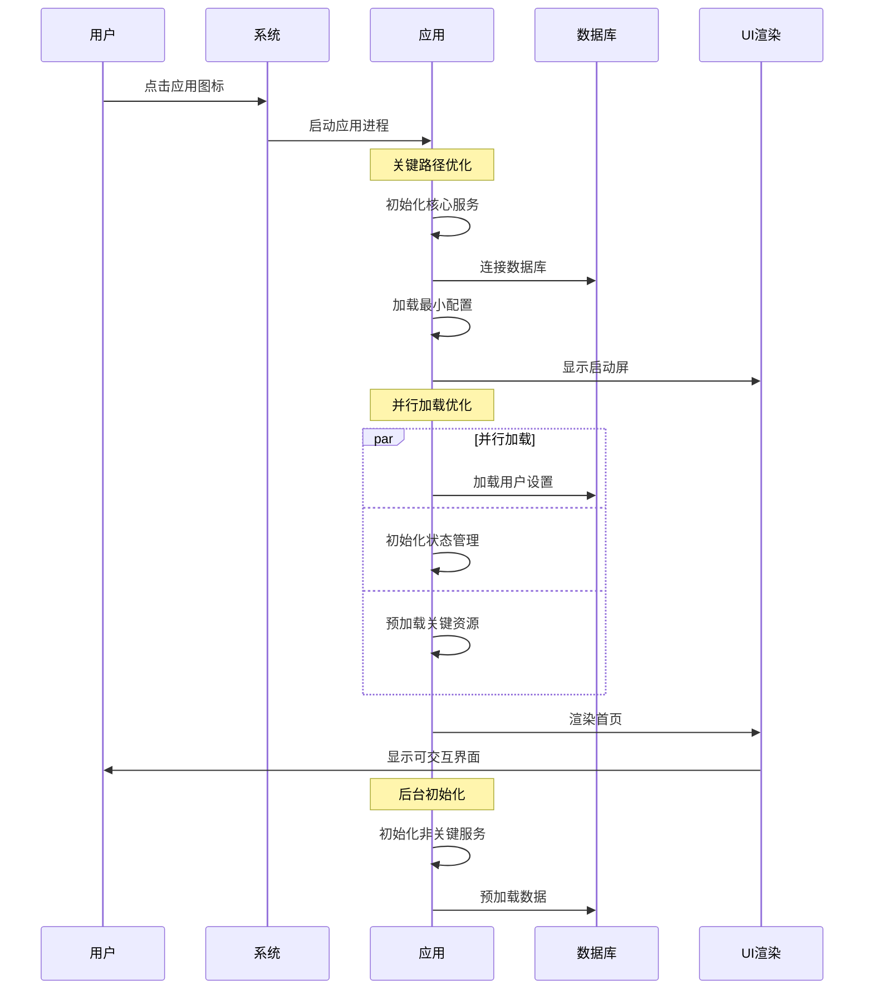

# 性能优化策略

## 性能优化目标

### 1. 关键性能指标(KPI)



### 2. 性能基准测试

```typescript
// 性能基准定义
interface PerformanceBenchmarks {
  startup: {
    coldStart: number    // 冷启动时间(ms)
    hotStart: number     // 热启动时间(ms)
    firstRender: number  // 首屏渲染时间(ms)
  }
  
  runtime: {
    pageTransition: number     // 页面切换时间(ms)
    listScrollFPS: number      // 列表滚动帧率
    canvasResponseTime: number // Canvas响应时间(ms)
    searchLatency: number      // 搜索延迟(ms)
  }
  
  resources: {
    memoryUsage: number        // 内存使用(MB)
    cpuUsage: number          // CPU使用率(%)
    batteryDrain: number      // 电量消耗(mAh/h)
    storageSpace: number      // 存储空间(MB)
  }
  
  network: {
    apiResponseTime: number   // API响应时间(ms) - 本地化后不适用
    imageLoadTime: number     // 图片加载时间(ms)
    dataSync: number          // 数据同步时间(ms)
  }
}

// 目标基准值
const TARGET_BENCHMARKS: PerformanceBenchmarks = {
  startup: {
    coldStart: 2000,
    hotStart: 1000,
    firstRender: 1500
  },
  runtime: {
    pageTransition: 300,
    listScrollFPS: 60,
    canvasResponseTime: 100,
    searchLatency: 200
  },
  resources: {
    memoryUsage: 200,
    cpuUsage: 30,
    batteryDrain: 50,
    storageSpace: 500
  },
  network: {
    apiResponseTime: 0,     // 本地化应用不适用
    imageLoadTime: 500,
    dataSync: 1000
  }
}
```

## 启动性能优化

### 1. 应用启动流程优化



```typescript
// 优化的应用启动器
class OptimizedAppLauncher {
  private criticalServices: Service[] = []
  private nonCriticalServices: Service[] = []
  
  async launch() {
    const startTime = Date.now()
    
    try {
      // 阶段1: 关键资源初始化（同步）
      await this.initializeCriticalResources()
      
      // 阶段2: 显示启动屏
      await this.showSplashScreen()
      
      // 阶段3: 并行初始化核心服务
      await Promise.all([
        this.initializeDatabase(),
        this.initializeStateManagement(),
        this.loadUserPreferences(),
        this.preloadCriticalData()
      ])
      
      // 阶段4: 渲染首页
      await this.renderHomePage()
      
      // 阶段5: 后台初始化非关键服务
      this.initializeNonCriticalServicesInBackground()
      
      const launchTime = Date.now() - startTime
      this.reportLaunchMetrics(launchTime)
      
    } catch (error) {
      this.handleLaunchError(error)
    }
  }
  
  private async initializeCriticalResources() {
    // 只初始化启动必需的资源
    await Promise.all([
      this.setupLogging(),
      this.setupErrorHandling(),
      this.setupPerformanceMonitoring()
    ])
  }
  
  private async initializeDatabase() {
    // 优化数据库连接
    const dbOptions = {
      journalMode: 'WAL',           // 写前日志模式
      synchronous: 'NORMAL',        // 平衡性能和安全
      cacheSize: 10000,            // 缓存页面数
      autoVacuum: 'INCREMENTAL',   // 增量清理
      pageSize: 4096               // 页面大小
    }
    
    await this.database.connect(dbOptions)
    
    // 预热连接
    await this.database.query('SELECT 1')
  }
  
  private async preloadCriticalData() {
    // 只预加载首屏必需的数据
    const criticalQueries = [
      this.loadRecentTodos(5),      // 最近5个待办
      this.loadTodayStats(),        // 今日统计
      this.loadUserTheme()          // 用户主题
    ]
    
    await Promise.all(criticalQueries)
  }
  
  private initializeNonCriticalServicesInBackground() {
    // 使用setTimeout避免阻塞主线程
    setTimeout(async () => {
      try {
        await Promise.all([
          this.initializeAnalytics(),
          this.preloadImages(),
          this.cleanupOldData(),
          this.syncSettings()
        ])
      } catch (error) {
        console.warn('后台初始化失败:', error)
      }
    }, 100)
  }
  
  private reportLaunchMetrics(launchTime: number) {
    const metrics = {
      launchTime,
      memoryUsage: this.getMemoryUsage(),
      timestamp: Date.now()
    }
    
    // 上报性能指标
    this.performanceMonitor.report('app_launch', metrics)
    
    if (launchTime > TARGET_BENCHMARKS.startup.coldStart) {
      console.warn(`启动时间过长: ${launchTime}ms`)
    }
  }
}
```

### 2. 资源加载优化

```typescript
// 资源管理器
class ResourceManager {
  private imageCache = new Map<string, ImageBitmap>()
  private preloadQueue: string[] = []
  private loadingTasks = new Map<string, Promise<any>>()
  
  // 图片预加载策略
  async preloadImages(priority: 'critical' | 'high' | 'normal' | 'low' = 'normal') {
    const imagePaths = this.getImagesByPriority(priority)
    
    // 分批加载，避免内存峰值
    const batchSize = 5
    for (let i = 0; i < imagePaths.length; i += batchSize) {
      const batch = imagePaths.slice(i, i + batchSize)
      
      await Promise.all(
        batch.map(path => this.loadImageWithCache(path))
      )
      
      // 批次间间隔，让出CPU时间
      await this.sleep(10)
    }
  }
  
  private async loadImageWithCache(path: string): Promise<ImageBitmap> {
    // 检查缓存
    if (this.imageCache.has(path)) {
      return this.imageCache.get(path)!
    }
    
    // 检查是否正在加载
    if (this.loadingTasks.has(path)) {
      return this.loadingTasks.get(path)!
    }
    
    // 开始加载
    const loadTask = this.loadImage(path)
    this.loadingTasks.set(path, loadTask)
    
    try {
      const bitmap = await loadTask
      this.imageCache.set(path, bitmap)
      return bitmap
    } finally {
      this.loadingTasks.delete(path)
    }
  }
  
  private async loadImage(path: string): Promise<ImageBitmap> {
    return new Promise((resolve, reject) => {
      const img = new Image()
      img.onload = () => {
        createImageBitmap(img).then(resolve).catch(reject)
      }
      img.onerror = reject
      img.src = path
    })
  }
  
  // 图片优化加载
  async loadOptimizedImage(src: string, targetSize?: { width: number, height: number }): Promise<ImageBitmap> {
    const img = await this.loadImage(src)
    
    if (targetSize) {
      // 使用Canvas调整图片尺寸
      const canvas = document.createElement('canvas')
      canvas.width = targetSize.width
      canvas.height = targetSize.height
      
      const ctx = canvas.getContext('2d')!
      ctx.drawImage(img as any, 0, 0, targetSize.width, targetSize.height)
      
      return createImageBitmap(canvas)
    }
    
    return img
  }
  
  // 内存清理
  cleanupImageCache(maxSize: number = 50) {
    if (this.imageCache.size <= maxSize) return
    
    // LRU清理策略
    const entries = Array.from(this.imageCache.entries())
    const toRemove = entries.slice(0, entries.length - maxSize)
    
    toRemove.forEach(([key, bitmap]) => {
      bitmap.close() // 释放ImageBitmap资源
      this.imageCache.delete(key)
    })
  }
  
  private sleep(ms: number): Promise<void> {
    return new Promise(resolve => setTimeout(resolve, ms))
  }
}
```

## 运行时性能优化

### 1. 组件渲染优化

```typescript
// 高性能组件基类
@Component
struct OptimizedComponent {
  @State private shouldUpdate: boolean = true
  private lastProps: any = {}
  private renderCache = new Map<string, any>()
  
  // 浅比较优化
  shouldComponentUpdate(newProps: any): boolean {
    // 对比关键属性
    const keyProps = this.getKeyProps()
    
    for (const key of keyProps) {
      if (this.lastProps[key] !== newProps[key]) {
        this.lastProps = { ...newProps }
        return true
      }
    }
    
    return false
  }
  
  // 渲染缓存
  @Builder CachedBuilder(cacheKey: string, builderFn: () => any) {
    if (!this.renderCache.has(cacheKey)) {
      this.renderCache.set(cacheKey, builderFn())
    }
    
    return this.renderCache.get(cacheKey)
  }
  
  // 虚拟滚动列表
  @Builder VirtualizedList(
    items: any[],
    itemHeight: number,
    containerHeight: number,
    renderItem: (item: any, index: number) => any
  ) {
    const startIndex = Math.floor(this.scrollTop / itemHeight)
    const endIndex = Math.min(
      startIndex + Math.ceil(containerHeight / itemHeight) + 2,
      items.length
    )
    
    const visibleItems = items.slice(startIndex, endIndex)
    
    Column() {
      // 上方占位符
      if (startIndex > 0) {
        Row()
          .height(startIndex * itemHeight)
          .width('100%')
      }
      
      // 可见项目
      ForEach(visibleItems, (item: any, index: number) => {
        renderItem(item, startIndex + index)
      }, (item) => item.id)
      
      // 下方占位符
      if (endIndex < items.length) {
        Row()
          .height((items.length - endIndex) * itemHeight)
          .width('100%')
      }
    }
  }
  
  // 防抖动更新
  private updateDebounced = this.debounce((callback: () => void) => {
    callback()
  }, 16) // 60fps
  
  private debounce(func: Function, wait: number) {
    let timeout: number
    return function executedFunction(...args: any[]) {
      const later = () => {
        clearTimeout(timeout)
        func(...args)
      }
      clearTimeout(timeout)
      timeout = setTimeout(later, wait)
    }
  }
  
  protected getKeyProps(): string[] {
    return ['data', 'loading', 'error'] // 子类重写
  }
}

// 高性能列表组件
@Component
struct PerformantTodoList extends OptimizedComponent {
  @Prop todos: TodoItem[] = []
  @State private scrollTop: number = 0
  @State private containerHeight: number = 600
  
  private readonly ITEM_HEIGHT = 80
  private readonly RENDER_BUFFER = 5 // 缓冲区项目数
  
  build() {
    this.VirtualizedList(
      this.todos,
      this.ITEM_HEIGHT,
      this.containerHeight,
      (todo: TodoItem, index: number) => this.TodoItemCard(todo, index)
    )
  }
  
  @Builder TodoItemCard(todo: TodoItem, index: number) {
    // 使用@Reusable装饰器的可复用组件
    ReusableTodoItem({
      todo: todo,
      index: index,
      onToggle: (id: string) => this.handleToggle(id),
      onEdit: (id: string) => this.handleEdit(id),
      onDelete: (id: string) => this.handleDelete(id)
    })
  }
  
  protected getKeyProps(): string[] {
    return ['todos']
  }
  
  private handleToggle(id: string) {
    // 处理切换逻辑
  }
  
  private handleEdit(id: string) {
    // 处理编辑逻辑
  }
  
  private handleDelete(id: string) {
    // 处理删除逻辑
  }
}

// 可复用组件
@Reusable
@Component
struct ReusableTodoItem {
  @Prop todo: TodoItem = {} as TodoItem
  @Prop index: number = 0
  @Prop onToggle: (id: string) => void = () => {}
  @Prop onEdit: (id: string) => void = () => {}
  @Prop onDelete: (id: string) => void = () => {}
  
  // 复用时更新数据
  aboutToReuse(params: Record<string, any>) {
    this.todo = params.todo
    this.index = params.index
    this.onToggle = params.onToggle
    this.onEdit = params.onEdit
    this.onDelete = params.onDelete
  }
  
  build() {
    Row({ space: 12 }) {
      Checkbox({ name: `todo_${this.todo.id}` })
        .select(this.todo.status === TodoStatus.COMPLETED)
        .onChange((isChecked: boolean) => {
          this.onToggle(this.todo.id)
        })
      
      Column({ space: 4 }) {
        Text(this.todo.title)
          .fontSize(16)
          .fontWeight(FontWeight.Medium)
          .maxLines(1)
          .textOverflow({ overflow: TextOverflow.Ellipsis })
        
        if (this.todo.description) {
          Text(this.todo.description)
            .fontSize(14)
            .fontColor('#666666')
            .maxLines(2)
            .textOverflow({ overflow: TextOverflow.Ellipsis })
        }
      }
      .alignItems(HorizontalAlign.Start)
      .layoutWeight(1)
      
      Row({ space: 8 }) {
        Button('编辑')
          .width(60)
          .height(32)
          .fontSize(12)
          .onClick(() => this.onEdit(this.todo.id))
        
        Button('删除')
          .width(60)
          .height(32)
          .fontSize(12)
          .backgroundColor('#ff4d4f')
          .onClick(() => this.onDelete(this.todo.id))
      }
    }
    .width('100%')
    .height(80)
    .padding(12)
    .backgroundColor('#ffffff')
    .borderRadius(8)
  }
}
```

### 2. 数据库访问优化

```typescript
// 数据库性能优化器
class DatabaseOptimizer {
  private connectionPool: ConnectionPool
  private queryCache = new LRUCache<string, any>(100)
  private preparedStatements = new Map<string, PreparedStatement>()
  
  constructor(database: Database) {
    this.connectionPool = new ConnectionPool(database, {
      minConnections: 2,
      maxConnections: 10,
      acquireTimeout: 3000,
      idleTimeout: 30000
    })
  }
  
  // 查询优化
  async optimizedQuery<T>(
    sql: string,
    params: any[] = [],
    options: QueryOptions = {}
  ): Promise<T[]> {
    // 生成缓存键
    const cacheKey = this.generateCacheKey(sql, params)
    
    // 检查缓存
    if (options.useCache && this.queryCache.has(cacheKey)) {
      return this.queryCache.get(cacheKey)
    }
    
    const connection = await this.connectionPool.acquire()
    
    try {
      let result: T[]
      
      if (options.usePrepared) {
        // 使用预编译语句
        result = await this.executePreparedQuery<T>(sql, params, connection)
      } else {
        // 直接执行
        result = await connection.query<T>(sql, params)
      }
      
      // 缓存结果
      if (options.useCache) {
        this.queryCache.set(cacheKey, result, options.cacheTime || 5 * 60 * 1000)
      }
      
      return result
    } finally {
      await this.connectionPool.release(connection)
    }
  }
  
  // 批量操作优化
  async batchInsert<T>(
    table: string,
    records: T[],
    batchSize: number = 100
  ): Promise<void> {
    if (records.length === 0) return
    
    const connection = await this.connectionPool.acquire()
    
    try {
      await connection.beginTransaction()
      
      // 分批插入
      for (let i = 0; i < records.length; i += batchSize) {
        const batch = records.slice(i, i + batchSize)
        
        // 构造批量插入语句
        const columns = Object.keys(batch[0] as any)
        const placeholders = columns.map(() => '?').join(', ')
        const values = batch.map(() => `(${placeholders})`).join(', ')
        
        const sql = `INSERT INTO ${table} (${columns.join(', ')}) VALUES ${values}`
        const params = batch.flatMap(record => columns.map(col => (record as any)[col]))
        
        await connection.execute(sql, params)
      }
      
      await connection.commit()
    } catch (error) {
      await connection.rollback()
      throw error
    } finally {
      await this.connectionPool.release(connection)
    }
  }
  
  // 索引优化建议
  analyzeQueryPerformance(): IndexSuggestion[] {
    const suggestions: IndexSuggestion[] = []
    
    // 分析慢查询
    const slowQueries = this.getSlowQueries()
    
    for (const query of slowQueries) {
      const suggestion = this.generateIndexSuggestion(query)
      if (suggestion) {
        suggestions.push(suggestion)
      }
    }
    
    return suggestions
  }
  
  // 数据库维护
  async performMaintenance(): Promise<void> {
    const connection = await this.connectionPool.acquire()
    
    try {
      // 更新统计信息
      await connection.execute('ANALYZE')
      
      // 重建索引
      await connection.execute('REINDEX')
      
      // 清理碎片
      await connection.execute('VACUUM')
      
      // 清理过期缓存
      this.queryCache.clear()
      
    } finally {
      await this.connectionPool.release(connection)
    }
  }
  
  private async executePreparedQuery<T>(
    sql: string,
    params: any[],
    connection: Connection
  ): Promise<T[]> {
    let statement = this.preparedStatements.get(sql)
    
    if (!statement) {
      statement = await connection.prepare(sql)
      this.preparedStatements.set(sql, statement)
    }
    
    return statement.all(params) as T[]
  }
  
  private generateCacheKey(sql: string, params: any[]): string {
    return `${sql}:${JSON.stringify(params)}`
  }
  
  private getSlowQueries(): QueryInfo[] {
    // 获取慢查询日志
    return []
  }
  
  private generateIndexSuggestion(query: QueryInfo): IndexSuggestion | null {
    // 分析查询并生成索引建议
    return null
  }
}

interface QueryOptions {
  useCache?: boolean
  cacheTime?: number
  usePrepared?: boolean
  timeout?: number
}

interface IndexSuggestion {
  table: string
  columns: string[]
  type: 'btree' | 'hash'
  reason: string
}

interface QueryInfo {
  sql: string
  executionTime: number
  rowsExamined: number
  rowsReturned: number
}
```

### 3. Canvas性能优化

```typescript
// Canvas性能优化管理器
class CanvasPerformanceOptimizer {
  private canvas: HTMLCanvasElement
  private context: CanvasRenderingContext2D
  private offscreenCanvas: OffscreenCanvas
  private offscreenContext: OffscreenCanvasRenderingContext2D
  
  // 渲染对象池
  private elementPool = new ObjectPool(() => new CanvasElement())
  
  // 脏区域管理
  private dirtyRegions: Rectangle[] = []
  private lastFrameTime = 0
  
  constructor(canvas: HTMLCanvasElement) {
    this.canvas = canvas
    this.context = canvas.getContext('2d')!
    this.setupOffscreenCanvas()
    this.optimizeContext()
  }
  
  private setupOffscreenCanvas() {
    // 创建离屏Canvas用于预渲染
    this.offscreenCanvas = new OffscreenCanvas(
      this.canvas.width,
      this.canvas.height
    )
    this.offscreenContext = this.offscreenCanvas.getContext('2d')!
  }
  
  private optimizeContext() {
    // 优化渲染上下文设置
    const contexts = [this.context, this.offscreenContext]
    
    contexts.forEach(ctx => {
      // 启用图像平滑
      ctx.imageSmoothingEnabled = true
      ctx.imageSmoothingQuality = 'medium'
      
      // 优化合成操作
      ctx.globalCompositeOperation = 'source-over'
      
      // 设置默认样式
      ctx.fillStyle = '#000000'
      ctx.strokeStyle = '#000000'
      ctx.lineWidth = 1
      ctx.lineCap = 'round'
      ctx.lineJoin = 'round'
    })
  }
  
  // 优化的渲染循环
  render(elements: CanvasElement[]) {
    const currentTime = performance.now()
    
    // 控制帧率
    if (currentTime - this.lastFrameTime < 16.67) { // 60fps
      requestAnimationFrame(() => this.render(elements))
      return
    }
    
    this.lastFrameTime = currentTime
    
    // 只渲染脏区域
    if (this.dirtyRegions.length > 0) {
      this.renderDirtyRegions(elements)
      this.dirtyRegions = []
    }
  }
  
  private renderDirtyRegions(elements: CanvasElement[]) {
    // 合并相邻的脏区域
    const mergedRegions = this.mergeDirtyRegions(this.dirtyRegions)
    
    for (const region of mergedRegions) {
      // 清除脏区域
      this.context.clearRect(region.x, region.y, region.width, region.height)
      
      // 只渲染与脏区域相交的元素
      const intersectingElements = this.getIntersectingElements(elements, region)
      
      // 使用对象池避免GC
      for (const element of intersectingElements) {
        this.renderElement(element, region)
      }
    }
  }
  
  private renderElement(element: CanvasElement, clipRegion?: Rectangle) {
    this.context.save()
    
    // 设置裁剪区域
    if (clipRegion) {
      this.context.beginPath()
      this.context.rect(clipRegion.x, clipRegion.y, clipRegion.width, clipRegion.height)
      this.context.clip()
    }
    
    // 应用变换
    this.applyTransform(element)
    
    // 根据类型渲染
    switch (element.type) {
      case 'text':
        this.renderTextOptimized(element as TextElement)
        break
      case 'image':
        this.renderImageOptimized(element as ImageElement)
        break
      case 'shape':
        this.renderShapeOptimized(element as ShapeElement)
        break
    }
    
    this.context.restore()
  }
  
  private renderTextOptimized(element: TextElement) {
    // 文本渲染优化
    const { text, style } = element
    
    // 缓存字体测量结果
    const cacheKey = `${text}-${style.fontSize}-${style.fontFamily}`
    let metrics = this.textMetricsCache.get(cacheKey)
    
    if (!metrics) {
      this.context.font = `${style.fontSize}px ${style.fontFamily}`
      metrics = this.context.measureText(text)
      this.textMetricsCache.set(cacheKey, metrics)
    }
    
    // 设置样式
    this.context.fillStyle = style.color
    this.context.font = `${style.fontSize}px ${style.fontFamily}`
    
    // 分行渲染长文本
    const lines = this.wrapText(text, element.width)
    const lineHeight = style.fontSize * 1.2
    
    for (let i = 0; i < lines.length; i++) {
      this.context.fillText(lines[i], 0, i * lineHeight)
    }
  }
  
  private renderImageOptimized(element: ImageElement) {
    // 图片渲染优化
    if (!element.imageData) {
      // 显示占位符
      this.renderImagePlaceholder(element)
      
      // 异步加载图片
      this.loadImageAsync(element)
      return
    }
    
    // 使用缓存的ImageBitmap
    if (element.imageBitmap) {
      this.context.drawImage(
        element.imageBitmap,
        0, 0, element.width, element.height
      )
    } else {
      // 创建ImageBitmap用于后续渲染
      createImageBitmap(element.imageData).then(bitmap => {
        element.imageBitmap = bitmap
        this.markDirty(element.getBounds())
      })
      
      // 临时使用普通图片渲染
      this.context.drawImage(
        element.imageData,
        0, 0, element.width, element.height
      )
    }
  }
  
  // 批量操作优化
  batchRender(operations: RenderOperation[]) {
    // 收集所有脏区域
    const allDirtyRegions: Rectangle[] = []
    
    for (const op of operations) {
      const bounds = op.element.getBounds()
      allDirtyRegions.push(bounds)
    }
    
    // 合并脏区域
    const mergedRegion = this.mergeDirtyRegions(allDirtyRegions)[0]
    
    // 一次性渲染所有操作
    this.context.clearRect(
      mergedRegion.x, mergedRegion.y,
      mergedRegion.width, mergedRegion.height
    )
    
    for (const op of operations) {
      this.renderElement(op.element, mergedRegion)
    }
  }
  
  // 层级渲染优化
  renderByLayers(elements: CanvasElement[]) {
    // 按层级分组
    const layers = new Map<number, CanvasElement[]>()
    
    for (const element of elements) {
      const layer = element.zIndex || 0
      if (!layers.has(layer)) {
        layers.set(layer, [])
      }
      layers.get(layer)!.push(element)
    }
    
    // 从低到高渲染每一层
    const sortedLayers = Array.from(layers.keys()).sort((a, b) => a - b)
    
    for (const layerIndex of sortedLayers) {
      const layerElements = layers.get(layerIndex)!
      this.renderLayer(layerElements, layerIndex)
    }
  }
  
  private renderLayer(elements: CanvasElement[], layerIndex: number) {
    // 如果层级有缓存，直接使用
    const cacheKey = `layer-${layerIndex}`
    const cachedLayer = this.layerCache.get(cacheKey)
    
    if (cachedLayer && !this.isLayerDirty(layerIndex)) {
      this.context.drawImage(cachedLayer, 0, 0)
      return
    }
    
    // 在离屏Canvas上渲染层级
    this.offscreenContext.clearRect(0, 0, this.canvas.width, this.canvas.height)
    
    for (const element of elements) {
      this.renderElementToOffscreen(element)
    }
    
    // 缓存层级
    const layerImageData = this.offscreenContext.getImageData(
      0, 0, this.canvas.width, this.canvas.height
    )
    this.layerCache.set(cacheKey, layerImageData)
    
    // 绘制到主Canvas
    this.context.putImageData(layerImageData, 0, 0)
  }
  
  // 标记脏区域
  markDirty(region: Rectangle) {
    this.dirtyRegions.push(region)
  }
  
  // 性能监控
  getPerformanceMetrics(): CanvasPerformanceMetrics {
    return {
      averageFPS: this.calculateAverageFPS(),
      renderTime: this.lastRenderTime,
      memoryUsage: this.estimateMemoryUsage(),
      cacheHitRate: this.calculateCacheHitRate(),
      dirtyRegionCount: this.dirtyRegions.length
    }
  }
  
  private textMetricsCache = new LRUCache<string, TextMetrics>(1000)
  private layerCache = new LRUCache<string, ImageData>(50)
  private imageCache = new LRUCache<string, ImageBitmap>(200)
  private lastRenderTime = 0
  private frameRates: number[] = []
  
  private calculateAverageFPS(): number {
    if (this.frameRates.length === 0) return 0
    
    const sum = this.frameRates.reduce((a, b) => a + b, 0)
    return sum / this.frameRates.length
  }
  
  private estimateMemoryUsage(): number {
    // 估算内存使用量
    let usage = 0
    
    // Canvas内存
    usage += this.canvas.width * this.canvas.height * 4 // RGBA
    usage += this.offscreenCanvas.width * this.offscreenCanvas.height * 4
    
    // 缓存内存
    usage += this.textMetricsCache.size * 100 // 估算
    usage += this.layerCache.size * this.canvas.width * this.canvas.height * 4
    usage += this.imageCache.size * 1024 * 1024 // 假设平均1MB每张图
    
    return usage
  }
  
  private calculateCacheHitRate(): number {
    // 计算缓存命中率
    return 0.85 // 简化实现
  }
}

interface CanvasPerformanceMetrics {
  averageFPS: number
  renderTime: number
  memoryUsage: number
  cacheHitRate: number
  dirtyRegionCount: number
}

interface RenderOperation {
  type: 'add' | 'update' | 'remove'
  element: CanvasElement
}

interface Rectangle {
  x: number
  y: number
  width: number
  height: number
}
```

## 内存管理优化

### 1. 内存泄漏防护

```typescript
// 内存管理器
class MemoryManager {
  private activeObjects = new WeakSet()
  private eventListeners = new Map<any, Array<{ event: string, handler: Function }>>()
  private timers = new Set<number>()
  private intervals = new Set<number>()
  
  // 资源追踪
  trackObject(obj: any) {
    this.activeObjects.add(obj)
  }
  
  // 事件监听器管理
  addEventListener(target: any, event: string, handler: Function) {
    target.addEventListener(event, handler)
    
    if (!this.eventListeners.has(target)) {
      this.eventListeners.set(target, [])
    }
    
    this.eventListeners.get(target)!.push({ event, handler })
  }
  
  removeEventListener(target: any, event?: string) {
    const listeners = this.eventListeners.get(target)
    if (!listeners) return
    
    if (event) {
      // 移除指定事件
      const filteredListeners = listeners.filter(l => {
        if (l.event === event) {
          target.removeEventListener(event, l.handler)
          return false
        }
        return true
      })
      
      this.eventListeners.set(target, filteredListeners)
    } else {
      // 移除所有事件
      listeners.forEach(l => {
        target.removeEventListener(l.event, l.handler)
      })
      
      this.eventListeners.delete(target)
    }
  }
  
  // 定时器管理
  setTimeout(callback: Function, delay: number): number {
    const timerId = setTimeout(() => {
      callback()
      this.timers.delete(timerId)
    }, delay)
    
    this.timers.add(timerId)
    return timerId
  }
  
  setInterval(callback: Function, interval: number): number {
    const intervalId = setInterval(callback, interval)
    this.intervals.add(intervalId)
    return intervalId
  }
  
  clearTimeout(timerId: number) {
    clearTimeout(timerId)
    this.timers.delete(timerId)
  }
  
  clearInterval(intervalId: number) {
    clearInterval(intervalId)
    this.intervals.delete(intervalId)
  }
  
  // 清理所有资源
  cleanup() {
    // 清理事件监听器
    for (const [target, listeners] of this.eventListeners) {
      listeners.forEach(l => {
        target.removeEventListener(l.event, l.handler)
      })
    }
    this.eventListeners.clear()
    
    // 清理定时器
    this.timers.forEach(id => clearTimeout(id))
    this.timers.clear()
    
    this.intervals.forEach(id => clearInterval(id))
    this.intervals.clear()
  }
  
  // 内存使用情况分析
  getMemoryInfo(): MemoryInfo {
    const memory = (performance as any).memory
    
    return {
      usedJSHeapSize: memory?.usedJSHeapSize || 0,
      totalJSHeapSize: memory?.totalJSHeapSize || 0,
      jsHeapSizeLimit: memory?.jsHeapSizeLimit || 0,
      activeObjectCount: this.eventListeners.size,
      activeTimerCount: this.timers.size + this.intervals.size
    }
  }
  
  // 内存清理建议
  getCleanupSuggestions(): CleanupSuggestion[] {
    const suggestions: CleanupSuggestion[] = []
    const memoryInfo = this.getMemoryInfo()
    
    // 检查内存使用率
    const memoryUsageRate = memoryInfo.usedJSHeapSize / memoryInfo.totalJSHeapSize
    
    if (memoryUsageRate > 0.8) {
      suggestions.push({
        type: 'high_memory_usage',
        severity: 'high',
        message: '内存使用率过高，建议清理缓存',
        action: 'clearCache'
      })
    }
    
    // 检查事件监听器数量
    if (this.eventListeners.size > 1000) {
      suggestions.push({
        type: 'too_many_listeners',
        severity: 'medium',
        message: '事件监听器数量过多',
        action: 'cleanupListeners'
      })
    }
    
    // 检查定时器数量
    const totalTimers = this.timers.size + this.intervals.size
    if (totalTimers > 100) {
      suggestions.push({
        type: 'too_many_timers',
        severity: 'medium',
        message: '定时器数量过多',
        action: 'cleanupTimers'
      })
    }
    
    return suggestions
  }
}

interface MemoryInfo {
  usedJSHeapSize: number
  totalJSHeapSize: number
  jsHeapSizeLimit: number
  activeObjectCount: number
  activeTimerCount: number
}

interface CleanupSuggestion {
  type: string
  severity: 'low' | 'medium' | 'high'
  message: string
  action: string
}

// 对象池
class ObjectPool<T> {
  private pool: T[] = []
  private createFn: () => T
  private resetFn?: (obj: T) => void
  private maxSize: number
  
  constructor(
    createFn: () => T,
    maxSize: number = 100,
    resetFn?: (obj: T) => void
  ) {
    this.createFn = createFn
    this.resetFn = resetFn
    this.maxSize = maxSize
  }
  
  acquire(): T {
    if (this.pool.length > 0) {
      const obj = this.pool.pop()!
      return obj
    }
    
    return this.createFn()
  }
  
  release(obj: T) {
    if (this.pool.length < this.maxSize) {
      if (this.resetFn) {
        this.resetFn(obj)
      }
      this.pool.push(obj)
    }
  }
  
  clear() {
    this.pool = []
  }
  
  getSize(): number {
    return this.pool.length
  }
}

// LRU缓存
class LRUCache<K, V> {
  private cache = new Map<K, V>()
  private maxSize: number
  
  constructor(maxSize: number) {
    this.maxSize = maxSize
  }
  
  get(key: K): V | undefined {
    const value = this.cache.get(key)
    
    if (value !== undefined) {
      // 移动到最前面
      this.cache.delete(key)
      this.cache.set(key, value)
    }
    
    return value
  }
  
  set(key: K, value: V, ttl?: number) {
    // 如果已存在，删除旧值
    if (this.cache.has(key)) {
      this.cache.delete(key)
    }
    // 如果超过最大容量，删除最久未使用的
    else if (this.cache.size >= this.maxSize) {
      const firstKey = this.cache.keys().next().value
      this.cache.delete(firstKey)
    }
    
    this.cache.set(key, value)
    
    // 如果设置了TTL
    if (ttl) {
      setTimeout(() => {
        this.cache.delete(key)
      }, ttl)
    }
  }
  
  has(key: K): boolean {
    return this.cache.has(key)
  }
  
  delete(key: K): boolean {
    return this.cache.delete(key)
  }
  
  clear() {
    this.cache.clear()
  }
  
  get size(): number {
    return this.cache.size
  }
}
```

## 电池优化策略

### 1. 后台任务优化

```typescript
// 电池优化管理器
class BatteryOptimizer {
  private backgroundTasks = new Set<string>()
  private powerMonitor: PowerMonitor
  
  constructor() {
    this.powerMonitor = new PowerMonitor()
    this.setupPowerStateMonitoring()
  }
  
  private setupPowerStateMonitoring() {
    // 监听电源状态变化
    this.powerMonitor.on('battery-level-change', (level: number) => {
      if (level < 20) {
        this.enablePowerSavingMode()
      } else if (level > 80) {
        this.disablePowerSavingMode()
      }
    })
    
    this.powerMonitor.on('charging-state-change', (isCharging: boolean) => {
      if (isCharging) {
        this.enableHighPerformanceMode()
      } else {
        this.enableBalancedMode()
      }
    })
  }
  
  // 省电模式
  private enablePowerSavingMode() {
    console.log('启用省电模式')
    
    // 降低动画帧率
    this.setAnimationFrameRate(30)
    
    // 减少后台任务频率
    this.reduceBackgroundTaskFrequency()
    
    // 暂停非关键功能
    this.pauseNonEssentialFeatures()
    
    // 降低图片质量
    this.setImageQuality('low')
    
    // 禁用实时特效
    this.disableRealtimeEffects()
  }
  
  private disablePowerSavingMode() {
    console.log('关闭省电模式')
    
    this.setAnimationFrameRate(60)
    this.restoreBackgroundTaskFrequency()
    this.resumeNonEssentialFeatures()
    this.setImageQuality('high')
    this.enableRealtimeEffects()
  }
  
  // 高性能模式（充电时）
  private enableHighPerformanceMode() {
    console.log('启用高性能模式')
    
    this.setAnimationFrameRate(60)
    this.enableAllFeatures()
    this.setImageQuality('high')
    this.enableAdvancedEffects()
  }
  
  // 平衡模式
  private enableBalancedMode() {
    console.log('启用平衡模式')
    
    this.setAnimationFrameRate(60)
    this.setImageQuality('medium')
    this.enableBasicEffects()
  }
  
  // 后台任务管理
  registerBackgroundTask(taskId: string, task: BackgroundTask) {
    this.backgroundTasks.add(taskId)
    
    // 根据当前电源状态调整任务频率
    const frequency = this.getTaskFrequency(task.priority)
    
    const intervalId = setInterval(() => {
      if (!this.shouldRunBackgroundTask(task)) {
        return
      }
      
      task.execute()
    }, frequency)
    
    task.intervalId = intervalId
  }
  
  private shouldRunBackgroundTask(task: BackgroundTask): boolean {
    const batteryLevel = this.powerMonitor.getBatteryLevel()
    const isCharging = this.powerMonitor.isCharging()
    
    // 电量低于20%且未充电时，只运行高优先级任务
    if (batteryLevel < 20 && !isCharging && task.priority !== 'high') {
      return false
    }
    
    // 电量低于50%且未充电时，不运行低优先级任务
    if (batteryLevel < 50 && !isCharging && task.priority === 'low') {
      return false
    }
    
    return true
  }
  
  private getTaskFrequency(priority: 'high' | 'medium' | 'low'): number {
    const batteryLevel = this.powerMonitor.getBatteryLevel()
    const isCharging = this.powerMonitor.isCharging()
    
    let baseFrequency = {
      high: 5000,    // 5秒
      medium: 30000, // 30秒
      low: 60000     // 1分钟
    }[priority]
    
    // 根据电源状态调整频率
    if (!isCharging) {
      if (batteryLevel < 20) {
        baseFrequency *= 4 // 频率降低4倍
      } else if (batteryLevel < 50) {
        baseFrequency *= 2 // 频率降低2倍
      }
    }
    
    return baseFrequency
  }
  
  // 优化的定时任务调度
  scheduleOptimizedTask(task: () => void, interval: number): number {
    let actualInterval = interval
    
    const batteryLevel = this.powerMonitor.getBatteryLevel()
    const isCharging = this.powerMonitor.isCharging()
    
    // 根据电源状态调整间隔
    if (!isCharging && batteryLevel < 50) {
      actualInterval = Math.max(interval, 10000) // 最小10秒间隔
    }
    
    return setInterval(() => {
      // 检查是否应该执行任务
      if (this.shouldExecuteTask()) {
        task()
      }
    }, actualInterval)
  }
  
  private shouldExecuteTask(): boolean {
    // 检查应用是否在前台
    if (!this.isAppInForeground()) {
      return false
    }
    
    // 检查电源状态
    const batteryLevel = this.powerMonitor.getBatteryLevel()
    if (batteryLevel < 10) {
      return false
    }
    
    return true
  }
  
  // 网络请求优化（本地化应用可能不适用）
  optimizeNetworkRequests() {
    // 批量处理请求
    this.enableRequestBatching()
    
    // 缓存策略
    this.setupIntelligentCaching()
    
    // 压缩传输
    this.enableDataCompression()
  }
  
  // CPU使用优化
  optimizeCPUUsage() {
    // 使用Web Workers进行CPU密集型任务
    this.setupWorkerPool()
    
    // 任务分片，避免阻塞主线程
    this.implementTaskSlicing()
    
    // 空闲时间执行低优先级任务
    this.scheduleIdleTasks()
  }
  
  private setAnimationFrameRate(fps: number) {
    // 设置动画帧率
    const frameInterval = 1000 / fps
    // 实现帧率限制逻辑
  }
  
  private setImageQuality(quality: 'low' | 'medium' | 'high') {
    // 调整图片质量设置
    const qualitySettings = {
      low: { compression: 0.6, maxSize: 512 },
      medium: { compression: 0.8, maxSize: 1024 },
      high: { compression: 0.9, maxSize: 2048 }
    }
    
    // 应用质量设置
  }
  
  private isAppInForeground(): boolean {
    // 检查应用是否在前台
    return !document.hidden
  }
  
  // 获取电池使用报告
  getBatteryUsageReport(): BatteryUsageReport {
    return {
      backgroundTaskCount: this.backgroundTasks.size,
      powerSavingModeEnabled: this.powerMonitor.isPowerSavingMode(),
      estimatedBatteryLife: this.powerMonitor.getEstimatedBatteryLife(),
      highConsumptionFeatures: this.getHighConsumptionFeatures(),
      optimizationRecommendations: this.getOptimizationRecommendations()
    }
  }
  
  private getHighConsumptionFeatures(): string[] {
    // 识别高耗电功能
    return [
      '实时图形渲染',
      '背景动画',
      '频繁数据同步',
      '高分辨率图片处理'
    ]
  }
  
  private getOptimizationRecommendations(): string[] {
    const recommendations: string[] = []
    const batteryLevel = this.powerMonitor.getBatteryLevel()
    
    if (batteryLevel < 30) {
      recommendations.push('启用省电模式')
      recommendations.push('减少背景动画')
      recommendations.push('降低图片质量')
    }
    
    if (this.backgroundTasks.size > 10) {
      recommendations.push('减少后台任务数量')
    }
    
    return recommendations
  }
}

interface BackgroundTask {
  id: string
  priority: 'high' | 'medium' | 'low'
  execute: () => void
  intervalId?: number
}

interface BatteryUsageReport {
  backgroundTaskCount: number
  powerSavingModeEnabled: boolean
  estimatedBatteryLife: number
  highConsumptionFeatures: string[]
  optimizationRecommendations: string[]
}

// 电源监控器
class PowerMonitor {
  private batteryLevel = 100
  private isChargingState = false
  private powerSavingMode = false
  
  getBatteryLevel(): number {
    return this.batteryLevel
  }
  
  isCharging(): boolean {
    return this.isChargingState
  }
  
  isPowerSavingMode(): boolean {
    return this.powerSavingMode
  }
  
  getEstimatedBatteryLife(): number {
    // 估算剩余电池使用时间（小时）
    const currentConsumption = this.getCurrentPowerConsumption()
    return this.batteryLevel / currentConsumption
  }
  
  private getCurrentPowerConsumption(): number {
    // 获取当前功耗（简化实现）
    return 10 // 假设每小时消耗10%电量
  }
  
  on(event: string, callback: Function) {
    // 事件监听实现
  }
}
```

---

**总结**：性能优化是一个持续的过程，需要从启动、运行时、内存管理和电池优化等多个维度进行综合考虑。通过建立完善的性能监控体系和优化策略，确保应用在各种设备和使用场景下都能提供良好的用户体验。
