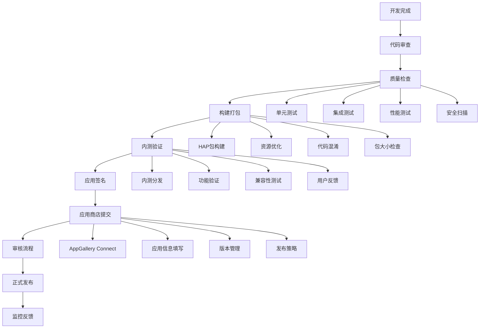
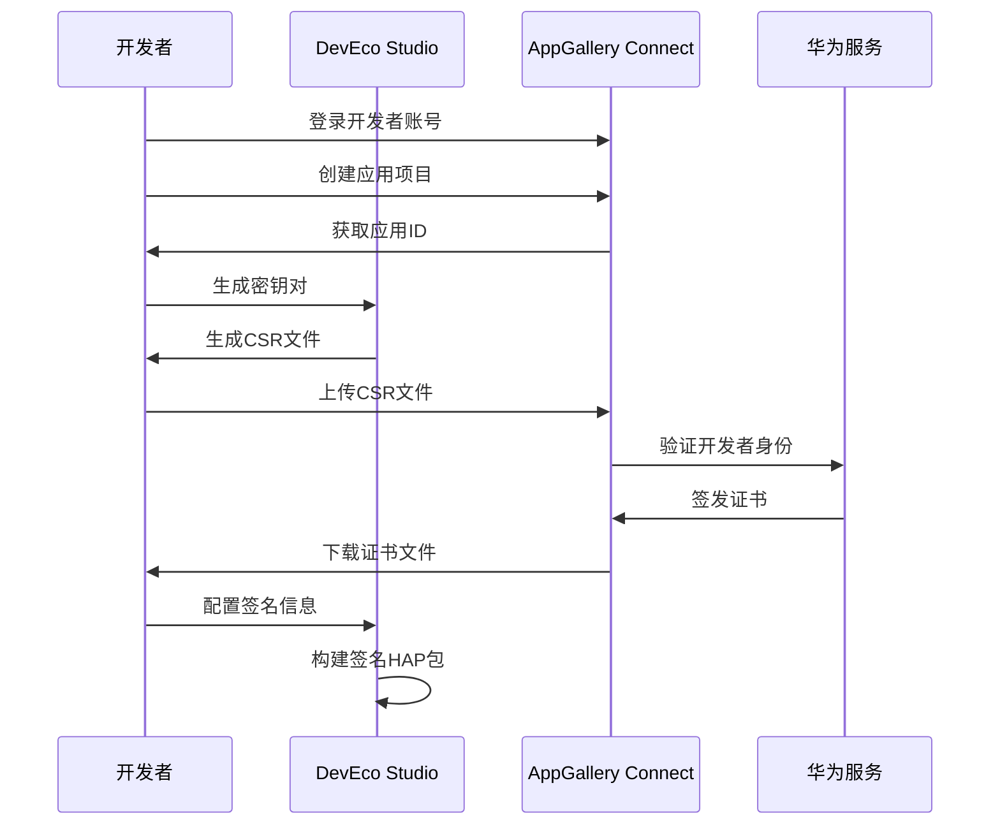

# 部署与发布指南

## 发布流程概览



## 构建配置优化

### 1. DevEco Studio构建配置

```json5
// build-profile.json5
{
  "app": {
    "signingConfigs": [
      {
        "name": "default",
        "type": "HarmonyOS",
        "material": {
          "certpath": "keys/cert.cer",
          "storePassword": "your_store_password",
          "keyAlias": "your_key_alias",
          "keyPassword": "your_key_password",
          "profile": "keys/profile.p7b",
          "signAlg": "SHA256withECDSA",
          "storeFile": "keys/keystore.p12"
        }
      }
    ],
    "products": [
      {
        "name": "default",
        "signingConfig": "default",
        "compatibleSdkVersion": "4.0.0(10)",
        "runtimeOS": "HarmonyOS"
      }
    ],
    "buildModeSet": [
      {
        "name": "debug",
        "arkOptions": {
          "obfuscation": {
            "ruleOptions": {
              "enable": false
            }
          }
        }
      },
      {
        "name": "release",
        "arkOptions": {
          "obfuscation": {
            "ruleOptions": {
              "enable": true,
              "files": ["obfuscation-rules.txt"]
            }
          }
        }
      }
    ]
  },
  "modules": [
    {
      "name": "entry",
      "srcPath": "./entry",
      "targets": [
        {
          "name": "default",
          "applyToProducts": ["default"]
        }
      ]
    }
  ]
}
```

```json5
// module.json5 (entry模块配置)
{
  "module": {
    "name": "entry",
    "type": "entry",
    "description": "$string:module_desc",
    "mainElement": "EntryAbility",
    "deviceTypes": [
      "phone",
      "tablet"
    ],
    "deliveryWithInstall": true,
    "installationFree": false,
    "pages": "$profile:main_pages",
    "abilities": [
      {
        "name": "EntryAbility",
        "srcEntry": "./ets/entryability/EntryAbility.ts",
        "description": "$string:EntryAbility_desc",
        "icon": "$media:icon",
        "label": "$string:EntryAbility_label",
        "startWindowIcon": "$media:icon",
        "startWindowBackground": "$color:start_window_background",
        "exported": true,
        "skills": [
          {
            "entities": [
              "entity.system.home"
            ],
            "actions": [
              "action.system.home"
            ]
          }
        ]
      }
    ],
    "requestPermissions": [
      {
        "name": "ohos.permission.INTERNET",
        "reason": "$string:permission_internet_reason",
        "usedScene": {
          "abilities": ["EntryAbility"],
          "when": "inuse"
        }
      },
      {
        "name": "ohos.permission.WRITE_MEDIA",
        "reason": "$string:permission_write_media_reason",
        "usedScene": {
          "abilities": ["EntryAbility"],
          "when": "inuse"
        }
      },
      {
        "name": "ohos.permission.READ_MEDIA",
        "reason": "$string:permission_read_media_reason",
        "usedScene": {
          "abilities": ["EntryAbility"],
          "when": "inuse"
        }
      }
    ]
  }
}
```

### 2. 代码混淆配置

```text
# obfuscation-rules.txt

# 保持Application类
-keep class * extends ohos.app.Application {
  <init>();
  void onCreate();
}

# 保持Ability类
-keep class * extends ohos.aafwk.ability.Ability {
  <init>();
  void onStart(ohos.aafwk.content.Intent);
  void onStop();
  void onDestroy();
}

# 保持数据模型类
-keep class com.example.handbook.types.** {
  <fields>;
  <methods>;
}

# 保持接口实现
-keep interface com.example.handbook.interfaces.** {
  <methods>;
}

# 保持数据库相关类
-keep class com.example.handbook.database.** {
  <fields>;
  <methods>;
}

# 保留注解
-keepattributes *Annotation*

# 保留行号信息用于调试
-keepattributes SourceFile,LineNumberTable

# 优化配置
-optimizations !code/simplification/cast,!field/*,!class/merging/*
-optimizationpasses 5
-allowaccessmodification
-dontpreverify

# 混淆配置
-repackageclasses ''
-allowaccessmodification
-printmapping mapping.txt
```

### 3. 资源优化配置

```typescript
// 资源优化构建脚本
class ResourceOptimizer {
  private projectPath: string
  private outputPath: string
  
  constructor(projectPath: string, outputPath: string) {
    this.projectPath = projectPath
    this.outputPath = outputPath
  }
  
  async optimize() {
    console.log('开始资源优化...')
    
    // 1. 图片压缩
    await this.optimizeImages()
    
    // 2. 音频压缩
    await this.optimizeAudio()
    
    // 3. 资源去重
    await this.deduplicateResources()
    
    // 4. 未使用资源清理
    await this.removeUnusedResources()
    
    // 5. 资源分包
    await this.splitResources()
    
    console.log('资源优化完成')
  }
  
  private async optimizeImages() {
    const imageFiles = await this.findFiles('**/*.{png,jpg,jpeg,webp}')
    
    for (const file of imageFiles) {
      await this.compressImage(file, {
        quality: 85,
        progressive: true,
        stripMetadata: true
      })
    }
  }
  
  private async optimizeAudio() {
    const audioFiles = await this.findFiles('**/*.{mp3,wav,aac}')
    
    for (const file of audioFiles) {
      await this.compressAudio(file, {
        bitrate: '128k',
        format: 'aac'
      })
    }
  }
  
  private async deduplicateResources() {
    const resourceHashes = new Map<string, string[]>()
    const allResources = await this.findFiles('**/*')
    
    // 计算文件hash
    for (const file of allResources) {
      const hash = await this.calculateFileHash(file)
      if (!resourceHashes.has(hash)) {
        resourceHashes.set(hash, [])
      }
      resourceHashes.get(hash)!.push(file)
    }
    
    // 处理重复文件
    for (const [hash, files] of resourceHashes) {
      if (files.length > 1) {
        console.log(`发现重复资源: ${files.join(', ')}`)
        // 保留第一个，删除其他
        await this.handleDuplicateFiles(files)
      }
    }
  }
  
  private async removeUnusedResources() {
    const usedResources = new Set<string>()
    const codeFiles = await this.findFiles('**/*.{ts,js,ets}')
    
    // 分析代码中引用的资源
    for (const codeFile of codeFiles) {
      const content = await fs.readFile(codeFile, 'utf8')
      const resourceReferences = this.extractResourceReferences(content)
      
      resourceReferences.forEach(ref => usedResources.add(ref))
    }
    
    // 查找未使用的资源
    const allResources = await this.findFiles('src/main/resources/**/*')
    const unusedResources = allResources.filter(resource => {
      const resourceName = path.basename(resource)
      return !usedResources.has(resourceName)
    })
    
    console.log(`发现${unusedResources.length}个未使用的资源`)
    
    // 删除未使用的资源
    for (const resource of unusedResources) {
      await fs.unlink(resource)
      console.log(`删除未使用资源: ${resource}`)
    }
  }
  
  private async splitResources() {
    // 将资源分包，减少主包大小
    const largeResources = await this.findLargeResources(1024 * 1024) // 1MB以上
    
    for (const resource of largeResources) {
      await this.moveToFeatureModule(resource)
    }
  }
  
  private extractResourceReferences(content: string): string[] {
    const references: string[] = []
    
    // 匹配 $r('app.media.xxx') 格式
    const mediaMatches = content.match(/\$r\(['"`]app\.media\.(\w+)['"`]\)/g)
    if (mediaMatches) {
      mediaMatches.forEach(match => {
        const name = match.match(/app\.media\.(\w+)/)?.[1]
        if (name) references.push(name)
      })
    }
    
    // 匹配 $r('app.string.xxx') 格式
    const stringMatches = content.match(/\$r\(['"`]app\.string\.(\w+)['"`]\)/g)
    if (stringMatches) {
      stringMatches.forEach(match => {
        const name = match.match(/app\.string\.(\w+)/)?.[1]
        if (name) references.push(name)
      })
    }
    
    return references
  }
}
```

## 应用签名与证书管理

### 1. 证书生成流程



### 2. 签名配置管理

```typescript
// 签名配置管理器
class SigningManager {
  private configPath: string
  private keystorePath: string
  private certificatePath: string
  
  constructor() {
    this.configPath = 'keys/signing-config.json'
    this.keystorePath = 'keys/keystore.p12'
    this.certificatePath = 'keys/cert.cer'
  }
  
  // 初始化签名配置
  async initializeSigningConfig(config: SigningConfig): Promise<void> {
    // 验证证书有效性
    await this.validateCertificate(config.certificatePath)
    
    // 验证密钥库
    await this.validateKeystore(config.keystorePath, config.storePassword)
    
    // 保存配置
    await this.saveSigningConfig(config)
    
    console.log('签名配置初始化完成')
  }
  
  private async validateCertificate(certPath: string): Promise<void> {
    try {
      const certContent = await fs.readFile(certPath)
      const cert = forge.pki.certificateFromPem(certContent.toString())
      
      // 检查证书有效期
      const now = new Date()
      if (now < cert.validity.notBefore || now > cert.validity.notAfter) {
        throw new Error('证书已过期或尚未生效')
      }
      
      console.log(`证书验证通过，有效期至：${cert.validity.notAfter}`)
    } catch (error) {
      throw new Error(`证书验证失败：${error.message}`)
    }
  }
  
  private async validateKeystore(keystorePath: string, password: string): Promise<void> {
    try {
      const keystoreContent = await fs.readFile(keystorePath)
      const p12Asn1 = forge.asn1.fromDer(keystoreContent.toString('binary'))
      const p12 = forge.pkcs12.pkcs12FromAsn1(p12Asn1, password)
      
      console.log('密钥库验证通过')
    } catch (error) {
      throw new Error(`密钥库验证失败：${error.message}`)
    }
  }
  
  // 自动续期证书提醒
  checkCertificateExpiry(): CertificateStatus {
    const certInfo = this.loadCertificateInfo()
    const now = new Date()
    const daysUntilExpiry = Math.ceil(
      (certInfo.expiryDate.getTime() - now.getTime()) / (1000 * 60 * 60 * 24)
    )
    
    if (daysUntilExpiry <= 0) {
      return {
        status: 'expired',
        message: '证书已过期，请立即更新',
        daysRemaining: daysUntilExpiry
      }
    } else if (daysUntilExpiry <= 30) {
      return {
        status: 'expiring_soon',
        message: `证书将在${daysUntilExpiry}天后过期，建议及时更新`,
        daysRemaining: daysUntilExpiry
      }
    } else {
      return {
        status: 'valid',
        message: `证书有效，${daysUntilExpiry}天后过期`,
        daysRemaining: daysUntilExpiry
      }
    }
  }
  
  // 生成签名HAP包
  async signHapPackage(unsignedHapPath: string, outputPath: string): Promise<void> {
    const config = await this.loadSigningConfig()
    
    try {
      // 使用华为提供的签名工具
      const signingCommand = [
        'hap-sign-tool',
        'sign-app',
        '-keystore', config.keystorePath,
        '-storepass', config.storePassword,
        '-keyalias', config.keyAlias,
        '-keypass', config.keyPassword,
        '-profile', config.profilePath,
        '-inFile', unsignedHapPath,
        '-outFile', outputPath,
        '-signAlg', 'SHA256withECDSA'
      ]
      
      await this.executeCommand(signingCommand.join(' '))
      
      // 验证签名
      await this.verifySignature(outputPath)
      
      console.log(`HAP包签名完成：${outputPath}`)
    } catch (error) {
      throw new Error(`签名过程失败：${error.message}`)
    }
  }
  
  private async verifySignature(hapPath: string): Promise<void> {
    const verifyCommand = [
      'hap-sign-tool',
      'verify-app',
      '-inFile', hapPath,
      '-outCertchain', 'temp-cert-chain.txt',
      '-outProfile', 'temp-profile.txt'
    ]
    
    await this.executeCommand(verifyCommand.join(' '))
    
    // 清理临时文件
    await fs.unlink('temp-cert-chain.txt').catch(() => {})
    await fs.unlink('temp-profile.txt').catch(() => {})
    
    console.log('签名验证通过')
  }
}

interface SigningConfig {
  keystorePath: string
  storePassword: string
  keyAlias: string
  keyPassword: string
  certificatePath: string
  profilePath: string
}

interface CertificateStatus {
  status: 'valid' | 'expiring_soon' | 'expired'
  message: string
  daysRemaining: number
}
```

## 应用商店发布

### 1. AppGallery Connect配置

```typescript
// AppGallery Connect发布管理器
class AppGalleryPublisher {
  private apiKey: string
  private clientId: string
  private clientSecret: string
  private baseUrl = 'https://connect-api.cloud.huawei.com'
  
  constructor(credentials: AGCCredentials) {
    this.apiKey = credentials.apiKey
    this.clientId = credentials.clientId
    this.clientSecret = credentials.clientSecret
  }
  
  // 获取访问token
  private async getAccessToken(): Promise<string> {
    const response = await fetch(`${this.baseUrl}/api/oauth2/v1/token`, {
      method: 'POST',
      headers: {
        'Content-Type': 'application/json'
      },
      body: JSON.stringify({
        grant_type: 'client_credentials',
        client_id: this.clientId,
        client_secret: this.clientSecret
      })
    })
    
    const data = await response.json()
    return data.access_token
  }
  
  // 上传HAP包
  async uploadHapPackage(
    appId: string,
    hapFilePath: string,
    versionInfo: VersionInfo
  ): Promise<string> {
    const token = await this.getAccessToken()
    const hapContent = await fs.readFile(hapFilePath)
    
    const formData = new FormData()
    formData.append('file', new Blob([hapContent]), path.basename(hapFilePath))
    formData.append('parseType', '1')
    
    const response = await fetch(
      `${this.baseUrl}/api/publish/v2/upload-url?appId=${appId}`,
      {
        method: 'POST',
        headers: {
          'Authorization': `Bearer ${token}`,
          'client_id': this.clientId
        },
        body: formData
      }
    )
    
    const result = await response.json()
    
    if (result.ret.code !== 0) {
      throw new Error(`上传失败：${result.ret.msg}`)
    }
    
    console.log(`HAP包上传成功，文件ID：${result.uploadFileRsp.fileDestUlr}`)
    return result.uploadFileRsp.fileDestUlr
  }
  
  // 提交版本审核
  async submitForReview(
    appId: string,
    versionInfo: VersionInfo
  ): Promise<void> {
    const token = await this.getAccessToken()
    
    const submitData = {
      fileType: 5, // HAP文件类型
      version: versionInfo.versionName,
      versionCode: versionInfo.versionCode,
      lang: 'zh',
      releaseType: versionInfo.releaseType || 1, // 1:全量发布
      remark: versionInfo.releaseNotes,
      releaseTime: versionInfo.releaseTime || Date.now()
    }
    
    const response = await fetch(
      `${this.baseUrl}/api/publish/v2/app-submit2?appId=${appId}`,
      {
        method: 'POST',
        headers: {
          'Authorization': `Bearer ${token}`,
          'Content-Type': 'application/json',
          'client_id': this.clientId
        },
        body: JSON.stringify(submitData)
      }
    )
    
    const result = await response.json()
    
    if (result.ret.code !== 0) {
      throw new Error(`提交审核失败：${result.ret.msg}`)
    }
    
    console.log('版本已提交审核')
  }
  
  // 查询审核状态
  async getReviewStatus(appId: string): Promise<ReviewStatus> {
    const token = await this.getAccessToken()
    
    const response = await fetch(
      `${this.baseUrl}/api/publish/v2/app-info?appId=${appId}`,
      {
        headers: {
          'Authorization': `Bearer ${token}`,
          'client_id': this.clientId
        }
      }
    )
    
    const result = await response.json()
    
    if (result.ret.code !== 0) {
      throw new Error(`查询失败：${result.ret.msg}`)
    }
    
    return {
      status: result.appInfo.auditInfo.auditOpinion,
      message: result.appInfo.auditInfo.auditOpinionDesc,
      lastUpdated: new Date(result.appInfo.auditInfo.auditTime)
    }
  }
  
  // 分阶段发布
  async stageRollout(
    appId: string,
    rolloutPercentage: number
  ): Promise<void> {
    const token = await this.getAccessToken()
    
    const rolloutData = {
      rolloutPercent: rolloutPercentage,
      releaseType: 2 // 分阶段发布
    }
    
    const response = await fetch(
      `${this.baseUrl}/api/publish/v2/app-release?appId=${appId}`,
      {
        method: 'PUT',
        headers: {
          'Authorization': `Bearer ${token}`,
          'Content-Type': 'application/json',
          'client_id': this.clientId
        },
        body: JSON.stringify(rolloutData)
      }
    )
    
    const result = await response.json()
    
    if (result.ret.code !== 0) {
      throw new Error(`分阶段发布失败：${result.ret.msg}`)
    }
    
    console.log(`已设置分阶段发布：${rolloutPercentage}%`)
  }
  
  // 获取发布统计
  async getReleaseStatistics(appId: string, days: number = 30): Promise<ReleaseStats> {
    const token = await this.getAccessToken()
    const endDate = new Date()
    const startDate = new Date(endDate.getTime() - days * 24 * 60 * 60 * 1000)
    
    const response = await fetch(
      `${this.baseUrl}/api/stats/v1/download-stats?appId=${appId}&startDate=${startDate.toISOString()}&endDate=${endDate.toISOString()}`,
      {
        headers: {
          'Authorization': `Bearer ${token}`,
          'client_id': this.clientId
        }
      }
    )
    
    const result = await response.json()
    
    return {
      totalDownloads: result.downloadStats.totalDownloads,
      dailyDownloads: result.downloadStats.dailyDownloads,
      activeUsers: result.downloadStats.activeUsers,
      retentionRate: result.downloadStats.retentionRate
    }
  }
}

interface AGCCredentials {
  apiKey: string
  clientId: string
  clientSecret: string
}

interface VersionInfo {
  versionName: string
  versionCode: number
  releaseNotes: string
  releaseType?: number
  releaseTime?: number
}

interface ReviewStatus {
  status: string
  message: string
  lastUpdated: Date
}

interface ReleaseStats {
  totalDownloads: number
  dailyDownloads: Array<{ date: string, downloads: number }>
  activeUsers: number
  retentionRate: number
}
```

### 2. 应用商店元数据管理

```typescript
// 应用商店元数据管理
class AppStoreMetadataManager {
  private metadataPath = 'metadata'
  
  // 生成应用商店描述
  generateStoreDescription(): StoreMetadata {
    return {
      zh: {
        appName: '女性手账',
        shortDescription: '专为女性设计的智能手账应用，记录美好生活',
        fullDescription: this.getFullDescription('zh'),
        keywords: ['手账', '日记', '心情记录', '待办事项', '生活管理', '女性'],
        releaseNotes: this.getReleaseNotes('zh'),
        screenshots: this.getScreenshots(),
        featureGraphic: 'metadata/feature-graphic-zh.png'
      },
      en: {
        appName: 'Women\'s Handbook',
        shortDescription: 'Smart handbook app designed for women to record beautiful life',
        fullDescription: this.getFullDescription('en'),
        keywords: ['handbook', 'diary', 'mood tracking', 'todo', 'life management'],
        releaseNotes: this.getReleaseNotes('en'),
        screenshots: this.getScreenshots(),
        featureGraphic: 'metadata/feature-graphic-en.png'
      }
    }
  }
  
  private getFullDescription(language: 'zh' | 'en'): string {
    const descriptions = {
      zh: `
女性手账 - 你的专属生活伴侣

🌸 核心功能：
• 智能待办管理：轻松规划每日任务，提高生活效率
• 心情记录追踪：记录每天的心情变化，了解自己
• 项目创作工具：丰富的模板和素材，创造属于你的作品
• 手账自动生成：根据数据自动生成精美手账页面
• 多主题切换：粉色、薄荷、奶茶等多种女性喜爱的主题

🎨 特色亮点：
• 专为女性设计的温馨界面
• 完全本地化存储，保护隐私安全
• 丰富的贴纸和装饰元素
• 智能数据分析，洞察生活规律
• 支持数据导出，随时备份珍贵回忆

📱 适用场景：
• 日常生活规划和记录
• 心情日记和成长足迹
• 创意项目和手工制作
• 学习笔记和知识整理
• 美好瞬间的保存和分享

开始你的精致生活之旅，让每一天都充满美好！
      `,
      en: `
Women's Handbook - Your Personal Life Companion

🌸 Core Features:
• Smart Todo Management: Easily plan daily tasks and improve life efficiency
• Mood Tracking: Record daily mood changes and understand yourself better
• Project Creation Tools: Rich templates and materials for your creative works
• Auto Handbook Generation: Automatically generate beautiful handbook pages from your data
• Multi-theme Support: Pink, mint, milk tea and other themes loved by women

🎨 Highlights:
• Warm interface designed specifically for women
• Completely local storage to protect privacy
• Rich stickers and decorative elements
• Smart data analysis to understand life patterns
• Data export support for backing up precious memories

📱 Use Cases:
• Daily life planning and recording
• Mood diary and growth journey
• Creative projects and handicrafts
• Study notes and knowledge organization
• Preserving and sharing beautiful moments

Start your exquisite life journey and make every day wonderful!
      `
    }
    
    return descriptions[language]
  }
  
  private getReleaseNotes(language: 'zh' | 'en'): string {
    const notes = {
      zh: `
🎉 版本 1.0.0 更新内容：

✨ 全新功能：
• 新增手账自动生成功能
• 支持多种导出格式（PNG、JPG、PDF）
• 新增心情统计和分析功能
• 增加了20+精美手账模板

🐛 修复和优化：
• 优化了图片加载速度
• 修复了部分设备上的兼容性问题
• 改进了数据备份和恢复机制
• 提升了应用启动速度

💝 其他改进：
• 界面细节优化，提升用户体验
• 新增使用教程和帮助文档
• 支持深色模式
• 优化了电池使用效率

感谢所有用户的支持和反馈！
      `,
      en: `
🎉 Version 1.0.0 Release Notes:

✨ New Features:
• Added automatic handbook generation
• Support for multiple export formats (PNG, JPG, PDF)
• New mood statistics and analysis
• 20+ beautiful handbook templates added

🐛 Fixes and Optimizations:
• Optimized image loading speed
• Fixed compatibility issues on some devices
• Improved data backup and recovery mechanism
• Enhanced app startup speed

💝 Other Improvements:
• Interface detail optimization for better user experience
• Added tutorials and help documentation
• Dark mode support
• Optimized battery usage efficiency

Thank you for all user support and feedback!
      `
    }
    
    return notes[language]
  }
  
  private getScreenshots(): Screenshot[] {
    return [
      {
        path: 'metadata/screenshots/home-screen.png',
        description: '首页界面',
        type: 'phone'
      },
      {
        path: 'metadata/screenshots/todo-list.png',
        description: '待办事项管理',
        type: 'phone'
      },
      {
        path: 'metadata/screenshots/mood-tracking.png',
        description: '心情记录',
        type: 'phone'
      },
      {
        path: 'metadata/screenshots/project-editor.png',
        description: '项目编辑器',
        type: 'phone'
      },
      {
        path: 'metadata/screenshots/handbook-generation.png',
        description: '手账生成',
        type: 'phone'
      },
      {
        path: 'metadata/screenshots/tablet-view.png',
        description: '平板界面',
        type: 'tablet'
      }
    ]
  }
  
  // 验证元数据完整性
  validateMetadata(): ValidationResult {
    const issues: string[] = []
    const metadata = this.generateStoreDescription()
    
    // 检查必需字段
    for (const [lang, data] of Object.entries(metadata)) {
      if (!data.appName) issues.push(`${lang}: 应用名称缺失`)
      if (!data.shortDescription) issues.push(`${lang}: 简短描述缺失`)
      if (!data.fullDescription) issues.push(`${lang}: 完整描述缺失`)
      if (!data.keywords || data.keywords.length === 0) {
        issues.push(`${lang}: 关键词缺失`)
      }
      if (!data.screenshots || data.screenshots.length < 3) {
        issues.push(`${lang}: 截图数量不足（至少需要3张）`)
      }
    }
    
    // 检查文件存在性
    for (const [lang, data] of Object.entries(metadata)) {
      if (data.featureGraphic && !fs.existsSync(data.featureGraphic)) {
        issues.push(`${lang}: 特色图形文件不存在`)
      }
      
      for (const screenshot of data.screenshots) {
        if (!fs.existsSync(screenshot.path)) {
          issues.push(`${lang}: 截图文件不存在 - ${screenshot.path}`)
        }
      }
    }
    
    return {
      isValid: issues.length === 0,
      issues
    }
  }
}

interface StoreMetadata {
  [language: string]: {
    appName: string
    shortDescription: string
    fullDescription: string
    keywords: string[]
    releaseNotes: string
    screenshots: Screenshot[]
    featureGraphic: string
  }
}

interface Screenshot {
  path: string
  description: string
  type: 'phone' | 'tablet'
}

interface ValidationResult {
  isValid: boolean
  issues: string[]
}
```

## 发布自动化流程

### 1. CI/CD流水线配置

```yaml
# .github/workflows/release.yml
name: 自动发布流水线

on:
  push:
    tags:
      - 'v*'
  workflow_dispatch:
    inputs:
      version_type:
        description: '发布类型'
        required: true
        default: 'patch'
        type: choice
        options:
          - patch
          - minor
          - major
      rollout_percentage:
        description: '分阶段发布百分比'
        required: false
        default: '10'

jobs:
  quality-check:
    name: 质量检查
    runs-on: ubuntu-latest
    steps:
      - uses: actions/checkout@v3
      
      - name: 设置Node.js环境
        uses: actions/setup-node@v3
        with:
          node-version: '18'
          
      - name: 安装依赖
        run: npm ci
        
      - name: 代码格式检查
        run: npm run lint
        
      - name: TypeScript类型检查
        run: npm run type-check
        
      - name: 运行单元测试
        run: npm run test:unit
        
      - name: 运行集成测试
        run: npm run test:integration
        
      - name: 生成测试覆盖率报告
        run: npm run test:coverage
        
      - name: 上传覆盖率到Codecov
        uses: codecov/codecov-action@v3
        
  security-scan:
    name: 安全扫描
    runs-on: ubuntu-latest
    needs: quality-check
    steps:
      - uses: actions/checkout@v3
      
      - name: 依赖安全扫描
        run: npm audit --audit-level=moderate
        
      - name: 代码安全扫描
        uses: securecodewarrior/github-action-add-sarif@v1
        with:
          sarif-file: 'security-scan-results.sarif'
          
  build-and-sign:
    name: 构建和签名
    runs-on: ubuntu-latest
    needs: [quality-check, security-scan]
    steps:
      - uses: actions/checkout@v3
      
      - name: 设置DevEco Studio环境
        uses: huawei/setup-deveco-studio@v1
        
      - name: 构建HAP包
        run: |
          cd handbook
          hvigorw clean
          hvigorw assembleHap
          
      - name: 配置签名证书
        env:
          KEYSTORE_BASE64: ${{ secrets.KEYSTORE_BASE64 }}
          CERT_BASE64: ${{ secrets.CERT_BASE64 }}
          PROFILE_BASE64: ${{ secrets.PROFILE_BASE64 }}
        run: |
          echo "$KEYSTORE_BASE64" | base64 -d > keys/keystore.p12
          echo "$CERT_BASE64" | base64 -d > keys/cert.cer
          echo "$PROFILE_BASE64" | base64 -d > keys/profile.p7b
          
      - name: 签名HAP包
        env:
          KEYSTORE_PASSWORD: ${{ secrets.KEYSTORE_PASSWORD }}
          KEY_PASSWORD: ${{ secrets.KEY_PASSWORD }}
        run: |
          hap-sign-tool sign-app \
            -keystore keys/keystore.p12 \
            -storepass $KEYSTORE_PASSWORD \
            -keyalias release \
            -keypass $KEY_PASSWORD \
            -profile keys/profile.p7b \
            -inFile handbook/build/outputs/hap/release/entry-release-unsigned.hap \
            -outFile handbook/build/outputs/hap/release/entry-release-signed.hap \
            -signAlg SHA256withECDSA
            
      - name: 验证签名
        run: |
          hap-sign-tool verify-app \
            -inFile handbook/build/outputs/hap/release/entry-release-signed.hap
            
      - name: 上传构建产物
        uses: actions/upload-artifact@v3
        with:
          name: signed-hap
          path: handbook/build/outputs/hap/release/entry-release-signed.hap
          
  deploy-internal:
    name: 内测部署
    runs-on: ubuntu-latest
    needs: build-and-sign
    if: github.event_name == 'workflow_dispatch'
    steps:
      - name: 下载构建产物
        uses: actions/download-artifact@v3
        with:
          name: signed-hap
          
      - name: 部署到内测环境
        env:
          AGC_CLIENT_ID: ${{ secrets.AGC_CLIENT_ID }}
          AGC_CLIENT_SECRET: ${{ secrets.AGC_CLIENT_SECRET }}
          APP_ID: ${{ secrets.APP_ID }}
        run: |
          python scripts/deploy-internal.py \
            --hap-file entry-release-signed.hap \
            --app-id $APP_ID \
            --client-id $AGC_CLIENT_ID \
            --client-secret $AGC_CLIENT_SECRET
            
  deploy-production:
    name: 生产环境部署
    runs-on: ubuntu-latest
    needs: build-and-sign
    if: startsWith(github.ref, 'refs/tags/v')
    steps:
      - uses: actions/checkout@v3
      
      - name: 下载构建产物
        uses: actions/download-artifact@v3
        with:
          name: signed-hap
          
      - name: 解析版本信息
        id: version
        run: |
          VERSION=${GITHUB_REF#refs/tags/v}
          echo "version=$VERSION" >> $GITHUB_OUTPUT
          echo "version_code=$(date +%Y%m%d%H%M)" >> $GITHUB_OUTPUT
          
      - name: 发布到AppGallery
        env:
          AGC_CLIENT_ID: ${{ secrets.AGC_CLIENT_ID }}
          AGC_CLIENT_SECRET: ${{ secrets.AGC_CLIENT_SECRET }}
          APP_ID: ${{ secrets.APP_ID }}
        run: |
          python scripts/deploy-production.py \
            --hap-file entry-release-signed.hap \
            --app-id $APP_ID \
            --version-name ${{ steps.version.outputs.version }} \
            --version-code ${{ steps.version.outputs.version_code }} \
            --rollout-percentage ${{ github.event.inputs.rollout_percentage || '100' }} \
            --client-id $AGC_CLIENT_ID \
            --client-secret $AGC_CLIENT_SECRET
            
      - name: 创建GitHub Release
        uses: actions/create-release@v1
        env:
          GITHUB_TOKEN: ${{ secrets.GITHUB_TOKEN }}
        with:
          tag_name: ${{ github.ref }}
          release_name: Release ${{ steps.version.outputs.version }}
          body_path: CHANGELOG.md
          draft: false
          prerelease: false
          
  post-deployment:
    name: 发布后处理
    runs-on: ubuntu-latest
    needs: [deploy-production]
    if: always()
    steps:
      - name: 发送通知
        uses: 8398a7/action-slack@v3
        with:
          status: ${{ job.status }}
          channel: '#releases'
          message: |
            应用发布状态：${{ job.status }}
            版本：${{ steps.version.outputs.version }}
            构建时间：${{ steps.date.outputs.date }}
        env:
          SLACK_WEBHOOK_URL: ${{ secrets.SLACK_WEBHOOK_URL }}
          
      - name: 更新文档
        run: |
          python scripts/update-release-docs.py \
            --version ${{ steps.version.outputs.version }}
```

### 2. 发布监控与回滚

```typescript
// 发布监控系统
class ReleaseMonitor {
  private agcPublisher: AppGalleryPublisher
  private metricsCollector: MetricsCollector
  
  constructor(credentials: AGCCredentials) {
    this.agcPublisher = new AppGalleryPublisher(credentials)
    this.metricsCollector = new MetricsCollector()
  }
  
  // 监控发布状态
  async monitorRelease(appId: string, releaseId: string): Promise<void> {
    console.log(`开始监控发布 ${releaseId}`)
    
    const monitoringInterval = setInterval(async () => {
      try {
        const status = await this.agcPublisher.getReviewStatus(appId)
        const metrics = await this.collectReleaseMetrics(appId)
        
        // 检查关键指标
        const healthCheck = this.performHealthCheck(metrics)
        
        if (!healthCheck.healthy) {
          console.warn('发布健康检查失败:', healthCheck.issues)
          
          // 如果问题严重，考虑自动回滚
          if (healthCheck.severity === 'critical') {
            await this.triggerAutoRollback(appId, releaseId)
            clearInterval(monitoringInterval)
          }
        }
        
        // 发布完成
        if (status.status === 'approved') {
          console.log('应用审核通过，发布完成')
          clearInterval(monitoringInterval)
        }
        
      } catch (error) {
        console.error('监控过程出错:', error)
      }
    }, 30000) // 每30秒检查一次
  }
  
  private async collectReleaseMetrics(appId: string): Promise<ReleaseMetrics> {
    const stats = await this.agcPublisher.getReleaseStatistics(appId, 1)
    
    return {
      downloadCount: stats.totalDownloads,
      crashRate: await this.getCrashRate(appId),
      uninstallRate: await this.getUninstallRate(appId),
      userRating: await this.getUserRating(appId),
      performanceMetrics: await this.getPerformanceMetrics(appId)
    }
  }
  
  private performHealthCheck(metrics: ReleaseMetrics): HealthCheckResult {
    const issues: string[] = []
    let severity: 'low' | 'medium' | 'high' | 'critical' = 'low'
    
    // 检查崩溃率
    if (metrics.crashRate > 0.05) { // 5%
      issues.push(`崩溃率过高: ${(metrics.crashRate * 100).toFixed(2)}%`)
      severity = 'critical'
    } else if (metrics.crashRate > 0.02) { // 2%
      issues.push(`崩溃率偏高: ${(metrics.crashRate * 100).toFixed(2)}%`)
      severity = Math.max(severity, 'high') as any
    }
    
    // 检查卸载率
    if (metrics.uninstallRate > 0.1) { // 10%
      issues.push(`卸载率过高: ${(metrics.uninstallRate * 100).toFixed(2)}%`)
      severity = Math.max(severity, 'high') as any
    }
    
    // 检查用户评分
    if (metrics.userRating < 3.0) {
      issues.push(`用户评分过低: ${metrics.userRating}`)
      severity = Math.max(severity, 'medium') as any
    }
    
    // 检查性能指标
    if (metrics.performanceMetrics.averageStartupTime > 3000) {
      issues.push(`启动时间过长: ${metrics.performanceMetrics.averageStartupTime}ms`)
      severity = Math.max(severity, 'medium') as any
    }
    
    return {
      healthy: issues.length === 0,
      issues,
      severity
    }
  }
  
  // 自动回滚
  private async triggerAutoRollback(appId: string, releaseId: string): Promise<void> {
    console.log(`触发自动回滚: ${releaseId}`)
    
    try {
      // 停止当前发布
      await this.stopRelease(appId, releaseId)
      
      // 回滚到上一个稳定版本
      await this.rollbackToPreviousVersion(appId)
      
      // 发送告警通知
      await this.sendRollbackAlert(appId, releaseId)
      
      console.log('自动回滚完成')
      
    } catch (error) {
      console.error('自动回滚失败:', error)
      
      // 发送紧急通知
      await this.sendEmergencyAlert(appId, releaseId, error.message)
    }
  }
  
  private async stopRelease(appId: string, releaseId: string): Promise<void> {
    // 停止分阶段发布
    await this.agcPublisher.stageRollout(appId, 0)
  }
  
  private async rollbackToPreviousVersion(appId: string): Promise<void> {
    // 获取上一个稳定版本
    const previousVersion = await this.getPreviousStableVersion(appId)
    
    if (previousVersion) {
      // 重新发布上一个版本
      await this.agcPublisher.stageRollout(appId, 100)
    }
  }
  
  private async getCrashRate(appId: string): Promise<number> {
    // 从监控系统获取崩溃率
    return this.metricsCollector.getCrashRate(appId)
  }
  
  private async getUninstallRate(appId: string): Promise<number> {
    // 从监控系统获取卸载率
    return this.metricsCollector.getUninstallRate(appId)
  }
  
  private async getUserRating(appId: string): Promise<number> {
    // 从应用商店获取用户评分
    return this.metricsCollector.getUserRating(appId)
  }
  
  private async getPerformanceMetrics(appId: string): Promise<PerformanceMetrics> {
    // 从性能监控系统获取指标
    return this.metricsCollector.getPerformanceMetrics(appId)
  }
}

interface ReleaseMetrics {
  downloadCount: number
  crashRate: number
  uninstallRate: number
  userRating: number
  performanceMetrics: PerformanceMetrics
}

interface HealthCheckResult {
  healthy: boolean
  issues: string[]
  severity: 'low' | 'medium' | 'high' | 'critical'
}

interface PerformanceMetrics {
  averageStartupTime: number
  averageMemoryUsage: number
  averageCpuUsage: number
  networkLatency: number
}
```

---

**总结**：完善的部署与发布流程是确保应用稳定上线的关键。通过自动化构建、签名、测试和发布，以及实时监控和自动回滚机制，可以大大降低发布风险，提高发布效率和质量。同时，详细的应用商店元数据管理有助于提升应用的发现性和下载转化率。
