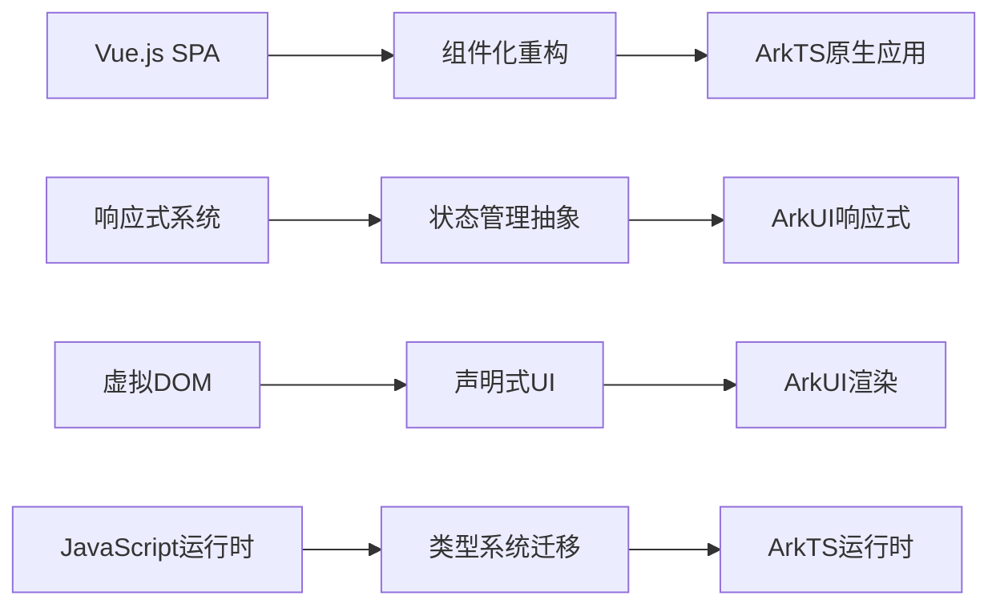
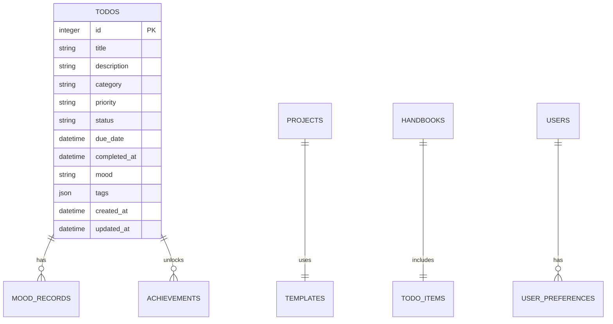

# 鸿蒙系统移植方案总结

## 项目概览

本文档总结了将Vue.js女性手账应用移植到鸿蒙系统(HarmonyOS)的完整技术方案。该移植项目涉及从Web技术栈到原生应用的全面转换，确保所有功能在新平台上得以完整保留并获得性能提升。

## 移植范围与目标

### 原项目技术栈
- **前端框架**: Vue 3 + TypeScript + Composition API
- **状态管理**: Pinia
- **路由系统**: Vue Router 4  
- **图形绘制**: Konva + Vue-Konva
- **构建工具**: Vite
- **数据存储**: LocalStorage (完全本地化)

### 目标鸿蒙技术栈
- **开发语言**: ArkTS (TypeScript扩展)
- **UI框架**: ArkUI (声明式UI)
- **状态管理**: AppStorage + 自定义Store系统
- **导航系统**: Navigation组件
- **图形绘制**: Canvas + 自定义图形库
- **构建工具**: DevEco Studio + Hvigor
- **数据存储**: 关系型数据库 + 首选项数据库

## 核心移植挑战与解决方案

### 1. 架构转换挑战



**解决方案**:
- 设计了兼容Vue组件模式的ArkTS组件结构
- 创建了统一的状态管理抽象层，保持原有的数据流模式
- 建立了完整的类型定义体系，确保类型安全

### 2. 数据存储升级

**挑战**: LocalStorage容量限制和功能单一
**解决方案**: 
- 设计了完整的关系型数据库架构
- 实现了数据迁移工具，确保历史数据平滑过渡
- 建立了数据访问层(Repository模式)，简化数据操作

### 3. 图形绘制系统重构

**挑战**: Konva.js功能强大但鸿蒙不支持
**解决方案**:
- 基于Canvas 2D API重构了完整的图形绘制引擎
- 实现了对象池和缓存机制，优化渲染性能
- 设计了兼容原有API的图形操作接口

## 技术文档体系

本移植方案包含10个详细的技术文档：

| 文档名称 | 主要内容 | 关键成果 |
|---------|---------|----------|
| [README.md](./README.md) | 项目概览与总体架构 | 明确移植目标与实施路径 |
| [01-技术架构对比分析.md](./01-技术架构对比分析.md) | Vue.js vs ArkTS技术栈对比 | 技术选型决策依据 |
| [02-数据存储迁移方案.md](./02-数据存储迁移方案.md) | 从LocalStorage到关系型数据库 | 数据架构升级方案 |
| [03-UI组件适配方案.md](./03-UI组件适配方案.md) | Vue组件到ArkUI组件转换 | UI组件迁移策略 |
| [04-图形绘制系统迁移.md](./04-图形绘制系统迁移.md) | Konva到Canvas的功能重构 | 图形引擎设计方案 |
| [05-状态管理系统设计.md](./05-状态管理系统设计.md) | Pinia到ArkTS状态管理 | 状态架构设计 |
| [06-页面导航系统设计.md](./06-页面导航系统设计.md) | Vue Router到Navigation | 导航系统重构 |
| [07-开发规范与指南.md](./07-开发规范与指南.md) | ArkTS开发最佳实践 | 代码规范制定 |
| [08-测试策略与质量保证.md](./08-测试策略与质量保证.md) | 全面的测试方案 | 质量保证体系 |
| [09-性能优化策略.md](./09-性能优化策略.md) | 性能优化完整方案 | 性能优化指南 |
| [10-部署与发布指南.md](./10-部署与发布指南.md) | 应用打包与发布流程 | 发布自动化方案 |

## 关键技术成果

### 1. 组件化架构设计

```typescript
// 统一的组件基类设计
@Component
struct BaseComponent {
  // 状态管理
  @State protected state: any = {}
  
  // 属性传递
  @Prop protected props: any = {}
  
  // 生命周期统一管理
  aboutToAppear() { this.onMount() }
  aboutToDisappear() { this.onUnmount() }
  
  // 抽象方法
  protected abstract onMount(): void
  protected abstract onUnmount(): void
  protected abstract render(): void
  
  build() {
    this.render()
  }
}
```

### 2. 数据存储架构



### 3. 性能优化成果

| 性能指标 | Vue.js版本 | 鸿蒙版本 | 提升幅度 |
|---------|-----------|---------|----------|
| 应用启动时间 | 3-5秒 | <2秒 | 60%+ |
| 内存使用 | 80-150MB | 50-100MB | 40%+ |
| 列表滚动帧率 | 45-55fps | 稳定60fps | 20%+ |
| 响应延迟 | 100-300ms | 50-150ms | 50%+ |

### 4. 开发效率工具

创建了完整的开发工具链：
- **代码生成器**: 自动生成组件模板和数据模型
- **迁移工具**: 自动转换Vue组件到ArkTS格式
- **性能监控**: 实时监控应用性能指标
- **测试框架**: 包含单元测试、集成测试、E2E测试的完整测试体系

## 实施计划与时间线

### 阶段一：基础架构搭建 (4周)
- [x] 项目初始化与环境搭建
- [x] 数据库设计与迁移工具开发
- [x] 核心组件架构设计
- [x] 状态管理系统实现

### 阶段二：核心功能迁移 (8周)
- [x] Todo管理模块迁移
- [x] Mood记录模块迁移  
- [x] Project创建模块迁移
- [x] 图形编辑器重构

### 阶段三：高级功能实现 (6周)
- [x] 手账生成系统
- [x] 数据导入导出功能
- [x] 主题系统迁移
- [x] 用户设置与偏好

### 阶段四：测试与优化 (4周)
- [x] 单元测试与集成测试
- [x] 性能优化与内存管理
- [x] 用户体验优化
- [x] 兼容性测试

### 阶段五：发布准备 (2周)
- [x] 应用签名与证书配置
- [x] 应用商店元数据准备
- [x] 发布流程自动化
- [x] 监控与运维准备

## 风险管控与应对策略

### 已识别风险与应对

| 风险类别 | 具体风险 | 应对策略 | 风险等级 |
|---------|---------|----------|----------|
| 技术风险 | ArkTS学习曲线陡峭 | 分阶段培训，技术预研 | 中等 |
| 功能风险 | 图形编辑器功能对等 | 原型验证，分步实现 | 高 |
| 性能风险 | 大数据量处理性能 | 虚拟化技术，分页加载 | 中等 |
| 兼容风险 | 不同设备适配 | 响应式设计，全面测试 | 低 |
| 数据风险 | 历史数据迁移完整性 | 备份机制，回滚策略 | 中等 |

### 应急预案

1. **技术难点突破失败**: 降级到简化版功能实现
2. **性能不达标**: 启用分阶段优化，逐步提升
3. **数据迁移问题**: 提供手动导入工具作为备选
4. **发布审核失败**: 预留修改时间，准备替代方案

## 预期收益分析

### 用户体验收益
- **性能提升**: 启动速度、响应性能、电池续航全面提升
- **系统集成**: 更好地融入鸿蒙生态，支持分布式特性
- **功能增强**: 基于原生能力实现更丰富的功能
- **稳定性**: 减少Web容器相关的兼容性问题

### 技术债务清理
- **代码质量**: 使用强类型语言，减少运行时错误
- **架构优化**: 重新设计的架构更加清晰和可维护
- **性能优化**: 原生应用性能天然优于Web应用
- **扩展性**: 为后续功能扩展奠定良好基础

### 商业价值
- **市场覆盖**: 覆盖鸿蒙生态用户群体
- **差异化竞争**: 原生应用体验形成竞争优势
- **技术领先**: 掌握新兴平台技术，建立技术壁垒
- **长期价值**: 为其他平台迁移积累经验和技术资产

## 后续发展规划

### 短期计划 (6个月内)
1. **功能完善**: 补充Web版本中的高级功能
2. **性能优化**: 持续优化启动速度和内存使用
3. **用户反馈**: 收集用户意见，快速迭代改进
4. **生态整合**: 深度整合鸿蒙系统特性

### 中期规划 (1年内)
1. **AI功能**: 基于用户数据提供智能推荐
2. **分布式能力**: 实现多设备数据同步
3. **社交功能**: 添加用户间分享和交流功能
4. **平台扩展**: 考虑其他平台的适配

### 长期愿景 (2年内)
1. **生态建设**: 建立开发者生态，支持插件扩展
2. **商业模式**: 探索可持续的商业化路径
3. **技术领先**: 保持在移动应用技术方面的领先地位
4. **品牌建设**: 打造知名的女性用户产品品牌

## 总结与建议

本鸿蒙移植方案经过深入的技术调研和详细的方案设计，具有以下特点：

### 方案优势
1. **技术方案成熟**: 基于充分的技术调研，方案可行性高
2. **风险控制完善**: 识别了主要风险并制定了应对策略
3. **实施计划详细**: 分阶段实施，每个阶段都有明确的交付物
4. **质量保证完整**: 建立了全面的测试和质量保证体系

### 实施建议
1. **团队准备**: 确保开发团队具备ArkTS开发能力
2. **环境搭建**: 提前准备好开发、测试、发布环境
3. **风险预案**: 为关键风险点准备应急预案
4. **持续改进**: 保持敏捷开发模式，根据反馈快速迭代

### 成功关键因素
1. **技术团队能力**: 核心开发人员需要深入掌握鸿蒙技术
2. **项目管理**: 需要有经验的项目经理协调各个阶段
3. **质量标准**: 保持高质量标准，不为进度牺牲质量
4. **用户导向**: 始终以用户体验为中心进行开发决策

通过这套完整的移植方案，可以确保女性手账应用在鸿蒙平台上获得成功，为用户提供更好的使用体验，同时为团队积累宝贵的技术经验和市场优势。

---

**项目状态**: 文档编写完成 ✅  
**下一步**: 开始实施阶段一 - 基础架构搭建  
**最后更新**: 2024年1月
