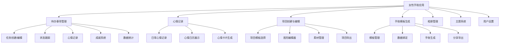
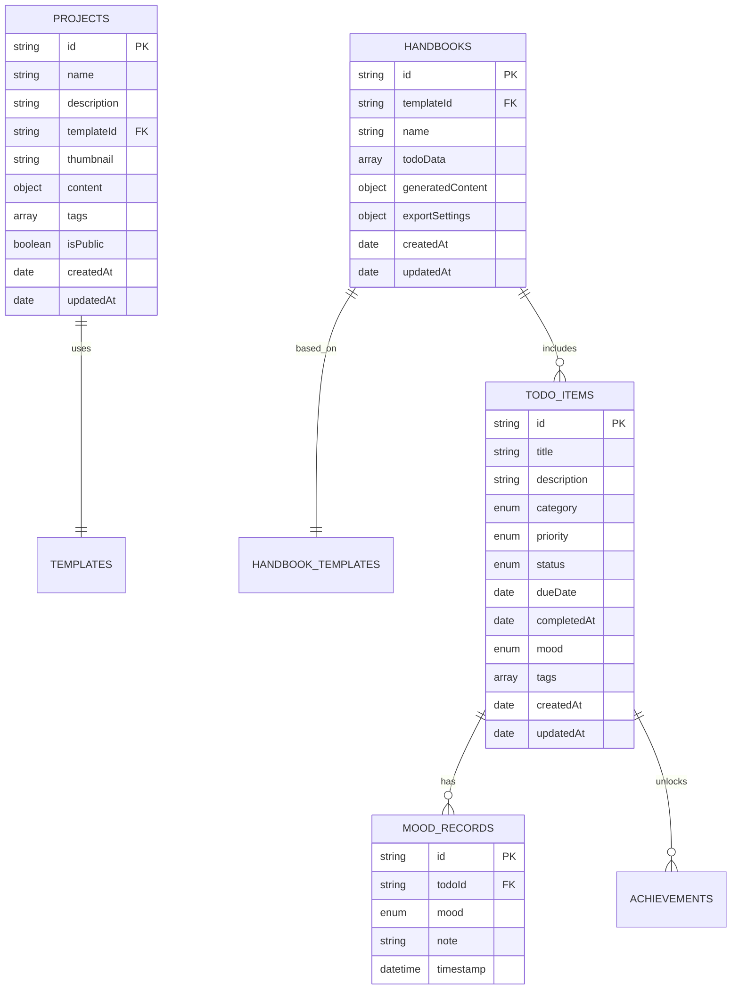
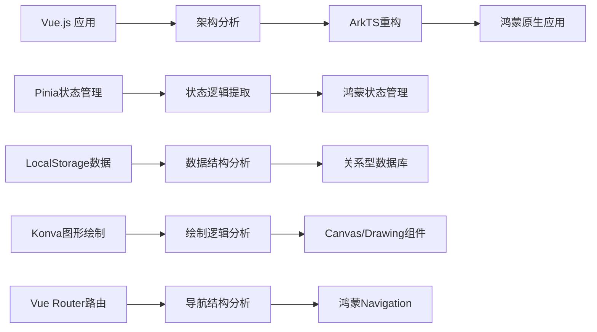
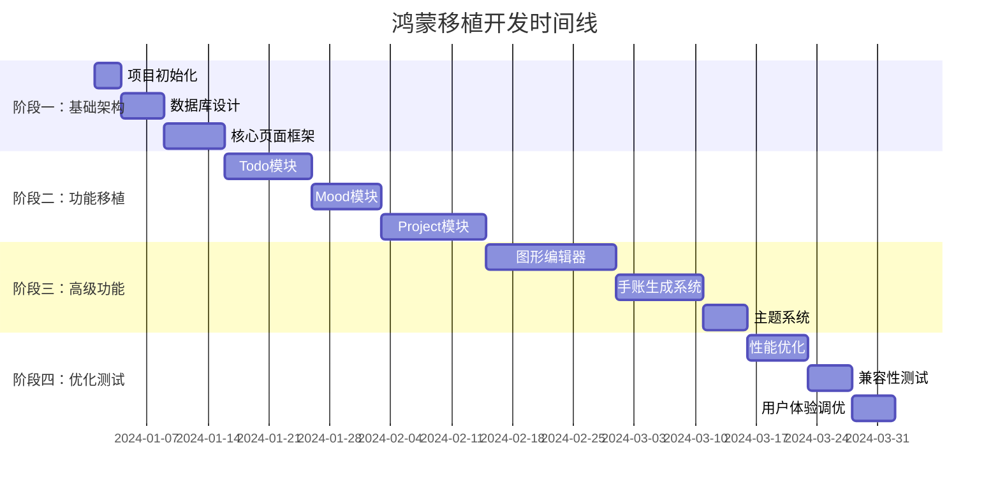

# 女性手账应用鸿蒙系统移植方案

## 项目概述

本文档详细阐述了将现有的Vue.js女性手账应用移植到鸿蒙系统(HarmonyOS)的完整方案。该应用是一个功能丰富的手账管理工具，包含待办事项管理、心情记录、项目创建、手账生成等核心功能。

## 原项目分析

### 技术栈构成
- **前端框架**: Vue 3 + TypeScript
- **状态管理**: Pinia
- **路由**: Vue Router 4
- **图形绘制**: Konva + Vue-Konva
- **构建工具**: Vite
- **数据存储**: LocalStorage (纯本地化存储)

### 核心功能模块

### 数据存储结构

## 鸿蒙移植目标

### 1. 技术适配目标
- 将Vue.js应用转换为ArkTS原生应用
- 保持所有原有功能特性
- 实现完全本地化数据存储
- 优化鸿蒙设备的用户体验

### 2. 功能保持目标
- ✅ 待办事项完整管理流程
- ✅ 心情记录与可视化展示
- ✅ 项目创建与图形编辑
- ✅ 手账模板系统
- ✅ 主题切换与个性化设置
- ✅ 数据导入导出功能

### 3. 性能优化目标
- 启动时间 < 2秒
- 页面切换动画流畅(60fps)
- 数据操作响应时间 < 500ms
- 内存占用控制在合理范围

## 移植方案概览

### 架构迁移策略

### 关键技术映射

| Vue.js 技术 | 鸿蒙 ArkTS 对应方案 | 说明 |
|-------------|------------------|------|
| Vue 3 组件 | ArkUI 自定义组件 | 组件化开发模式保持一致 |
| Pinia 状态管理 | AppStorage/LocalStorage | 全局状态管理 |
| Vue Router | Navigation 组件 | 页面路由与导航 |
| LocalStorage | 关系型数据库 | 持久化存储升级 |
| Konva 绘图 | Canvas 组件 | 2D图形绘制 |
| CSS 样式 | ArkTS 样式系统 | 样式语法适配 |

### 开发阶段规划

## 文档结构

本移植方案包含以下详细文档：

1. **[技术架构对比分析](./01-技术架构对比分析.md)** - Vue.js与ArkTS技术栈详细对比
2. **[数据存储迁移方案](./02-数据存储迁移方案.md)** - 从LocalStorage到关系型数据库的迁移
3. **[UI组件适配方案](./03-UI组件适配方案.md)** - Vue组件到ArkUI组件的转换
4. **[图形绘制系统迁移](./04-图形绘制系统迁移.md)** - Konva到Canvas组件的迁移
5. **[状态管理系统设计](./05-状态管理系统设计.md)** - Pinia到鸿蒙状态管理的迁移
6. **[页面导航系统设计](./06-页面导航系统设计.md)** - Vue Router到Navigation的迁移
7. **[开发规范与指南](./07-开发规范与指南.md)** - ArkTS开发最佳实践
8. **[测试策略与质量保证](./08-测试策略与质量保证.md)** - 全面的测试方案
9. **[性能优化策略](./09-性能优化策略.md)** - 鸿蒙应用性能优化
10. **[部署与发布指南](./10-部署与发布指南.md)** - 应用打包与发布流程

## 预期收益

### 用户体验提升
- **原生性能**: 相比Web应用，原生应用具有更好的性能表现
- **系统集成**: 更好地集成鸿蒙系统特性，如分布式能力
- **离线体验**: 完全离线可用，无网络依赖
- **安全性**: 本地数据存储，隐私保护更好

### 技术价值
- **跨平台能力**: 鸿蒙生态系统的广泛覆盖
- **维护性**: 统一的ArkTS技术栈，降低维护成本
- **扩展性**: 为后续功能扩展奠定坚实基础
- **学习价值**: 掌握鸿蒙应用开发技能

## 风险评估与应对

### 主要风险
1. **技术学习曲线**: ArkTS相对较新的技术栈
2. **图形绘制复杂度**: Konva到Canvas的功能对等迁移
3. **数据迁移**: 确保数据完整性和兼容性
4. **用户体验**: 保持原有的交互体验

### 应对策略
1. **分阶段开发**: 逐步迁移，降低风险
2. **原型验证**: 关键功能先做技术原型
3. **数据备份**: 完善的数据迁移和回退方案
4. **用户测试**: 持续的用户体验测试和反馈

---

**注意**: 本文档持续更新中，具体实施细节请参考各专项文档。
