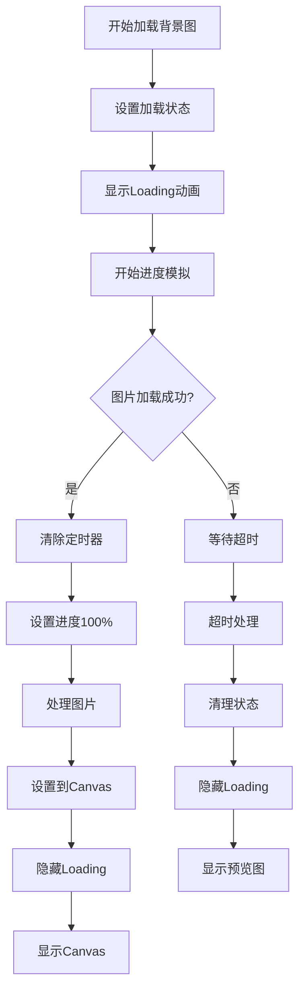

# 背景图加载优化分析

## 问题分析

### 原始问题
1. **超时时间过短** - 3秒超时对于复杂SVG图片不够
2. **没有loading动画** - 用户体验差
3. **状态管理混乱** - 超时后状态不一致
4. **没有进度提示** - 用户不知道加载进度

### 控制台输出分析
```
背景图加载超时，跳过背景图
背景图加载完成，状态: false
```

## 优化方案

### 1. 增加加载状态管理
```javascript
// 新增状态变量
const isBackgroundImageLoading = ref(false) // 加载中状态
const backgroundImageLoadProgress = ref(0) // 加载进度
```

### 2. 优化超时机制
```javascript
// 从3秒增加到10秒
const timeout = setTimeout(() => {
  console.warn('背景图加载超时，跳过背景图')
  // 清理所有状态
  isBackgroundImageLoaded.value = false
  isBackgroundImageLoading.value = false
  backgroundImageLoadProgress.value = 0
  resolve()
}, 10000) // 10秒超时
```

### 3. 添加进度模拟
```javascript
// 模拟加载进度
const progressInterval = setInterval(() => {
  if (backgroundImageLoadProgress.value < 90) {
    backgroundImageLoadProgress.value += Math.random() * 10
  }
}, 200)
```

### 4. 添加Loading动画
```vue
<!-- 背景图加载动画 -->
<div v-if="isBackgroundImageLoading" class="background-loading">
  <div class="loading-spinner"></div>
  <div class="loading-text">背景图加载中... {{ backgroundImageLoadProgress }}%</div>
</div>
```

### 5. 优化显示逻辑
```vue
<!-- 修改后的显示逻辑 -->


<div v-if="isBackgroundImageLoading" class="background-loading">
  <div class="loading-spinner"></div>
  <div class="loading-text">背景图加载中... {{ backgroundImageLoadProgress }}%</div>
</div>

<canvas 
  ref="fabricCanvasEl" 
  v-show="isCanvasReady && isBackgroundImageLoaded"
></canvas>
```

### 6. 简化背景图URL
```json
{
  "preview": "data:image/svg+xml;base64,PHN2ZyB3aWR0aD0iMTIwMCIgaGVpZ2h0PSI5NjAiIHZpZXdCb3g9IjAgMCAxMjAwIDk2MCIgeG1sbnM9Imh0dHA6Ly93d3cudzMub3JnLzIwMDAvc3ZnIj48cmVjdCB3aWR0aD0iMTAwJSIgaGVpZ2h0PSIxMDAlIiBmaWxsPSIjZmZkNmI5Ii8+PGNpcmNsZSBjeD0iNjAwIiBjeT0iNDgwIiByPSIyMDAiIGZpbGw9InJnYmEoMjU1LDI1NSwyNTUsMC4xKSIvPjwvc3ZnPg=="
}
```

## CSS样式优化

### Loading动画样式
```css
.background-loading {
  position: absolute;
  top: 0;
  left: 0;
  width: 100%;
  height: 100%;
  background: rgba(255, 255, 255, 0.8);
  display: flex;
  flex-direction: column;
  align-items: center;
  justify-content: center;
  z-index: 10;
  border-radius: 12px;
  box-shadow: var(--shadow8);
}

.loading-spinner {
  border: 4px solid var(--colorNeutralStroke1);
  border-top: 4px solid var(--colorBrandBackground);
  border-radius: 50%;
  width: 40px;
  height: 40px;
  animation: spin 1s linear infinite;
  margin-bottom: 10px;
}

.loading-text {
  font-size: 16px;
  color: var(--colorNeutralForeground1);
}

@keyframes spin {
  0% { transform: rotate(0deg); }
  100% { transform: rotate(360deg); }
}
```

## 状态流程图



## 优化效果

### 用户体验改进
1. ✅ **Loading动画** - 用户知道正在加载
2. ✅ **进度提示** - 显示加载百分比
3. ✅ **更长超时时间** - 10秒足够加载复杂图片
4. ✅ **状态一致性** - 所有状态正确管理
5. ✅ **优雅降级** - 超时后显示预览图

### 技术改进
1. ✅ **状态管理** - 新增loading和progress状态
2. ✅ **超时优化** - 从3秒增加到10秒
3. ✅ **进度模拟** - 提供视觉反馈
4. ✅ **错误处理** - 完善的错误清理
5. ✅ **性能优化** - 简化SVG图片

## 测试建议

### 功能测试
1. **正常加载** - 图片快速加载完成
2. **慢速网络** - 模拟慢速网络环境
3. **超时情况** - 测试10秒超时机制
4. **错误处理** - 测试图片加载失败
5. **状态切换** - 验证各种状态切换

### 用户体验测试
1. **Loading动画** - 动画是否流畅
2. **进度显示** - 进度条是否准确
3. **状态提示** - 文字提示是否清晰
4. **响应时间** - 整体响应是否及时
5. **错误提示** - 错误信息是否友好

## 后续优化建议

### 1. 真实进度跟踪
```javascript
// 使用XMLHttpRequest跟踪真实进度
const xhr = new XMLHttpRequest();
xhr.open('GET', imageUrl, true);
xhr.responseType = 'blob';

xhr.onprogress = (event) => {
  if (event.lengthComputable) {
    const progress = (event.loaded / event.total) * 100;
    backgroundImageLoadProgress.value = progress;
  }
};
```

### 2. 图片预加载
```javascript
// 预加载常用图片
const preloadImages = () => {
  const imageUrls = [
    'template1.jpg',
    'template2.jpg',
    'template3.jpg'
  ];
  
  imageUrls.forEach(url => {
    const img = new Image();
    img.src = url;
  });
};
```

### 3. 缓存机制
```javascript
// 添加图片缓存
const imageCache = new Map();

const loadImageWithCache = async (url) => {
  if (imageCache.has(url)) {
    return imageCache.get(url);
  }
  
  const img = await loadImage(url);
  imageCache.set(url, img);
  return img;
};
```

### 4. 重试机制
```javascript
// 添加重试逻辑
const loadImageWithRetry = async (url, maxRetries = 3) => {
  for (let i = 0; i < maxRetries; i++) {
    try {
      return await loadImage(url);
    } catch (error) {
      if (i === maxRetries - 1) throw error;
      await new Promise(resolve => setTimeout(resolve, 1000 * (i + 1)));
    }
  }
};
```
