# 图片加载流程图分析

## 问题描述
1. **初始化太久** - 背景图加载超时导致初始化延迟
2. **图片显示问题** - 第一次进入有模板图片，过几秒钟就刷新掉了
3. **添加图片功能未实现** - 按钮点击后没有反应

## 详细流程图

```mermaid
graph TD
    A[页面加载] --> B[Editor.vue onMounted]
    B --> C[检查模板ID]
    C --> D{有模板ID?}
    D -->|是| E[应用模板默认值]
    D -->|否| F[显示空状态]
    
    E --> G[等待DOM更新 nextTick]
    G --> H[开始初始化画布]
    
    H --> I[设置状态: isCanvasInitializing=true]
    I --> J[加载Fabric.js]
    J --> K[创建Fabric Canvas]
    K --> L[调整Canvas尺寸]
    
    L --> M[检查背景图URL]
    M --> N{有背景图URL?}
    N -->|是| O[开始加载背景图]
    N -->|否| P[跳过背景图]
    
    O --> Q[设置3秒超时]
    Q --> R[调用f.Image.fromURL]
    R --> S{图片加载成功?}
    S -->|是| T[清除超时]
    S -->|否| U[超时触发]
    
    T --> V[调整背景图尺寸]
    V --> W[设置背景图到Canvas]
    W --> X[Canvas渲染]
    
    U --> Y[跳过背景图]
    Y --> Z[继续初始化]
    
    X --> Z
    P --> Z
    
    Z --> AA[设置状态: isCanvasReady=true]
    AA --> BB[设置状态: isCanvasInitializing=false]
    BB --> CC[Canvas初始化完成]
    
    %% 模板显示逻辑
    CC --> DD[模板显示阶段]
    DD --> EE{currentBackgroundUrl存在?}
    EE -->|是| FF{isCanvasReady为false?}
    EE -->|否| GG[显示空白画布]
    
    FF -->|是| HH[显示模板预览图片]
    FF -->|否| II[显示Canvas]
    
    HH --> JJ[等待Canvas就绪]
    JJ --> KK[Canvas就绪后]
    KK --> LL{isCanvasReady为true?}
    LL -->|是| II
    LL -->|否| HH
    
    II --> MM[隐藏预览图片]
    MM --> NN[显示Canvas]
    
    %% 添加图片功能
    NN --> OO[用户点击添加图片]
    OO --> PP[triggerAddImage函数]
    PP --> QQ{isCanvasReady为true?}
    QQ -->|是| RR[触发文件选择器]
    QQ -->|否| SS[显示警告]
    
    RR --> TT[用户选择文件]
    TT --> UU[onPickForeground函数]
    UU --> VV[读取文件]
    VV --> WW[添加到Canvas]
```



## 问题分析

### 问题1: 初始化太久
**原因分析:**
- 背景图URL: `https://images.unsplash.com/photo-1523580846011-d3a5bc25702b?w=1200&q=80`
- 网络加载慢或失败导致3秒超时
- 超时后继续初始化，但背景图可能丢失

**解决方案:**
1. 使用本地图片或更稳定的CDN
2. 增加加载状态提示
3. 优化超时处理逻辑

### 问题2: 图片显示问题
**原因分析:**
```vue
<!-- 模板显示逻辑 -->

<div v-if="!currentBackgroundUrl && !isCanvasReady" class="canvas-empty">
  {{ isCanvasInitializing ? '画布初始化中...' : '空白画布' }}
</div>
<canvas ref="fabricCanvasEl" v-show="isCanvasReady"></canvas>
```

**问题所在:**
1. 当`isCanvasReady`变为`true`时，预览图片被隐藏
2. 但Canvas可能没有正确显示背景图
3. 导致用户看到空白画布

**解决方案:**
1. 确保Canvas背景图正确加载
2. 添加Canvas背景图加载状态检查
3. 优化显示逻辑

### 问题3: 添加图片功能未实现
**原因分析:**
1. 按钮点击事件可能没有正确绑定
2. 文件选择器可能被隐藏或禁用
3. 文件处理函数可能有问题

**解决方案:**
1. 检查事件绑定
2. 确保文件选择器可见
3. 添加详细的调试日志

## 修复建议

### 1. 优化背景图加载
```javascript
// 添加背景图加载状态
const isBackgroundImageLoaded = ref(false)

// 修改背景图加载逻辑
const loadBackgroundImage = async (url: string) => {
  try {
    isBackgroundImageLoaded.value = false
    await new Promise((resolve, reject) => {
      const timeout = setTimeout(() => {
        reject(new Error('背景图加载超时'))
      }, 3000)
      
      const img = new Image()
      img.onload = () => {
        clearTimeout(timeout)
        isBackgroundImageLoaded.value = true
        resolve(img)
      }
      img.onerror = () => {
        clearTimeout(timeout)
        reject(new Error('背景图加载失败'))
      }
      img.src = url
    })
  } catch (error) {
    console.warn('背景图加载失败:', error)
    isBackgroundImageLoaded.value = false
  }
}
```

### 2. 修复显示逻辑
```vue
<!-- 修改后的显示逻辑 -->

<div v-if="!currentBackgroundUrl && !isCanvasReady" class="canvas-empty">
  {{ isCanvasInitializing ? '画布初始化中...' : '空白画布' }}
</div>
<canvas 
  ref="fabricCanvasEl" 
  v-show="isCanvasReady && isBackgroundImageLoaded"
></canvas>
```

### 3. 增强添加图片功能
```javascript
// 添加详细的调试日志
function triggerAddImage() { 
  console.log('=== triggerAddImage 被调用 ===')
  console.log('isCanvasReady.value:', isCanvasReady.value)
  console.log('fgFileInput.value:', fgFileInput.value)
  
  if (!isCanvasReady.value) {
    console.log('❌ 画布未就绪')
    alert('画布正在初始化，请稍后再试')
    return
  }
  
  if (!fgFileInput.value) {
    console.log('❌ 文件输入框未找到')
    return
  }
  
  console.log('✅ 触发文件选择器')
  fgFileInput.value.click()
}
```

## 测试步骤

1. **检查模板数据加载**
2. **验证背景图URL有效性**
3. **测试Canvas初始化流程**
4. **验证添加图片功能**
5. **检查显示状态切换**

## 预期结果

修复后应该实现:
- ✅ 快速初始化（<3秒）
- ✅ 模板图片正确显示且不消失
- ✅ 添加图片功能正常工作
- ✅ 替换图片功能正常工作
